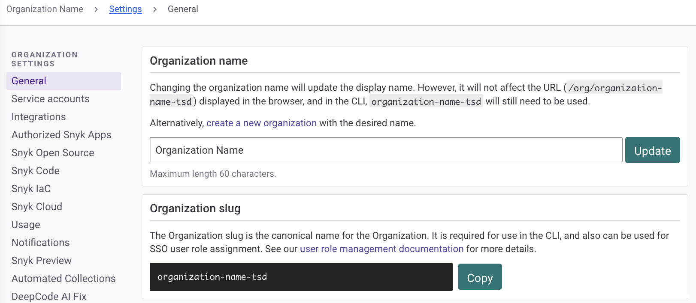

# Custom mapping

Custom mapping allows you to dynamically assign users to your Snyk Groups and Organizations based on data provided by your Identity Provider (IdP), in order to implement a scaled user provisioning and access model.


Contact your Snyk account team or Snyk Support to turn on custom mapping once you have completed the setup steps.


To understand more about roles and permissions within Snyk, see [Pre-defined roles](../../../../snyk-platform-administration/user-roles/pre-defined-roles.md). See also [user role management](../../../../snyk-platform-administration/user-roles/user-role-management.md).

## Requirements for custom mapping

* Complete the SSO information worksheet for the appropriate IdP (identity provider) found in [Resources for SSO setup](../set-up-snyk-single-sign-on-sso.md#resources-for-sso-setup).
* Properly configure the custom attributes in your IdP to populate the `roles` array mapping. See [Roles array mapping with Snyk](./#roles-array-mapping-with-snyk).

## Custom mapping options

Snyk offers an updated custom mapping option explained on this page, with increased flexibility, including the ability to grant users Group-level and Tenant-level custom roles, in addition to pre-defined roles.&#x20;

The Snyk [Legacy custom mapping](legacy-custom-mapping.md) option is still supported.

## Roles array mapping with Snyk

In the IdP, you must first pass a custom mapping called `roles` as a string array. [Examples](examples-setting-up-custom-mapping-for-idps/) of how to set this up for different IdPs are provided.

Refer to your identity provider documentation for further information on how to configure custom mappings.

## Custom mapping assertions

This section documents the role assertions that Snyk expects in order to map correctly to Snyk roles within Snyk Tenants, Groups, and Organizations.

### Role assertion format

Role assertions should be provided to Snyk in the following format:

`snyk:{scope}:{target}:{role}`

Where:

* `snyk` is a fixed prefix for role mapping. **Required**.
* `scope` can be one of `org`, `group`, or `tenant`. **Required**; if a role mapping does not contain a valid scope, it will be ignored.
* `target` can be a slug of an `org`, `group`, or `tenant` where the role will be granted. See [slugs](./#slugs) for more information.
  * **Optional**; may be an asterisk `*` or empty string `::`to apply as a [wildcard](./#wildcards) for all resources within the defined `scope` that are associated with the SSO connection.
  * **Optional**; an asterisk ( `*`) or an empty string can be used to apply to all resources **t**hat are associated with the SSO connection.
* `role` is the normalized name of the required role. **Required**; if no role is present, the role mapping is ignored. See [Role normalized name](./#role-normalized-name) to find this information.
  * If the role is a custom role, that is, a role created in the Group Member Roles admin panel that can be of either `Org` or `Group` type,  then it must have a `custom:` prefix. See the [example role assertions](./#example-role-assertions).
  * Built-in roles do not have the `custom:` prefix, so values like `org_admin`, `org_collaborator`, `group_viewer` will refer to the Snyk pre-defined roles, which are shown with a padlock symbol in the Member Roles page.


Users must only have one role mapped per Organization, Group or Tenant. Mapping multiple roles except when using wildcards is not supported and can lead to unexpected behavior.


### Default role assignments

All users with any memberships within a Tenant must have a Tenant membership. If a user has a membership of an Organization, they must also have a Group Membership.&#x20;

If only an Organization-level role assertion is provided for a given user, for example,  then the user will automatically be assigned the **Tenant Member** and **Group Member** roles. These automatic assignments can be overridden by providing role assertions at the Group or Tenant level.

Snyk recommends providing explicit Tenant level and Group level role assertions where needed, to ensure that users have the correct role on login.


An SSO connection may only be associated with one Tenant, and all users with any memberships within a tenant must also have a Tenant Membership.&#x20;

Therefore, it may be easier to assign Tenant-level roles by using the wildcard syntax (see example below), since the SSO is only linked to the one Tenant.


### Example role assertions

* `snyk:group:*:group_admin` Assigns the user the Group admin role for all groups associated with the SSO connection.
* `snyk:group::custom:sysadmin` Assigns the user the custom Group-level role `Sys Admin` for all groups associated with the SSO connection.
  * Note that `::` here indicates an empty string for the target, and so is treated as a wildcard in the preceding example.
  * Note that this Group-level custom role must be created manually before it can be assigned.
* `snyk:org:my-default-org:org_admin` Assigns the user the **Organization Admin** Organization-level role for the Organization `my-default-org`.
* `snyk:tenant::tenant_admin` Assigns the user the **Tenant Admin** Tenant-level role for the Tenant associated with the SSO connection.

### Example role assertions array

An example of a set of role assertions for a user follows:

<pre><code><strong>{
</strong><strong>    "roles": [
</strong>        "snyk:group:*:group_viewer",
        "snyk:org:development:org_admin",
        "snyk:org:test-org-N58YhztauHcaMiNfvi5fbL:custom:developer_readonly",
    ]
}
</code></pre>


The system also supports comma-separated lists of roles instead of an array.

```
{
  "roles": "snyk:group:*:group_viewer, snyk:org:development:org_admin, 
snyk:org:test-org-N58YhztauHcaMiNfvi5fbL:custom:developer_readonly"
}
```


These assertions will assign the user:

* The pre-defined Group-level role **Group Viewer** for all groups in the SSO. See [pre-defined roles](../../../../snyk-platform-administration/user-roles/pre-defined-roles.md) for the permission this grants
* The pre-defined Organization-level role **Organization Admin** for the Organization with the name **Development**.
* The custom Organization-level role **Developer ReadOnly** for the Organization with the name **Test Org**, which has the slug `test-org-N58YhztauHcaMiNfvi5fbL`.

## Wildcards

Custom mapping introduces wildcards, which allow one assertion to assign a user the same role in all Organizations or Groups.

Assertions using wildcards take a lower priority than assertions with a specific target. This means that it is possible, for example, to assign a user a default role for all Organizations, and specific roles in others:

```
roles: [
        "snyk:org:*:custom:developer_readonly",
        "snyk:org:development:org_admin",
    ]
```

These role assertions will:

* Grant the user the pre-defined Organization-level role **Organization Admin** in the **Development** Organization.
* Grant the user the custom Organization-level role **Developer ReadOnly** on all other organizations within the SSO connection.
* Grant the user the pre-defined Group-level role **Group Member** on all groups in the SSO connection. For more details, see the note that follows.


Any user that is granted a role in an Organization within the SSO without an explicit Group-level role in the role assertion, will also be implicitly assigned the **Group Member** Group-level role for that Group. This is the pre-defined Group-level role with the fewest permissions and ensures that the user becomes a member of the Group.


## Slugs

For a valid role assertion, the Organization or Group slug may be required, where a wildcard is not used. The slug is the canonical name for the Organization or Group within Snyk.

To find an Organization slug, navigate to the **Settings** page for the Organization, and under **General** settings, the Organization slug value is visible. This can then be copied and used in role assertions in custom mapping.&#x20;

<figure><figcaption><p>Organization general settings page, showing the Organization slug</p></figcaption></figure>

To find the slug of a Group, navigate to the Group Settings, and find the Group slug under General Settings, which you can copy.

<figure><figcaption><p>Group general settings page, showing the Group slug</p></figcaption></figure>

## Role normalized name

To find the normalized name of a role for use in custom mapping, first confirm that the role exists for the Snyk Group by navigating to it in the Group settings: **Group Settings** > **Member Roles** > {**Role**}.&#x20;

This will open the role details page that shows which permissions are enabled for the role and also shows the normalized name. Copy this normalized name and use it in custom mapping.

For more details on roles, and specifically, custom roles, see [user role management](../../../../snyk-platform-administration/user-roles/user-role-management.md).

<figure><figcaption><p>Role details page for Organization Admin role</p></figcaption></figure>

## Pre-defined role slugs

Snyk has a set of [pre-defined roles](../../../../snyk-platform-administration/user-roles/pre-defined-roles.md). Their corresponding normalized names are listed below.

| Role Type    | Role Name        | Role Slug          |
| ------------ | ---------------- | ------------------ |
| Organization | Org Admin        | `org_admin`        |
| Organization | Org Collaborator | `org_collaborator` |
| Group        | Group Admin      | `group_admin`      |
| Group        | Group Viewer     | `group_viewer`     |
| Group        | Group Member     | `group_member`     |
| Tenant       | Tenant Admin     | `tenant_admin`     |
| Tenant       | Tenant Viewer    | `tenant_viewer`    |
| Tenant       | Tenant Member    | `tenant_member`    |
