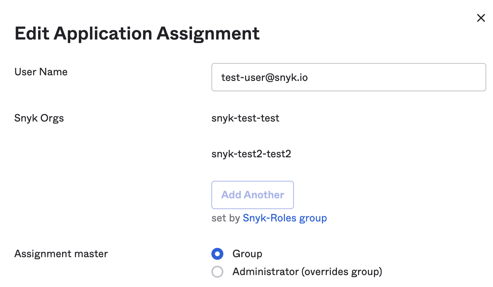

# Example: setting up custom mapping for Okta

The following shows two different options for custom mapping of Okta roles, using [Legacy custom mapping](../legacy-custom-mapping.md).


For both of these options to work, the Snyk SSO application must be assigned at the group level, not the user level.


## Option 1: Assign Custom Mapping with Groups

In this configuration:

* Okta groups are mapped to Snyk Organizations.
* Okta groups are mapped to Snyk Organization membership roles.
* The user role in Snyk is pre-set in each Okta group for all members of that group.

The steps follow.


Note: The Snyk SSO application must be assigned at the group level, not the user level.

When you look at a user's Application assignment it should look similar to the image that follows, with set by **Snyk-Roles group** following **Add Another** grayed out.


<figure><figcaption>
Roles set on group level
</figcaption></figure>

### Create a single app attribute containing both the Snyk Organization name and role

1. On the main page of Okta, select **Directory** > **Profile Editor** > **your Snyk SSO app**.
2. Select **+Add Attribute**.
3. In the corresponding fields, add the following details for this Attribute:\
   **Data type**: string array\
   **Display name**: Snyk Orgs\
   **Variable name:** snyk\_orgs\
   **Group Priority**: Combine values across groups
4. Select **Save.**

### Assign the attribute to the relevant Okta groups

1. On the main page of Okta select **Directory** > **Groups**.
2. Select a **Group**, navigate to the **Applications** tab, click **Assign** **application** if not already assigned, and choose your Snyk SSO app,. Then click on the pencil next to the displayed Snyk SSO app.
3. In the **Edit App Assignment** dialog, add the Snyk Organization slug, and the Organization role name associated with your Okta group (no spaces or capital letters), following the syntax explained in [custom mapping ](../)(or see [legacy custom mapping](../legacy-custom-mapping.md) if you are using that option).&#x20;
4. Repeat the preceding steps for all your applicable Okta groups to assign the org name and role combination to each user within each configured group.

### Construct a value expression that creates a roles array to be sent to Snyk

1. Navigate to **Applications** > **Applications** and click on the **Snyk app** you configured.
2. Select **General Tab** > **Edit SAML Settings** and click **next** to go to the **Configure SAML** step.
3. Add an **Attribute Statement** named “roles” of an unspecified type.
4.  Select **Attribute Statements** and set **roles** as the **Name** field with **Name format** **Unspecified** and the **Value** in the following expression:

    `Arrays.flatten(appuser.snyk_orgs)`
5. Reach out to your Snyk point of contact so they can complete the configuration.


If your Snyk representative lets you know that `Arrays.flatten(appuser.snyk_orgs)` is sent to Snyk, instead of the actual roles value(s), you must verify that the App is assigned at the Group level and not the user level. If both user and Group have been assigned, the individual assignment will take precedence, and the roles assignment will not work. Remove the individual assignment if this is the case.


## Option 2: Assign custom mapping with user roles

The following describes Custom Mapping with user roles.&#x20;


These instructions show how to map roles using the [legacy custom mapping](../legacy-custom-mapping.md) option. To use Custom mapping, [option 1](example-setting-up-custom-mapping-for-okta.md#option-1-assign-custom-mapping-with-groups) is recommended. \
Reach out to your Snyk point of contact if you have any questions


* Okta groups are mapped to Snyk Organizations.
* User profiles are tied to each user, not the Okta group.


Note: The Snyk SSO application must be assigned at the group level, not the user level.

When you look at a user's Application assignment it should look similar to the image that follows, with set by **Snyk-Roles group** following **Add Another** grayed out.


<figure><figcaption></figcaption></figure>

### Create an app attribute that contains the names of your relevant Snyk Organizations

When your Snyk Groups and users have been set up, follow these steps:

1. On the main page of Okta select **Directory** > **Profile Editor** > **your Snyk SSO app**.
2. Select **+Add Attribute**.
3. In the corresponding fields, add the following details for the first Attribute:\
   **Data type**: string array\
   **Display name**: Snyk Orgs\
   **Variable name**: snyk\_orgs\
   **Group Priority**: Combine values across groups
4. select **Save and Add Another**.

### Create a second app attribute that contains roles

1. In the corresponding fields, add the following details for the second Attribute:\
   **Data type**: String\
   **Display name**: Snyk User Role\
   **Variable name**: user\_role\
   **Enum**: Check **Define enumerated list of values**\
   **Attribute members Collaborator:** collaborator or collab\
   **Attribute members Admin**: administrator or admin\
   **Attribute members GroupAdmin**: groupadmin\
   **Attribute required**: Yes\
   **Scope**: User personal
2. Select **Save**.

### Assign the first attribute to your Okta groups

1. On the main page of Okta select **Directory > Groups**.
2. Select a **Group**, navigate to the **Applications** tab, click **Assign** **application i**f not already assigned, and choose your Snyk SSO app. Then click on the pencil next to the displayed Snyk app.
3. In **Edit App Assignment** dialog, add the Snyk Organization name to associate with your Okta group (no spaces or capital letter(s)).
4. Repeat the preceding steps to assign the Snyk app to all your applicable Okta groups, modifying the Snyk Organization name as needed.

### Assign the second attribute to your users

1. On the main page of Okta select **Directory** > **People.**
2. Select a **User,** navigate to the **Applications** tab, and click on the pencil next to the application.
3. Select the right user type in group (user role): **Collaborator**, **Admin**, or **Group Admin**.

### Construct a value expression that concatenates these two attributes into string values in a roles array to be sent to Snyk

1. Navigate to **Applications** > **Applications** and click on the **Snyk app** you configured.
2. Select **General Tab** > **SAML Settings** > **Edit** and click **next** to go to the Configure SAML step.
3. Select **Attribute Statements** and add an attribute named **roles** with **Name format** **Unspecified** and the **Value** in the following expression:\
   `appuser.user_role == "groupadmin" ? "snyk-groupadmin" : Arrays.flatten(String.replace(String.replace(String.append("snyk-",String.append(Arrays.toCsvString(appuser.snyk_orgs),"-"+appuser.user_role)),",",",snyk-"),",","-"+appuser.user_role+","))`
4. Click **Next** > **Finish.**
5. Reach out to your Snyk point of contact so they can complete the configuration. This process may take four to five days.

The following explains the roles expression:

* If the role is `groupadmin`, the expression ignores everything else and passes `snyk-groupadmin`.
* If the role is not `groupadmin`, then for each Snyk Org name listed across all Groups, the expression automatically concatenates the prefix “`snyk-`” with the Snyk Org name and appends `user_role` at the end of each Organization name. An example result follows.

Example roles are:`[ "snyk-groupadmin", "snyk-org1-admin", "snyk-org2-admin" ]`
