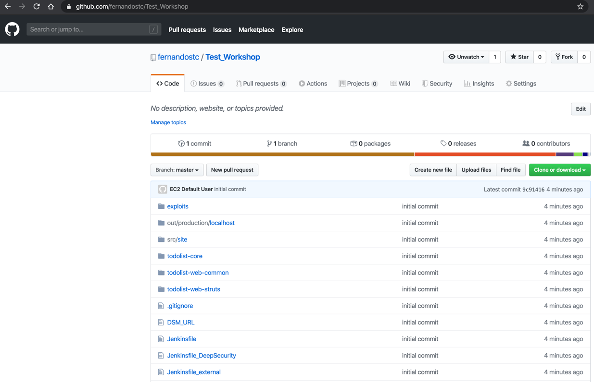

# Example: setting up custom mapping for Ping Identity

This page explains how to configure the custom mapping of roles for Ping Identity using [Legacy custom mapping](../legacy-custom-mapping.md).


This guide assumes your Ping Identity application is configured and functional.



Any step on the Snyk side in setting up the Enterprise application must be performed by your Snyk contact, as self-serve SSO does not accommodate custom mapping.


1.  In your application configuration, select **Attribute mappings** and click the pencil to edit the attributes.

    <figure><figcaption>
Edit mapping attributes
</figcaption></figure>
2.  Select **+Add** and enter the following attribute, then save the change,\
    **roles**: `Group Names`\\

    <figure><figcaption>
Add roles array
</figcaption></figure>
3.  In the left menu, select **Identities/Groups** and add the Snyk Groups needed following the syntax explained on the [Cusom Mapping Option](../) page.

    <figure><figcaption>
Adding an example Group
</figcaption></figure>
4. If you so not select a **Population** at the bottom of the previous screen, ensure that you assign the Group to the user(s) who should be part of the role assignment in Snyk. If you select a **Population**, all users in that population will inherit the permissions of the assigned Snyk role.
5. To finalize the process, reach out to your Snyk contact to validate that the SAML payload contains the role array and to enable the custom mapping feature.
