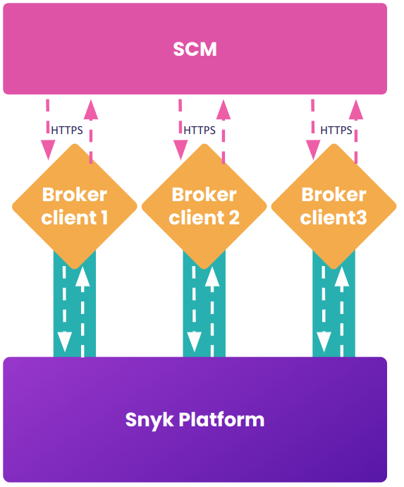

# High availability mode

Snyk Broker can bring high availability capabilities to both servers and clients, thus increasing the scalability of the current Broker, initially to support the addition of the “git-clone-through-broker” flow for Snyk Code.

High availability mode allows several Broker Clients to have separate connections, independent of one another. The Snyk platform will spread the requests it makes evenly across the connections to ease the load on each client and provide true redundancy if one is offline. High availability mode also avoids downtime in the fairly infrequent cases when Snyk upgrades the Broker server components.

<figure><figcaption><p>Operation of multiple Broker clients in high availability</p></figcaption></figure>

To use high availability mode, deploy more than one replica, either by running more than one container or by increasing the replica count in your Kubernetes deployment. Each container must have the exact same parameters.

A maximum of four Broker Clients running concurrently in high availability mode is allowed. A fifth tunnel will attempt to connect indefinitely.

## Settings to enable high availability (HA) mode

High availability mode is disabled by default. To activate it, set the following environment variables as shown either in your container or deployment:

```
BROKER_HA_MODE_ENABLED=true
```

Helm chart deployments can set these values by enabling the mode using set arguments. Helm chart version 1.7.0 or later is required.

```
--set highAvailabilityMode.enabled=true
```

Review the chart values file to adjust additional configurations such as increasing replica count, updating broker dispatcher base URL, and so on.

## **Important notes about settings**

The Dispatcher Base Url should be specific to your region if you are using a regional Snyk platform, for example, api.eu.snyk.io. See [Regional hosting and data residency](../../../snyk-data-and-governance/regional-hosting-and-data-residency.md) for details.

If you are using app.snyk.io, the following is not required. It is applicable only to regional Snyk platforms.

```
BROKER_DISPATCHER_BASE_URL=https://api.snyk.io
```

Outbound connection to api.snyk.io or the corresponding api hostname must be allowed. Otherwise, preflight checks will indicate failure upon Broker client startup.

`BROKER_CLIENT_URL` value must remain the same across all the Broker clients in the high availability set. The same BROKER\_TOKEN must also be used.  \
It is acceptable for this URL to resolve to a particular client.

The multiple tunnels are primarily supporting Snyk=>You flow. The webhooks going You=>Snyk can take any tunnel as well.

Preferably, Load Balancers can also be introduced. Kubernetes deployment with a service in front of each Broker Client will distribute this automatically.&#x20;

The following client log lines show the high availability mode is active.

> ```shell
> ...
> checking for HA mode (enabled=true)
> received server id (serverId=0)
> broker client is connecting to broker server (url=https://broker.snyk.io, serverId=0)
> ...
> ```

Using high availability mode introduces the concept of allocated tunnels for each client, scheduling those tunnels across a predictable set of Broker servers so a unique client can be connected to the right pod.
