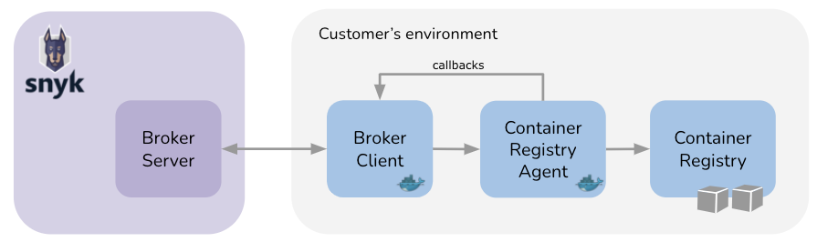

# Snyk Broker - Container Registry Agent


**Feature availability**

Snyk Broker Container Registry Agent is available only with Enterprise plans. For more information, see [plans and pricing](https://snyk.io/plans/).


The Snyk Broker Container Registry Agent enables you to connect with network-restricted container registries so you can scan these registries using the Snyk service.

When you use the Container Registry Agent, Snyk can integrate with private container registries that you host, and help you to better secure container images in those registries. Integration with private container registries allows you to:

* Keep sensitive data such as your access tokens inside your private network, never sharing that information with Snyk.
* Provide controlled access to the network for Snyk, limiting Snyk access and the actions that Snyk can perform.

This page explains how to use the Container Registry Agent to integrate through Broker with supported open-source container registries as [listed](./#supported-container-registries) on this page. This method of integration is designed for users who require images to be scanned in their own environment instead of inside the Snyk service.

If you do not require that images be scanned in your own environment, you do not need to use the Container Registry Agent. You can integrate with the supported container registries from the integrations page in your account. For details, see [Snyk Container security integrations](../../../../scan-with-snyk/snyk-container/container-registry-integrations/).

## Components of the network-restricted container registries solution

The following components are needed with network-restricted container registries:

* Broker Server: running on the Snyk SaaS backend.
* Broker Client and Container Registry Agent: two Docker images deployed in your infrastructure, creating two separate services, responsible for sampling your container registries in a secured manner and sending the allowed information to Snyk

The Broker Client provides the Container Registry Agent with the connection details. The Agent uses these details to connect to the container registry, scan the images, and send the scan results through the brokered communication using callbacks. The brokered communication happens when a Broker Client connects, using your Broker ID, to a Broker Server which runs in the Snyk environment. See the [Snyk Broker](../) introductory information for more details.

<figure><figcaption><p>High-level architecture of the Snyk Broker Container Registry Agent</p></figcaption></figure>

## Supported container registries

Using the Snyk Broker Container Registry Agent you can integrate Snyk with the following open-source container registries:

* JFrog Container Registry (Artifactory) (type: artifactory-cr)
* Harbor registry (type: harbor-cr)
* Azure Container Registry (type: acr)
* Google Cloud Container Registry (GCR) (type: gcr)
* Amazon Elastic Container Registry (ECR) (type: ecr)
* Google Artifact Registry (type: google-artifact-cr)
* Docker Hub registry (type: docker-hub). Note: Snyk Broker is unable to connect to a self-hosted instance of OCI Distribution, that is, [`docker.io/registry`](http://docker.io/registry).
* RedHat Quay container registry (type: quay-cr)
* Nexus registry (type: nexus-cr)
* GitHub Container registry (type: github-cr)
* DigitalOcean Container Registry (type: digitalocean-cr)
* GitLab Container Registry (type: gitlab-cr)

Artifactory and Nexus are also available as private package repositories with Broker options. The Brokers required for the Container Registry must be those specified in [Prerequisites for Container Registry Agent](./#prerequisites-for-container-registry-agent), not the Brokers for `snyk/broker:artifactory` or `snyk/broker:nexus`.

GitHub Container Registry and GitLab Container Registry do not follow Docker v2 API; they do not have the /v2/\_catalog endpoint. Thus, it is not possible to list images in repos, and you must manually specify the images you wish to scan.

## Prerequisites for Container Registry Agent


For the Container Registry Agent to work, you must have two separate containers deployed in your infrastructure, creating two separate services. For details, see [Components of the network-restricted container registries solution](./#components-of-the-network-restricted-container-registries-solution).


The system and software requirements to set up and run the Snyk Broker Container Registry Agent are as follows:

* Broker Client machine system requirements: 1 CPU, 256MB of RAM
* Container registry agent machine system requirements should be (given MAX\_ACTIVE\_OPERATIONS=1):
  * CPU: 1 vcpu
  * Memory: 2Gb (should be reflected in node memory setting)
  * Storage: 5Gb
* Container registry credentials that have list and pull images permissions
* Connection between Broker and Agent
* HTTPS connection between the Agent and the registry. For HTTP-only registries, deploy a reverse proxy between the Agent and the container registry.
* If using Classic Broker for Docker, use image `snyk/broker:container-registry-agent` when deploying the Broker client.
* If using Universal Broker: for Docker, use image `snyk/broker:universal` when deploying the Broker client.
* [Download for the Container Registry Agent image on Docker](https://hub.docker.com/r/snyk/container-registry-agent/tags?page=1\&ordering=last_updated) and use the `snyk/container-registry-agent:latest` command if you use Docker.


**Scaling to adjust scan capacity**

With the listed configuration of 1 vCPU and 2GB RAM, scanning capacity would be approximately 160 images of \~350MB each in one run. You can scale this up based on your image sizes. If you have a specific use case that does not allow scaling and does not fit the limitations, contact [Snyk Support](https://support.snyk.io).


## Set up the remote connection for Container Registry Agent using Docker

### Configuring and running the Container Registry Agent

Snyk recommends deploying the Container Registry Agent first as both Universal and Classic Broker requires configuration input from that deployment, namely the Container Registry Agent URL. You can pull the Container Registry Agent image from Docker Hub using the link provided in the [prerequisites](./#prerequisites-for-container-registry-agent).

To configure the Container Registry Agent, the following environment variables are available:

* `SNYK_PORT` - the local port at which the Container Registry Agent accepts connections (default value: 17500).
* `SNYK_MAX_IMAGE_SIZE_IN_BYTES` - the maximum size of an image that Snyk is able to scan (optional, default value: 2147483648).

Run the Container Registry Agent container with the relevant configuration:

```
docker run --restart=always \
       -p 8081:8081 \
       -e SNYK_PORT=8081 \
       snyk/container-registry-agent:latest
```

### Universal Broker

Deploy the Universal Broker by following the installation instructions available on the [Universal Broker ](../../../../enterprise-setup/snyk-broker/universal-broker/)page. The `snyk-broker-config` CLI tool guides you through the process of submitting and storing all configuration details needed to connect the Broker Client to the Container Registry Agent and the Container Registry.

You must provide the following details while creating your connection:

* `CR_AGENT_URL` - The URL of your Container Registry Agent you have deployed above, including scheme and port, to which the Broker Client routes the requests, for example, "http://my.container-registry-agent:8081".
* `CR_BASE` - The hostname of the container registry API to connect to, for example, "cr.host.com".
* `CR_USERNAME` - The username for authenticating to the container registry API.
* `CR_PASSWORD` - The password credential reference for authenticating to the container registry API.
* `CR_TOKEN` - The authentication token credential reference, if required for the specific connection type.

### Classic Broker

To set up the Snyk Classic Broker and the Container Registry Agent, you must have a Broker token. Contact [Snyk Support](https://support.snyk.io) to obtain your Broker token.

#### Configuring and running the Broker Client for Container Registry Agent

To use the Broker Client with a Container Registry Agent deployment, run `docker pull snyk/broker:container-registry-agent` if you have not already done so as a [prerequisite](./#prerequisites-for-container-registry-agent).

The following environment variables are required to configure the Broker Client.


[Container registry-specific configurations](./#container-registry-specific-configurations) are needed for DigitalOcean Container Registry, Google Cloud Container Registry, Google Artifact Registry, and Artifactory. For Elastic Container Registry, additional setup is required, while [specific configurations](./#container-registry-specific-configurations) are also provided.


* `BROKER_TOKEN` - The Snyk Broker token, obtained from your Container registry integration provided by Snyk support.
* `BROKER_CLIENT_URL` - The URL of your Broker Client, including scheme and port, which is used by the container registry agent to call back to Snyk through the brokered connection, for example,\
  "http://my.broker.client:8000".
  * This must have `http://` and the port number.
  * [Additional settings](../https-for-broker-client-with-docker.md) are required to configure the client with HTTPS.
* `CR_AGENT_URL` - The URL of your Container Registry Agent, including scheme and port, to which the Broker Client routes the requests, for example "http://my.container-registry-agent:8081".
* `CR_TYPE` - The container registry type as listed in [Supported container registries](./#supported-container-registries) on this page, for example, "docker-hub", "gcr," "artifactory-cr".
* `CR_BASE` - The hostname of the container registry API to connect to, for example, "cr.host.com".
* `CR_USERNAME` - The username for authenticating to the container registry API.
* `CR_PASSWORD` - The password for authenticating to the container registry API.
* `CR_TOKEN` - Authentication token for the DigitalOcean container registry.
* `PORT` - The local port at which the Broker client accepts connections (default value: 7341).
* Optional - `BROKER_CLIENT_VALIDATION_URL` - URL to configure `/systemcheck` for the container registry agent. For details, see [Configuring and using systemcheck](./#configuring-and-using-systemcheck) on this page.

Run the Broker Client container with the relevant configuration:

```
docker run --restart=always \
       -p 8000:8000 \
       -e BROKER_TOKEN="<secret-broker-token>" \
       -e BROKER_CLIENT_URL="<broker-client-url>" \
       -e CR_AGENT_URL="<container-registry-agent-url>" \
       -e CR_TYPE="<container-registry-type>" \
       -e CR_BASE="<container-registry-hostname>" \
       -e CR_USERNAME="<username>" \
       -e CR_PASSWORD="<password>" \
       -e PORT=8000 \
       snyk/broker:container-registry-agent
```

## Container registry-specific configurations

The following container registries require specific environment variables, setup, or both, and are valid for both the Universal and Classic Broker.

### **DigitalOcean Container Registry**

`CR_USERNAME` and `CR_PASSWORD` are not required to set up the Broker Client for DigitalOcean Container Registry. Instead, specify the `CR_TOKEN`, the Digital Ocean authentication token.

### **GCR and Google Artifact Registry**

All the preceding information applies to setting up the Broker Client for these container registries. The `CR_USERNAME` value is permanent and should be `_json_key`, and the `CR_PASSWORD` value should be the JSON key used to authenticate to Google.

### **JFrog Container Registry (Artifactory)**

If you are using `Repository path` as your Docker access method, set the container registry hostname in the `CR_BASE` variable in this structure: `<your artifactory host>/artifactory/api/docker/<artifactory-repo-name>`

The catalog endpoint `/artifactory/api/docker/<artifactory-repository>/v2/_catalog` is not required for importing a Project in Artifactory. The catalog endpoint is used for listing the image repositories.

See [Configuring your JFrog Artifactory container registry integration](../../../../scan-with-snyk/snyk-container/container-registry-integrations/integrate-with-jfrog-artifactory/configuring-your-jfrog-artifactory-container-registry-integration.md) for more details.

### **Elastic Container Registry (ECR)**

In Elastic Container Registries and other container registries, the communication is the same. The Agent makes synchronous calls to the container registries to list and pull the image. Then the Agent scans the images and sends the results to the Broker Client using callbacks. ECR has a special authentication mechanism that requires setting up an IAM Role or User in the Agent.

<figure><figcaption><p>High-level architecture of the brokered ECR integration</p></figcaption></figure>

#### **Required AWS Resource with ECR**

ECR setup requires that the following kinds of IAM resources be created:

* Container Registry Agent IAM Role or IAM User: an IAM Role or IAM User the Agent uses to assume a cross-account role with access to ECR. It should have the following permissions: "`sts:AssumeRole"`.
*   Snyk ECR Service Role: an IAM Role with access to ECR which is assumed by the Container Registry Agent IAM Role or IAM User to gain read-only access to ECR.\
    The ECR Service Role should have the following permissions:

    ```
    [
      "ecr:GetLifecyclePolicyPreview",
      "ecr:GetDownloadUrlForLayer",
      "ecr:BatchGetImage",
      "ecr:DescribeImages",
      "ecr:GetAuthorizationToken",
      "ecr:DescribeRepositories",
      "ecr:ListTagsForResource",
      "ecr:ListImages",
      "ecr:BatchCheckLayerAvailability",
      "ecr:GetRepositoryPolicy",
      "ecr:GetLifecyclePolicy"
    ]
    ```

#### **Setup steps for ECR**

The resources described can be used as follows, so that a single Container Registry Agent instance can access ECR repositories located in different accounts.

Run this step once only. Create the Container Registry Agent IAM Role or IAM User and use it to run the Container Registry Agent. The IAM Role or IAM User could be provided to the Container Registry Agent using one of the methods described in the [AWS docs](https://docs.aws.amazon.com/sdk-for-javascript/v2/developer-guide/setting-credentials-node.html).

Run the following steps for each of your ECR accounts, using a separate Broker instance for each ECR account:

1. In the AWS account where your ECR resides, create the Snyk ECR Service Role with read access to your ECR, and edit the trust relationship to allow this role to be assumed only by the specific Container Registry Agent IAM Role or IAM User created in the one-time step.
2. Restrict the Container Registry Agent IAM Role or IAM User to be allowed to assume only the Snyk ECR Service Role(s).
3. Provide the Broker Client with the Role ARN (Amazon Service Name) of the Snyk ECR Service Role together with the ECR region. The Broker Client passes this Role ARN to the Container Registry Agent, and the Container Registry Agent assumes it to access your ECR. The following environment variables are required:
   * CR\_ROLE\_ARN=\<the role ARN of SnykEcrServiceRole>
   * CR\_REGION=\<AWS Region of ECR>
   * CR\_EXTERNAL\_ID=\<Optional. An external ID found in the trust relationship condition>

## Configuring and using systemcheck

You can use the `/systemcheck` endpoint of the Broker Client to verify connectivity between the Broker Client, the Container Registry Agent, and your container registry.

To use the endpoint, provide the following environment variable to the Broker Client:\
`BROKER_CLIENT_VALIDATION_URL=<agent-url>/systemcheck`

When you call the `/systemcheck` endpoint of the Broker Client, it uses the `BROKER_CLIENT_VALIDATION_URL` to make a request to the `/systemcheck` endpoint Container Registry Agent, with the credentials provided to the Broker Client. The Container Registry Agent then makes a request to the container registry to validate connectivity.


The `/systemcheck` endpoint is not mandatory for the brokered integration to function. For more information, see [Systemcheck documentation](../troubleshooting-broker.md#monitoring-systemcheck).


## **Debugging methods for Container Registry Agent**

The `LOG_LEVEL` environment variable can be set to control the desired log level of the Container Registry Agent and Broker Client. The default value is `info`. The accepted values are `debug`, `info`, `warn` and `error`.


Enabling debugging for third-party libraries is not recommended for production environments, as this may expose sensitive information in logs not maintained by Snyk, for example, headers of HTTP requests.


To enable debug logs from the third-party HTTP request library [Needle](https://www.npmjs.com/package/needle), set the environment variable `NODE_DEBUG=needle`.

To enable debug logs from all third-party libraries, set the environment variables `DEBUG=*` and `NODE_DEBUG=*`.

The `DEBUG` environment variable controls the [Debug](https://www.npmjs.com/package/debug) package output. The `NODE_DEBUG` environment variable controls Node.js [util.debuglog](https://nodejs.org/api/util.html#utildebuglogsection-callback) output.
