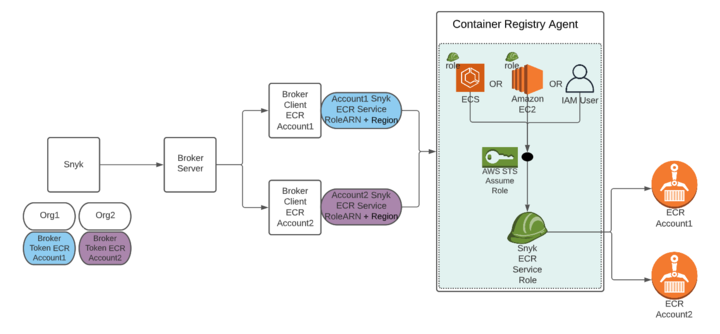

# Setting up the Container Registry Agent for a brokered ECR integration

## Terminology and diagram for brokered ECR integration

In Elastic Container Registries the brokered communication is the same as in other container registries. However, ECR has a special authentication mechanism that requires setting up an Identify and Access Management (IAM) Role or User in the Agent.

The Container Registry Agent IAM Role or IAM User is an IAM Role or IAM User is used by the Container Registry Agent to assume a role with access to ECR.

The Snyk ECR Service Role is an IAM Role with access to ECR and assumed by the Container Registry Agent IAM Role or IAM User to gain read-only access to ECR. The Snyk ECR Service Role ARN is provided to the Broker Client together with the region the ECR runs in, and is passed to the Container Registry Agent that will assume it.

If there are multiple ECRs in multiple accounts that need to communicate with the Container Registry Agent, you must set up a Broker Client for each ECR.

The following illustrates the architecture for a brokered ECR integration. Refer to the steps that follow for information about setting up the components on the diagram.

<figure><figcaption><p>Architecture of the brokered ECR integration</p></figcaption></figure>

## **Summary of steps for brokered ECR integration**

Follow these steps to set up a single Container Registry Agent instance with access to ECR repositories located in different accounts.

1. Run this step once only. Create the Container Registry Agent IAM Role or IAM User with permissions to assume a role. Use the IAM Role or IAM User to run the Container Registry Agent. Run the following steps for each of your ECR accounts, using a separate Broker instance for each ECR accoun**t**.
2. In the AWS account where your ECR resides, create the Snyk ECR Service Role with read access to your ECR and restrict this role to be assumed only by the specific Container Registry Agent IAM Role or IAM User created in the previous step.
3. Restrict the Container Registry Agent IAM Role or IAM User to be allowed to assume only your Snyk ECR Service Role(s).
4. Provide the Broker Client with the Role Amazon Resource Name (ARN) of the Snyk ECR Service Role. The Broker Client passes this Role ARN to the Container Registry Agent, and the Container Registry Agent assumes it to access your ECR.

## **Step 1: Run the Container Registry Agent with a IAM User or IAM Role**

In this step, create an IAM Role or an IAM User for use by the Container Registry Agent. The IAM Role or IAM User could be provided to the Container Registry Agent via the methods described in the [AWS docs](https://docs.aws.amazon.com/sdk-for-javascript/v2/developer-guide/setting-credentials-node.html).

The following examples explain how to provide the IAM Role or IAM User using one of the following methods. You can also provide a dedicated role in Amazon ECS tasks. For more information, see the [AWS docs](https://docs.aws.amazon.com/AmazonECS/latest/developerguide/task-iam-roles.html).

### **Example: Create a dedicated EC2 Service Role and load credentials from AWS Identity and Access Management (IAM) roles for Amazon EC2**

#### Create a role

1. Go to [AWS](https://console.aws.amazon.com/iam/home?#/policies) to log in to the AWS Management Console with the IAM service and navigate to the **Roles** page.
2. Choose to **create a role**.
3. Select **AWS service** for the **type of trusted entity**.
4. Select **EC2** as the **use case**.
5. Choose to go next with permission and tags.
6. Review and provide a role name: **SnykCraEc2Role**.
7. Create the role.
8.  From the role's **Summary** page, for later use, copy the **Instance Profile ARN**.\
    Example:  `arn:aws:iam::aws-account:instance-profile` or `SnykCraEc2Role`\
    Also, copy the **Role ARN**.

    Example: `arn:aws:iam::aws-account:role` or `SnykCraEc2Role`

#### Create a policy to allow the EC2 role to assume another role

1. In the newly created role page, in the **Permissions** tab, create an **Inline policy**.
2. In **Service** choose **STS**.
3. In **Actions** choose **Write** > **AssumeRole**.
4. In **Resources** choose **All resources** (you will harden the resources in a later step).
5.  In the **JSON** tab verify that the policy contains the following:

    ```
    {
      Version: 2012-10-17,
      Statement: [
        {
          Sid: SnykCraAssumeRolePolicy,
          Effect: Allow,
          Action: sts:AssumeRole,
          Resource: *
        }
      ]
    }
    ```
6. Review the policy and provide a policy name: **SnykCraAssumeRolePolicy**.
7. Choose to create the policy.

#### Attach the role to the EC2 machine running the Container Registry Agent

1. Go to the **EC2 Management Console** and choose the instance running the Container Registry Agent container.
2. Select **Actions** > **Security** > **Modify IAM Role**.
3. From the **IAM role** dropdown list, choose the Instance profile of the IAM role created in the first step.\
   Example: `arn:aws:iam::aws-accoun:instance-profile` or `SnykCraEc2Role`
4. **Save**.

When you are running the Container Registry Agent image on the EC2 machine, the credentials of the attached role are automatically picked up by the running Container Registry Agent. Therefore, no extra steps are needed. For more information, see the [Amazon docs](https://docs.aws.amazon.com/AWSEC2/latest/UserGuide/iam-roles-for-amazon-ec2.html#instance-metadata-security-credentials).

### Example: Creating a dedicated user and providing its credentials through environment variables

#### Create a user

1. Go to [AWS](https://console.aws.amazon.com/iam/home?#/policies) to log in to the AWS Management Console with the IAM service and navigate to the **Users** page.
2. Select **Add users**.
3. Enter the user name: **SnykCraUser**.
4. Select **Programmatic access** as the **Access type**.
5. Choose to go next with permission and tags.
6. Review and create the user.
7. Once the user is created, save its credentials (Access Key ID and Secret Access Key) for later use.
8. From the user's **Summary** page, copy the **User ARN** for later use.\
   Example: `arn:aws:iam::aws-account:user` or `SnykCraUser`

#### Create a policy to allow the user to assume a role

1. In the newly created user page, in the **Permissions** tab create an **Inline policy**.
2. In **Service** choose **STS**.
3. In **Actions** choose **Write** >**AssumeRole**.
4. In **Resources** choose **All resources** (you will harden the resources in a later step).
5.  In the **JSON** tab verify that the policy contains the following statement:

    ```
    {
      Version: 2012-10-17,
      Statement: [
        {
          Sid: SnykCraAssumeRolePolicy,
          Effect: Allow,
          Action: sts:AssumeRole,
          Resource: *
        }
      ]
    }
    ```
6. Review the policy and provide a policy name: **SnykCraAssumeRolePolicy**.
7. Choose to create the policy.

#### Use the credentials when running the Container Registry Agent

When you are running the Container Registry Agent image, the credentials could be provided by setting the following environment variables:

* `AWS_ACCESS_KEY_ID=User access key ID`
* `AWS_SECRET_ACCESS_KEY=User secret access key`

## Step 2: Create Snyk ECR Service Role and enable cross-account access to ECR

In this step, you will create a Role in the account in which your ECR repositories reside. This Role will allow read-only access to your repositories and could be assumed by the Role created in the previous step.

### **1. Create a read-only ECR policy to be used by the Snyk ECR Service Role**

1. Go to [AWS](https://console.aws.amazon.com/iam/home?#/policies) to log in to the AWS Management Console with the IAM service and navigate to the **Policies** page.
2. Create a new policy.
3. Choose to edit the JSON data.
4.  Delete the default data and in its place copy and paste the following:

    ```
    {
      Version:2012-10-17,
      Statement: [
        {
          Sid:SnykAllowPull,
          Effect:Allow,
          Action: [
            ecr:GetLifecyclePolicyPreview,
            ecr:GetDownloadUrlForLayer,
            ecr:BatchGetImage,
            ecr:DescribeImages,
            ecr:GetAuthorizationToken,
            ecr:DescribeRepositories,
            ecr:ListTagsForResource,
            ecr:ListImages,
            ecr:BatchCheckLayerAvailability,
            ecr:GetRepositoryPolicy,
            ecr:GetLifecyclePolicy
          ],
          Resource:*
        }
      ]
    }
    ```
5. Choose to review the policy.
6. Set **AmazonEC2ContainerRegistryReadOnlyForSnyk** as the **Name**.
7. Set **Provides Container Registry Agent with read-only access to Amazon EC2 Container Registry repositories** as the **description**.
8. Choose to create the policy.

### 2. Create Snyk ECR Service Role with which to implement the policy

1. From the AWS Management Console again, navigate to the **Roles** page. [Log in](https://console.aws.amazon.com/iam/home?#/roles) if needed to navigate to the AWS Management Console.
2. Create a new role.
3. Select **AWS service** as the trusted entity and **EC2** as the service for this Role.
4. Choose to go next with permission.
5. Check the policy **AmazonEC2ContainerRegistryReadOnlyForSnyk** on the list.
6. Choose to go next with tags and review.
7. Set **SnykEcrServiceRole** as the Name.
8. Set **Allows EC2 instances to call ECR AWS services on your behalf** as the description.

### 3. Harden the usability scope of the Snyk ECR Service Role

This step hardens the usability of the Snyk ECR Service Role so that it can be assumed only by the Container Registry Agent IAM Role or IAM Role.

1. From the **Roles** page, find and select the [SnykEcrServiceRole](https://console.aws.amazon.com/iam/home?#/roles/SnykEcrServiceRole) to enter the Role configurations.
2. Select the **Trust relationships** tab.
3. Edit the trust relationship.
4.  Delete all of the data and replace it with the following JSON:

    ```
    {
      Version:2012-10-17,
      Statement: [
        {
          Effect:Allow,
          Principal:{
            AWS:ARN of Container Registry Agent IAM User or IAM Role
          },
          Action:sts:AssumeRole,
          Condition:{
            StringEquals: {
              sts:ExternalId:optional external ID
            }
          }
        }
      ]
    }
    ```

    * In **Statement.Principal.AWS** enter the IAM Role or IAM User created in the Step 1 .\
      Example: `arn:aws:iam::aws-account:user` or `SnykCraEc2Role`\
      OR `arn:aws:iam::aws-account:role` or `SnykCraUser`, respectively
    * In **Condition.StringEquals.sts:ExternalId** you may use an external ID of your choice, which will be used when the credentials object is provided to the Broker Client.
    * To support multiple external IDs, enter a list of IDs in a square brackets.\
      Example: `sts:ExternalId: [ 11111111-1111-1111-1111-111111111111, 22222222-2222-2222-2222-222222222222 ]`
5. Update the trust policy.

## Step 3: Harden the usability scope of the IAM Role or IAM User used by the Container Registry Agent

This step hardens the usability of the IAM Role or IAM User used by the Container Registry Agent so that it could assume only the[ SnykEcrServiceRole](https://console.aws.amazon.com/iam/home?#/roles/SnykEcrServiceRole).

1. Copy the Role ARN key that appears at the top of the **Summary** section of the[ SnykEcrServiceRole](https://console.aws.amazon.com/iam/home?#/roles/SnykEcrServiceRole).
2. In the AWS account where the IAM Role or IAM User was created for running the Container Registry Agent, edit the **SnykCraAssumeRolePolicy**:
   1. If an IAM Role was created, go to **Roles** and choose the **SnykCraEc2Role** role.
      1. In the **SnykCraAssumeRolePolicy** choose to edit the JSON.
      2. Add the role ARN of[ SnykEcrServiceRole](https://console.aws.amazon.com/iam/home?#/roles/SnykEcrServiceRole) as the resource:\
         `Resource: Role ARN of SnykEcrServiceRole`
   2. IF an IAM User was created, go to **Users** and choose the SnykCraUser user.
      1. In the **SnykCraAssumeRolePolicy** choose to edit the JSON
      2. Add the role ARN of[ SnykEcrServiceRole](https://console.aws.amazon.com/iam/home?#/roles/SnykEcrServiceRole) as the resource:\
         `Resource: Role ARN of SnykEcrServiceRol`

If the Container Registry Agent needs to access multiple ECR registries found in different accounts, you must add a separate item to the Statement list, so that each ECR account has a separate statement, for example:

```
{
  Version: 2012-10-17,
  Statement: [
    {
      Sid: SnykCraAssumeRolePolicyAccountA,
      Effect: Allow,
      Action: sts:AssumeRole,
      Resource: role ARN of SnykEcrServiceRole of account A
    },
    {
      Sid: SnykCraAssumeRolePolicyAccountB,
      Effect: Allow,
      Action: sts:AssumeRole,
      Resource: Role ARN of SnykEcrServiceRole of account B
    },
  ]
}
```

## **Step 4: Provide** Snyk ECR Service Role **ARN and external ID to the Broker Client**

In this step, the Role ARN of the SnykEcrServiceRole \_\*\*\_will be used by providing it to the Broker Client. The broker client will pass it to the Container Registry Agent, which will assume it to connect to ECR.

1. Copy the **Role ARN** key that appears at the top of the **Summary** section of the[ SnykEcrServiceRole](https://console.aws.amazon.com/iam/home?#/roles/SnykEcrServiceRole).
2. When running the Broker Client, provide the following environment variables to allow the Container Registry Agent to access your ECR account. No username and password are needed.
   * `CR_TYPE=ecr`
   * `CR_ROLE_ARN=the role ARN of SnykEcrServiceRole`
   * `CR_REGION=AWS Region of ECR`
   * `CR_EXTERNAL_ID=Optional. The external ID found in the trust relationship condition`
