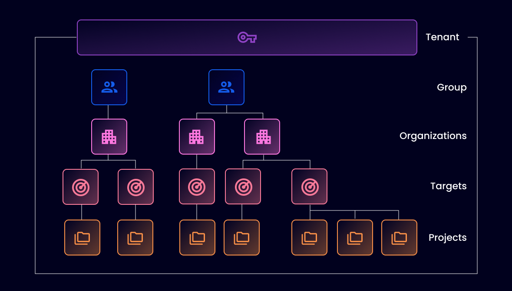

# Name your Organization

Organizations contain your scan, setup integrations, and view results.

* A Group is only available on the Enterprise plan, typically named after the company or line of business.
* An Organization on the Team plan is the topmost level and is typically named after the company or name given to that company's Organization.


The Team plan consists of one licensed Organization for your use.


The first step is to set the name of your Organization to be used by Snyk and others when referring to Snyk.

## Introduction to structure

<figure><figcaption>
Determine your Snyk account structure
</figcaption></figure>

Snyk uses a hierarchical approach to managing assets, access, and rollup reporting.

* **Snyk Tenant:** A Tenant encompasses the entire Snyk workspace of your company, team and individual users.
* **Snyk Group:** This is the top entity used to group Organizations.
*   **Snyk Organizations**: below the Group level, typically representing:

    * Line of business
    * Git Organization or team structure
    * Types of application
    * Development teams.

    In the context of Snyk Team or Free plans, you are entitled to a single Organization. The expectation is usually to use a company name, or if there are several different teams with team plans in your company, use the company name with your team name or line of business as the name. For example, "Company - Team Name"
* **Snyk Projects:** The targets you have tested/monitored with Snyk, such as a CLI scan, a container being monitored in registry, or open source files identified.

For more details, see [Manage Groups and Organizations](../../../snyk-platform-administration/groups-and-organizations/).


If you have hundreds or thousands of repositories, consider the Snyk Enterprise plan for access to additional organizations to restrict access, separate reporting, and manageable lists to interact with.

