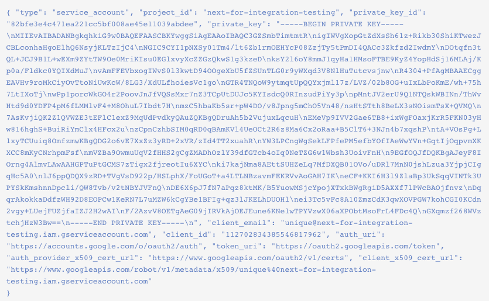

# Enable permissions to access GCR

## **Prerequisites to enabling GCR permissions**

Enable the [Cloud Resources Manager API](https://console.cloud.google.com/apis/library/cloudresourcemanager.googleapis.com?q=cloud%20resource%20manager\&id=16f5d23e-c895-4b9d-88e4-864c1766636f\&project=next-for-integration-testing) for the Google account you plan on integrating with Snyk.

From the relevant project in Google, ensure you have created a service account for this Snyk integration.

## **Steps in enabling GCR permissions**

1. Go to the Google Cloud Platform Console [Credentials](https://console.cloud.google.com/apis/credentials) page, select the Project that you want to integrate with, and then select **setting up a new service account key**.
2. From the view that opens choose the **service account** from the dropdown list that you created for this integration and configure a **new key** for that account with these values:
   * **Service account name** - assign a unique name for the account to help you remember its uses later on.
   * **Role** - Storage Object Viewer (roles/storage.objectViewer)
   * **Service account ID** - leave empty
   * **Key type** - JSON
3. Click **Create** to generate the key for your project.
4. Copy _the entire contents_ of the JSON file, which is similar to the following:

<figure><figcaption>
GCR_key_file_contents
</figcaption></figure>

Save the data you copied to paste it when [configuring integration for GCR](configure-integration-for-gcr.md).
