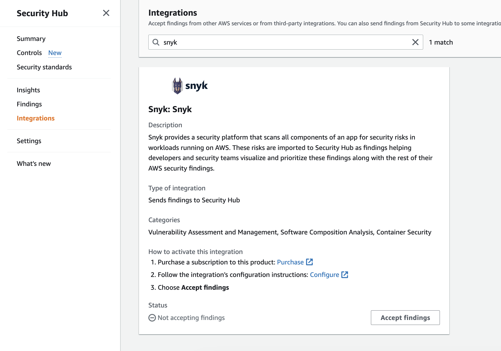
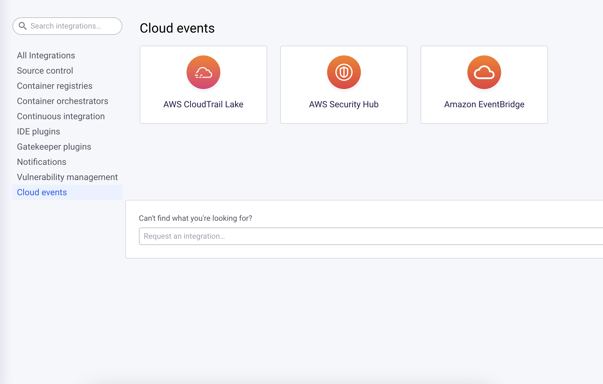
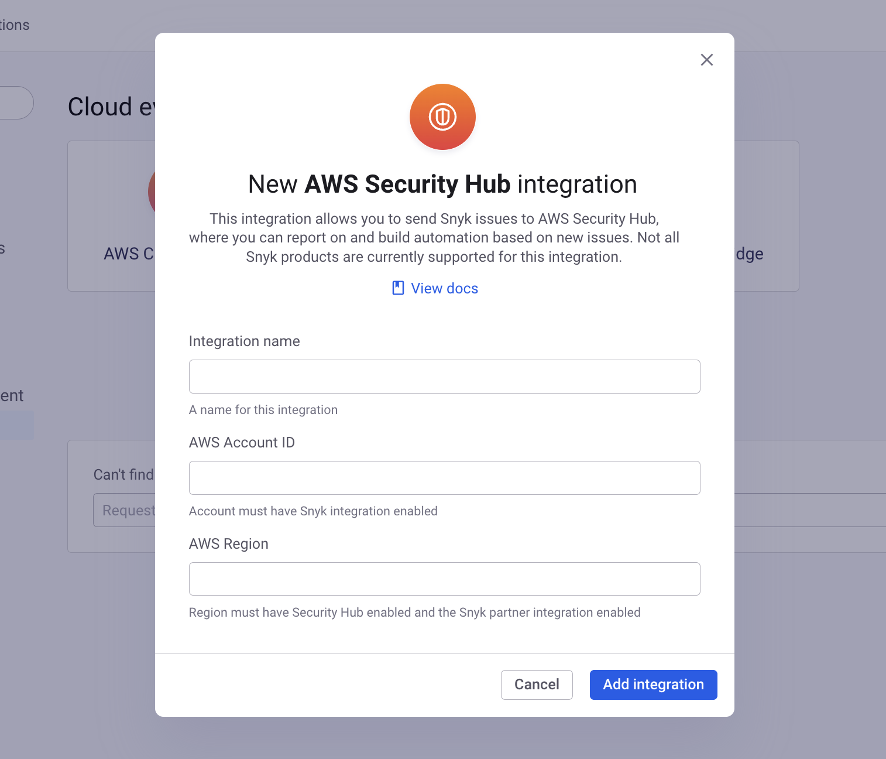
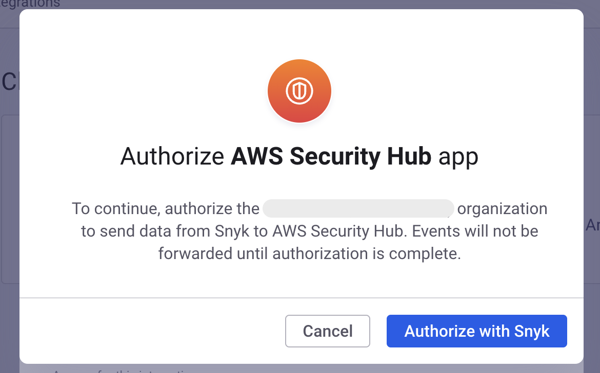
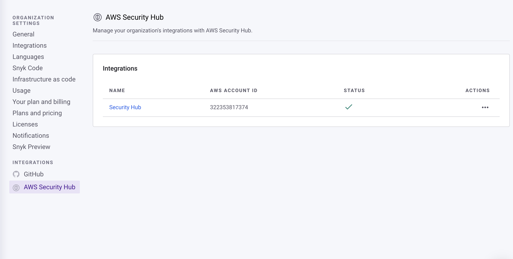
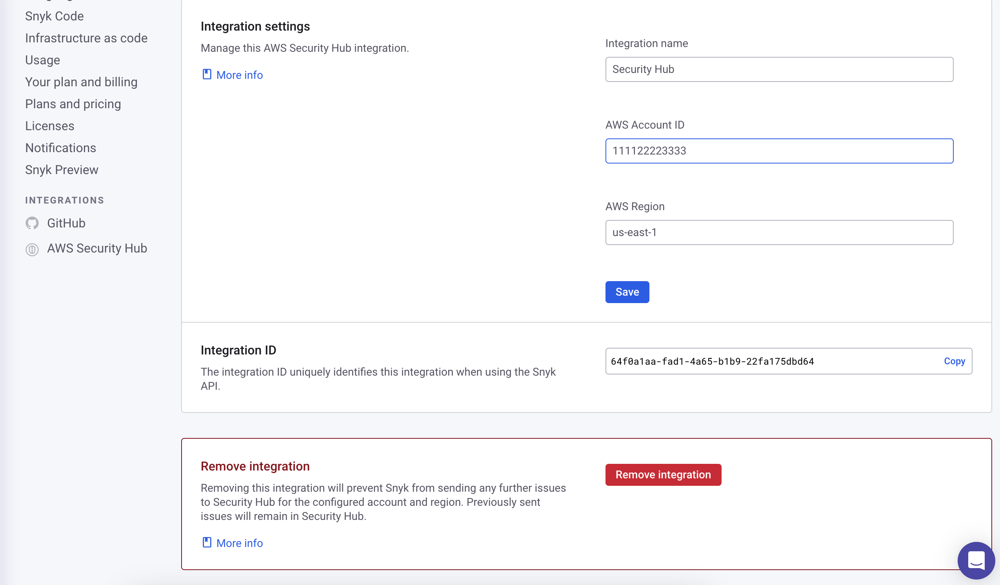

# AWS Security Hub


**Transition to Snyk Apps**

Snyk is currently transitioning event forwarding integrations to use the Snyk Apps platform. This change will enable new features and enhanced security across current and future Cloud Events integrations.&#x20;

During the transition, existing integrations will continue to function normally and customers will have the opportunity to authorize the integrations to ensure they continue working once they become Snyk Apps. You can complete authorization for existing integrations by following these steps:

1. Go to the **Settings** page for your Organization
2. Go to the settings section for the integration you want to authorize (e.g. Amazon EventBridge, AWS CloudTrail Lake, AWS Security Hub)
3. Click the **Authorize app** button and complete the App authorization flow

At the end of the transition window, **integrations which have not been authorized will no longer be able to forward events and will cease functioning.**


The [AWS Security Hub](https://aws.amazon.com/security-hub/) integration sends Snyk issues to Security Hub, allowing you to centralize your security reporting, build custom alerting, and trigger automation. Once configured, the integration will automatically upload Snyk issues to Security Hub as security findings. When issues are updated or new remediations become available, the corresponding Security Hub findings will automatically be updated.

There are two steps required to configure the integration:

1. Configure Security Hub to accept findings from Snyk in the Security Hub console.
2. Configure Snyk to send findings to Security Hub in the Snyk dashboard.

## Configuring Security Hub to accept Snyk findings

Go the the Security Hub console for the AWS account and region you want to receive Snyk findings. Navigate to the **Integrations** section and search for **Snyk**. On the **Snyk** integration tile, click **Accept findings** and follow the prompts.

<figure><figcaption></figcaption></figure>

Once this step is done, you can continue setting up the integration in the Snyk dashboard.

## Configuring Snyk to send findings to Security Hub

Navigate to [the Snyk integrations page](https://app.snyk.io/integrations) and search for **Security Hub** or navigate to the **Cloud events** section. Click on the **Security Hub** tile to start creating a new integration.

<figure><figcaption>
Create new Security Hub integration
</figcaption></figure>

Enter a **name** for the integration, along with the **AWS Account ID** and **AWS Region** where you enabled the Snyk partner integration in step one.

<figure><figcaption>
Enter integration details
</figcaption></figure>

After this step is complete, Snyk will begin sending new issue events to Security Hub.


Issues on existing Projects will not be sent to Security Hub unless those issues are updated. To backfill issues from existing projects, you can delete and re-import them.


### Snyk App Authorization

If this is the first time you have set up an AWS Security Hub integration for your organization, you will be prompted to complete the Snyk App authorization flow.

<figure><figcaption></figcaption></figure>

After completing the authorization flow you will be redirected to the settings page for the integration.&#x20;

## Managing and deleting a Security Hub integration

Go to the [Security Hub integration settings page](https://app.snyk.io/manage/integrations/aws-securityhub) in the Snyk dashboard and click on the name of the integration you want to manage.

<figure><figcaption>
Select integration to manage
</figcaption></figure>

Clicking on the name of an integration opens the settings page for that integration, where you can view and update configuration information for the integration.

To delete an integration, scroll to the bottom of the integration settings page and click the **Remove integration** button.

<figure><figcaption>
Remove integration
</figcaption></figure>

After the integration is deleted, Snyk will no longer send issues to Security Hub. Issues that have already been sent to Security Hub will remain there until they are archived.
