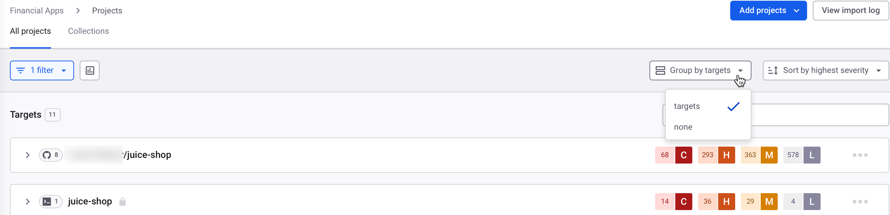
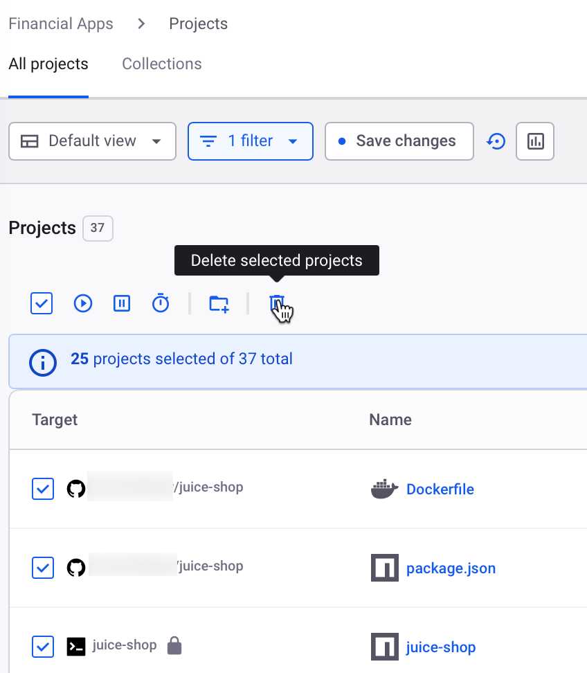
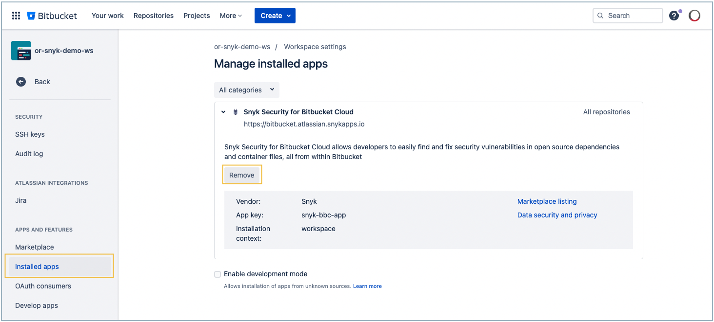

# Migrate a Bitbucket Cloud Personal Access Token


Snyk recommends using the Bitbucket Cloud App integration for smoother integration.


This topic describes how to migrate your existing [Bitbucket Cloud Personal Access Token (PAT) integration](snyk-bitbucket-cloud-integration.md), displayed in Snyk as **Bitbucket Cloud (Legacy)**, to the [**Bitbucket Cloud App**](snyk-bitbucket-cloud-app-integration.md) integration.

## Deciding which Bitbucket Cloud integration to use

In general, Snyk recommends using the new Bitbucket app integration. However, the new integration does not fit all cases. The information in this section is intended to help you decide which integration is right for you.

### Main capabilities unlocked by the new app integration

* Allows using Snyk with Bitbucket's [allowlisting IP addresses](https://support.atlassian.com/bitbucket-cloud/docs/control-access-to-your-private-content/) premium tier feature.
* Helps handle rate-limiting issues for companies who spread their repos across multiple workspaces in Bitbucket Cloud.
* Supports the first-party interface in Bitbucket Cloud (Snyk's Security tab) out-of-the-box, meaning you need not install and maintain the first-party extension app to consume Snyk's security insights from Bitbucket Cloud.

### Limitations of the new app integration

* In the new app integration, every Snyk Organization can connect to only one workspace in Bitbucket Cloud. If you want to import Projects from various workspaces in Bitbucket into the same single Organization in Snyk, use the PAT integration.
* The new app integration does not yet support Snyk Multi-Tenant EU, Snyk Multi-Tenant AUS, and Snyk Single-Tenant cloud deployments.
* For customers who are part of the custom branch closed beta, the new app integration's first-party interface in Bitbucket Cloud does not allow importing Projects from non-default branches. It is possible to import a non-default branch; you must do it from the Snyk.io import modal.

### Are there any plans for end-of-life for the Personal Access Token (PAT) integration?

No, the Personal Access Token Bitbucket Cloud integration is fully supported, and there are no plans to stop supporting it.

However, there is a first-party interface _extension_ app that serves as an extension layer to the PAT integration, allowing developers to consume Snyk's findings from within the Bitbucket interface. This extension app was developed and supported by an external contractor company. As this functionality is now an integral part of the new app integration, the extension app has now moved to no-support mode, meaning that customers who use the PAT integration alongside the first-party extension app must migrate to the new app integration to get support for the first-party interface functionality.

## Migration instructions

### Things you should know before migrating

To migrate to the new app integration, you must remove all the previously imported Projects from Snyk, delete the legacy PAT integration and its Projects, set up the new app integration, and reimport your Projects to Snyk from the new integration.


Before going through the migration process, you should note that the following Project-level information will not persist:

* Historic Project-related data, including trend numbers for fixing vulnerabilities
* Project-related metadata: ignores and tags


### Migration process

The migration process includes the following steps:

1. [Deleting the existing Projects](migrate-a-bitbucket-cloud-personal-access-token.md#1.-delete-existing-projects) that are connected to the Bitbucket Cloud PAT (Legacy) integration in Snyk.
2. [Disconnecting the Legacy integration in Snyk](migrate-a-bitbucket-cloud-personal-access-token.md#2.-disconnect-the-legacy-integration).
3. [Removing the first-party extension](migrate-a-bitbucket-cloud-personal-access-token.md#3.-remove-the-snyk-tab-for-the-legacy-integration-in-bitbucket-cloud-optional) for the Legacy integration in Bitbucket (optional)
4. [Connecting the Bitbucket Cloud App ](migrate-a-bitbucket-cloud-personal-access-token.md#set-up-the-new-bitbucket-cloud-app-integration.)and importing Projects.

#### 1. Delete existing Projects

Delete all the existing Projects in Snyk that were previously imported from the Legacy integration. To use the bulk delete action on the Projects page, change the grouping filter to **Group by none**. You can now select multiple Projects in the list individually or by selecting the checkbox at the top to **Select all visible projects**. To delete a Project, select the trash icon, **Delete selected projects**.

<figure><figcaption>
Change the Projects filter to <strong>Group by none</strong>
</figcaption></figure>

<figure><figcaption>
Bulk delete the selected Projects
</figcaption></figure>

#### 2. Disconnect the Legacy integration

To disconnect the Bitbucket Cloud (Legacy) integration, go to the settings page of Bitbucket Cloud (Legacy) integration, scroll to the relevant section, and click **Disconnect.**

<figure><figcaption>
Disconnect the Bitbucket Cloud PAT (Legacy) integration
</figcaption></figure>

#### 3. Remove the Snyk tab for the Legacy integration in Bitbucket Cloud (optional)

The Bitbucket Cloud (Legacy) has an optional first-party interface app for Bitbucket Cloud.

This app can be installed on your Bitbucket Cloud workspace to enrich the legacy integration with a first-party interface as the "_**Snyk**_" tab)

If you have used this app, before setting up the Snyk Bitbucket Cloud App in the next step, remove the Legacy interface app in Bitbucket Cloud.\
This functionality is supported out-of-the-box in the Snyk App integration.\
\
Go to your **Workspace settings** page in **Bitbucket.org > Manage installed apps**, expand the **Snyk Security for Bitbucket Cloud** app, and click **Remove.**

<figure><figcaption>
Remove the first-party Snyk Legacy interface app in Bitbucket
</figcaption></figure>

#### 4. Set up the Bitbucket Cloud App integration

See the [Bitbucket Cloud App integration](snyk-bitbucket-cloud-app-integration.md) topic for instructions.

## Migration demo

#### **Watch this Snyk Bitbucket Cloud App migration demo to see how to migrate.**

In less than five minutes, Marco Morales, a Partner Solutions Architect at Snyk, talks about the Snyk Bitbucket Cloud App and goes through the process to migrate an existing Legacy integration to the Snyk Bitbucket Cloud App.

_Go to timestamp 2:34 to jump right into the demo._


How to migrate to the new Snyk Bitbucket Cloud App integration

