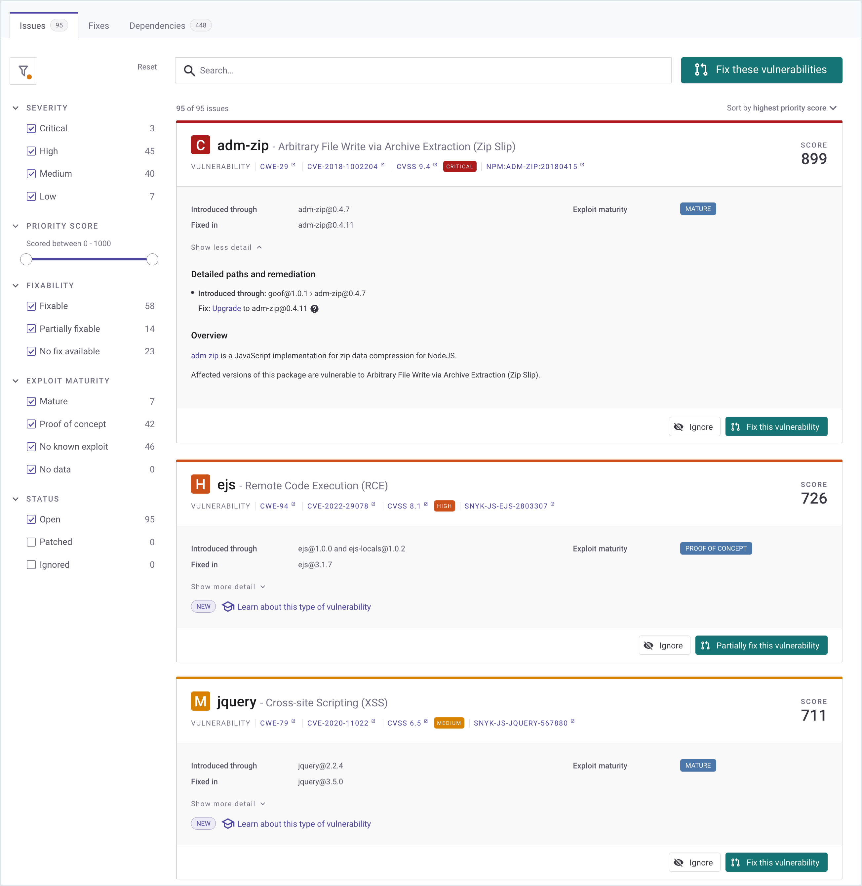
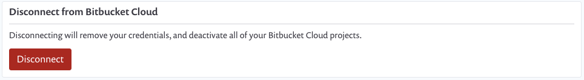

# Snyk Bitbucket Cloud integration


**Feature availability**\
This feature is available for all plans. See [pricing plans](https://snyk.io/plans/) for more details.

Snyk recommends installing or [migrating](migrate-a-bitbucket-cloud-personal-access-token.md) to the [Bitbucket Cloud Application](snyk-bitbucket-cloud-app-integration.md) for smoother integration and to ensure long-term support.


The Snyk Bitbucket Cloud (PAT) integration lets you:

* Continuously perform security scanning across all the integrated repositories
* Detect vulnerabilities in your open-source components
* Provide automated fixes and upgrades

## How to set up the Snyk Bitbucket Cloud Integration


Admin permissions are required; however, Snyk's access is ultimately limited by the [permissions assigned to the App Password](https://support.atlassian.com/bitbucket-cloud/docs/app-passwords/).


1. To give Snyk access to your Bitbucket account, set up a dedicated service account in Bitbucket with admin permissions. See the [Bitbucket documentation ](https://support.atlassian.com/bitbucket-cloud/docs/grant-access-to-a-workspace/)to learn more about adding users to a workspace.\
   The newly created user must have **Admin** permissions to all the repositories you need to monitor with Snyk.
2. In Snyk, go to the **Integrations** page, open the **Bitbucket Cloud** card, and configure the **Account credentials**.
3. In the **Account credentials >** **Creating an app password** section in Snyk, use the link  (**Create an App password**) to jump to your Bitbucket Cloud account.
4.  Follow the Bitbucket procedure to set up an account with the following permissions:

    * **Account: Email & Read**
    * **Workspace membership: Read**
    * **Projects: Read**
    * **Repositories: Read & Write**
    * **Pull requests: Read & Write**
    * **Webhooks: Read & Write**

    See the [Bitbucket documentation](https://confluence.atlassian.com/bitbucket/app-passwords-828781300.html) for more details about the procedure.
5. Enter the username and the [App Password for the Bitbucket account](https://support.atlassian.com/bitbucket-cloud/docs/app-passwords/) you created and **Save** your changes.\
   You can find your username under the Bitbucket **Personal settings.**\
   Snyk connects to your Bitbucket Cloud account. When the connection succeeds, the following confirmation appears:\
   \
   

## How to add Bitbucket repositories to Snyk

After you connect Snyk to your Bitbucket Cloud account, you can select repositories for Snyk to monitor.

1. In Snyk, go to **Integrations** > **Bitbucket Cloud** card, and click **Add your Bitbucket Cloud repositories to Snyk** to start importing repositories to Snyk.
2. Choose the repositories you want to import to Snyk and click **Add selected repositories**.

After you add the selected repositories, Snyk scans them for dependency files in the entire directory tree, that is, `package.json`, `pom.xml`, and so on, and imports them to Snyk as Projects.

The imported projects appear on your **Projects** page and are continuously checked for vulnerabilities.

<figure><figcaption>
The Imported projects on your <strong>Projects</strong> page
</figcaption></figure>

## Bitbucket integration features

After the integration is in place, you will be able to use capabilities such as:

* [Project-level security reports](snyk-bitbucket-cloud-integration.md#project-level-security-reports)
* [Project monitoring and automatic fix pull requests](snyk-bitbucket-cloud-integration.md#project-monitoring-and-automatic-fix-pull-requests)
* [Pull request testing](snyk-bitbucket-cloud-integration.md#pull-request-tests)

### Project-level security reports

Snyk produces advanced [security reports](https://docs.snyk.io/features/reports/reports-overview) that let you explore the vulnerabilities found in your repositories and fix them immediately by opening a fix pull request directly to your repository, with the required upgrades or patches.

The example that follows shows a Project-level security report.

<figure><figcaption>
An example of a Project-level security report
</figcaption></figure>

### Project monitoring and automatic fix Pull Requests

Snyk scans your Projects on either a daily or a weekly basis. When new vulnerabilities are found, Snyk notifies you by email and by opening [automated pull requests](../../scan-using-snyk/snyk-open-source/open-source-basics/fix-pull-requests-for-new-vulnerabilities.md) with fixes for your repositories.

The example that follows shows a fix Pull Request opened by Snyk.

<figure><figcaption>
Example of an automatic fix Pull Request opened by Snyk
</figcaption></figure>

To review and adjust the automatic fix pull request settings:

1. In Snyk, go to  (Organization settings) > **Integrations > Source control > Bitbucket Cloud**, and click **Edit Settings**.
2. Scroll to the **Automatic fix PRs** section and configure the relevant options.

<figure><figcaption>
Configure Automatic fix PRs
</figcaption></figure>


Unlike manual pull requests opened from the Bitbucket interface, Snyk pull requests are _not_ automatically assigned to the default reviewer set in your Bitbucket Cloud account.

For more information, see [Snyk automated pull requests](../../scan-using-snyk/snyk-open-source/open-source-basics/fix-pull-requests-for-new-vulnerabilities.md).


### Pull request tests

Snyk tests any newly-created pull request in your repositories for security vulnerabilities and sends a build check to Bitbucket Cloud. You can see directly from Bitbucket Cloud whether or not the pull request introduces new security issues.

The example that follows shows a Snyk pull request build check on the Bitbucket Cloud **Pull Request** page.

<figure><figcaption>
Example of a Snyk pull request build check on the Bitbucket Cloud <strong>Pull Request</strong> page
</figcaption></figure>

To review and adjust the pull request tests settings:

1. In Snyk, go to  (Organization settings) > **Integrations > Source control > Bitbucket Cloud**, and click **Edit Settings**.
2. Scroll to **Default Snyk test for pull requests > Open Source Security & Licenses**, and configure the relevant options.

<figure><figcaption>
Configuring the options for pull request Open Source Security &#x26; Licenses
</figcaption></figure>

## Required permissions scope for the Bitbucket Cloud integration

All the operations, whether triggered manually or automatically, are performed for a Bitbucket Cloud [service account](https://docs.snyk.io/features/user-and-group-management/managing-groups-and-organizations/service-accounts) that has its token (App Password) configured in the **Integration settings**.

The table that follows shows the required access scopes for the configured token.

| Action                                                 | Purpose                                                                                                                                                                                                                                             | Required permissions in Bitbucket                                                                                                     |
| ------------------------------------------------------ | --------------------------------------------------------------------------------------------------------------------------------------------------------------------------------------------------------------------------------------------------- | ------------------------------------------------------------------------------------------------------------------------------------- |
| Daily / weekly tests                                   | Used to read manifest files in private repos                                                                                                                                                                                                        | Repositories: **Read**                                                                                                                |
| Manual fix pull requests (triggered by the user)       | Used to create fix PRs in the monitored repos                                                                                                                                                                                                       | 
Repositories: <strong>Read</strong>, <strong>Write</strong>

Pull requests: <strong>Read</strong>, <strong>Write</strong>
 |
| Automatic fix and upgrade pull requests                | Used to create fix / upgrade PRs in the monitored repos                                                                                                                                                                                             | Repositories: **Read**, **Write** Pull requests: **Read**, **Write**                                                                  |
| Snyk tests on pull requests                            | Used to send pull request status checks whenever a new PR is created or an existing PR is updated                                                                                                                                                   | Repositories: **Read**, **Write** Pull requests: **Read**, **Write**                                                                  |
| Importing new projects to Snyk                         | Used to present a list of all the available repos in the Bitbucket instance in the "Add Projects" screen (import popup)                                                                                                                             | 
Account: <strong>Read</strong>

Workspace membership: <strong>Read</strong>

Projects: <strong>Read</strong>
         |
| Snyk tests on pull requests: **initial configuration** | 
Used to add SCM webhooks to the imported repos. Snyk uses these webhooks to:
<ul><li>Track the state of Snyk pull requests when PRs are created, updated triggered, merged, and so on</li><li>Send push events to trigger PR checks</li></ul> | Webhooks: **Read**, **Write**                                                                                                         |

## Required permissions scope for repositories 

For Snyk to perform the required operations on monitored repositories, such as reading manifest files on a frequent basis and opening fix or upgrade PRs, the integrated Bitbucket Cloud service account needs **Admin** permissions on the imported repositories.

| Action                                                  | Purpose                                                                                                                                                                                                                                                | Permissions required on repo |
| ------------------------------------------------------- | ------------------------------------------------------------------------------------------------------------------------------------------------------------------------------------------------------------------------------------------------------ | ---------------------------- |
| Daily / weekly tests                                    | Used to read manifest files in private repositories.                                                                                                                                                                                                   | **Write** or above           |
| Snyk tests on pull requests                             | Used to send pull request status checks when a new PR is created or an existing PR is updated.                                                                                                                                                         | **Write** or above           |
| Opening fix and upgrade pull requests                   | Used to create fix PRs in monitored repositories.                                                                                                                                                                                                      | **Write** or above           |
| Snyk tests on pull requests - **initial configuration** | 
Used to add SCM webhooks to the imported repos. Snyk uses these webhooks to:
<ul><li>Track the state of Snyk pull requests when PRs are created, updated, triggered, merged, and so on.</li><li>Send push events to trigger PR checks.</li></ul> | **Admin**                    |

## How to disconnect Snyk from Bitbucket Cloud


When you disconnect Snyk from your repository Projects, your credentials are removed from Snyk, and any integration-specific Projects that Snyk is monitoring are deactivated in Snyk.\
If you choose to re-enable this integration, you must re-enter your credentials and activate your Projects.


To disconnect this integration, in  (Organization settings)> **Integrations:**

1. In your list of integrations, select the Bitbucket integration you want to deactivate and click **Edit settings** to open a page with the current status of your integration.\
   \
   The page includes sections that are specific to each integration, where you can manage your credentials, API key, Service Principal, or connection details.
2. Scroll to the relevant section and click **Disconnect.**

<figure><figcaption>
Disconnect button at the bottom left of the Disconnect from Bitbucket Cloud section
</figcaption></figure>
