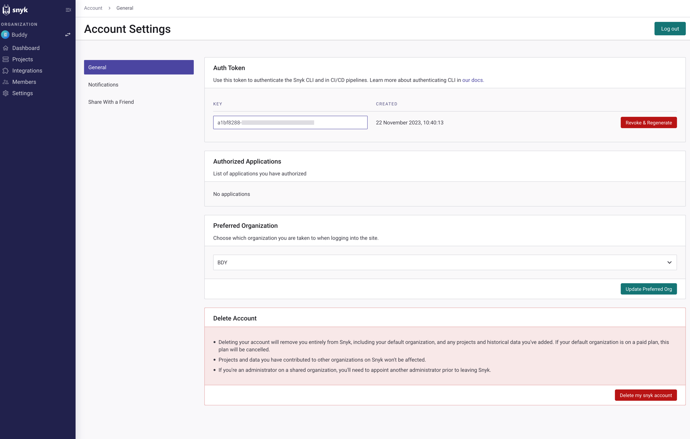
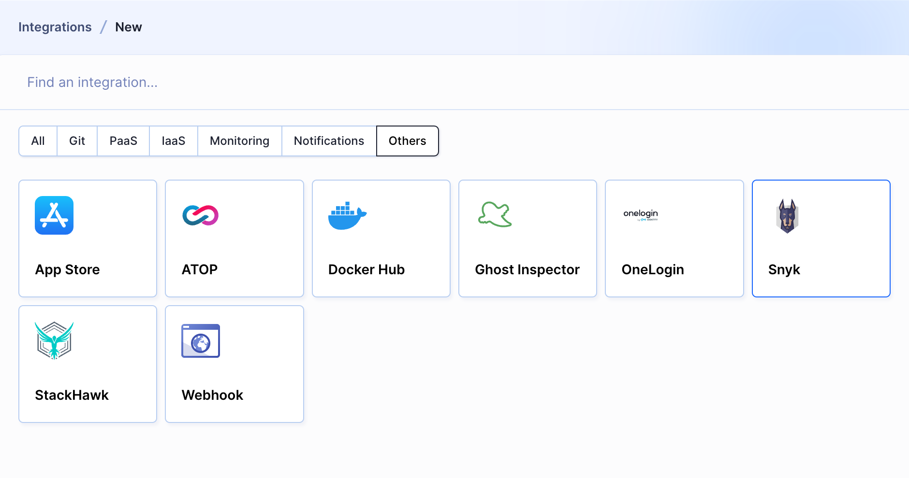
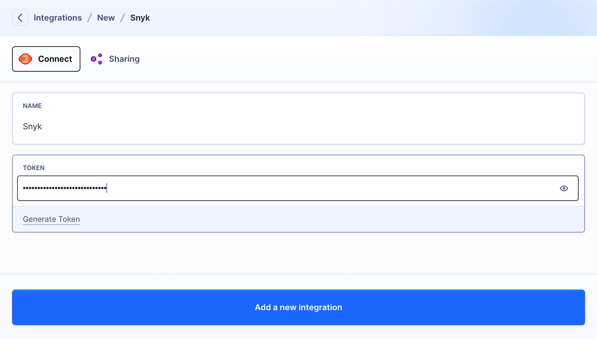
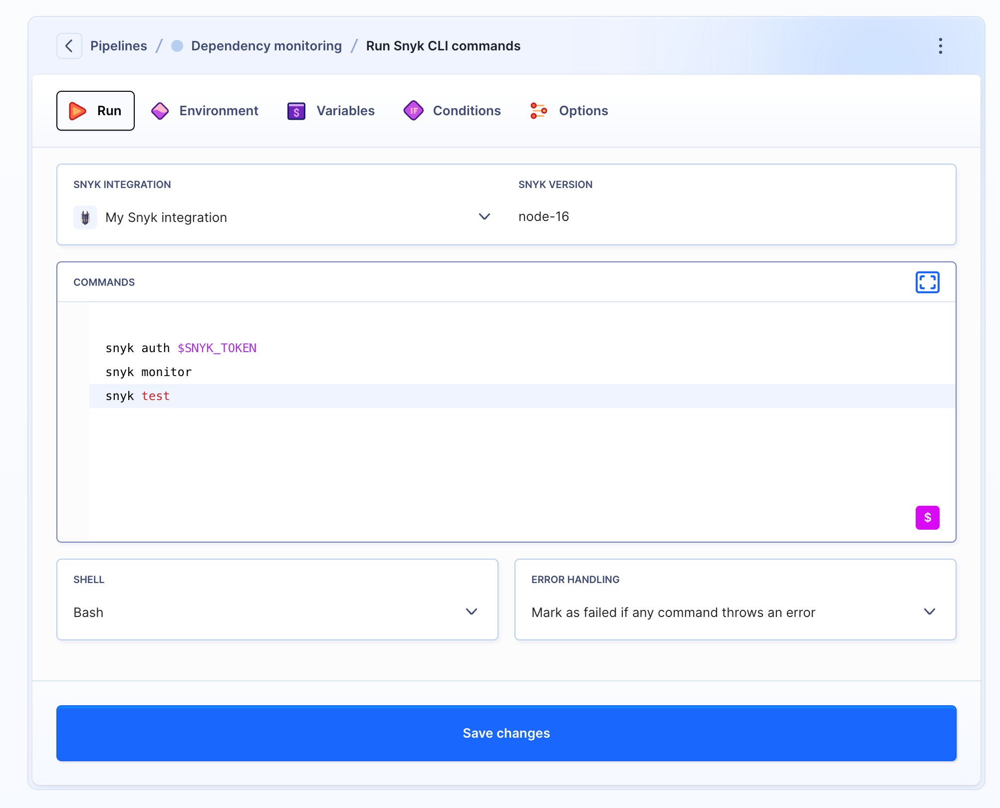
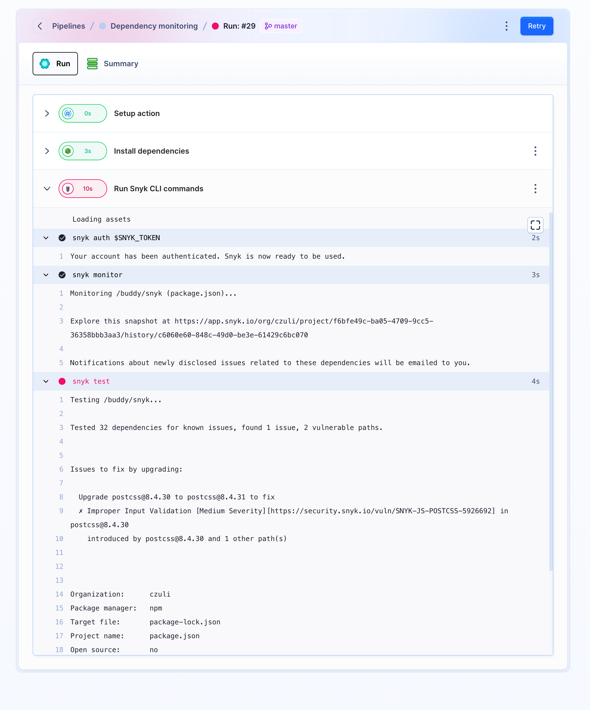

# Snyk Buddy integration

The Snyk Buddy integration allows you to stay ahead of security concerns by helping you find and fix vulnerabilities in your app’s project dependencies.

The integration lets you:

* scan your project's dependencies and check for any known vulnerabilities
* continuously monitor your project dependencies and send alerts if any security issues or vulnerabilities are discovered
* maintain high code quality and security
* receive detailed security reports that highlight the vulnerabilities found in your dependencies

## How to set up a Buddy integration

1.Go to the [Account Settings](https://app.snyk.io/account) in Snyk, open the **General** tab, and copy the key displayed there:

<figure><figcaption>
Buddy settings page displaying a Snyk Auth Token section
</figcaption></figure>

2.Open your [Buddy workspace](https://app.buddy.works/login) and head to the **Integrations** tab. Click **New integration** and look up **Snyk**:

<figure><figcaption>
Buddy integrations page highlighting Snyk among other service options
</figcaption></figure>

3.When the configuration window shows up, provide the integration name and paste the previously copied **Key** in the **Token** field. Next, click **Add a new integration** to finish configuration:

<figure><figcaption>
Buddy Snyk integration setup with token input field
</figcaption></figure>

Once the integration is configured, you can add the **Snyk** action to your pipeline in Buddy to ensure that the security of your application is continuously monitored:

<figure><figcaption>
Buddy pipeline configuration interface featuring Snyk CLI commands step
</figcaption></figure>

The default command in the action is ``snyk test``,which can be easily expanded with other [Snyk CLI commands](https://docs.snyk.io/snyk-cli/cli-commands-and-options-summary):

<figure><figcaption>
Buddy pipeline setup showing the Snyk command input area
</figcaption></figure>

You can view scan results in the pipeline logs. The commands are color-coded for easier issue identification:

<figure><figcaption>
Log output from a Buddy pipeline execution with Snyk vulnerability test results
</figcaption></figure>
