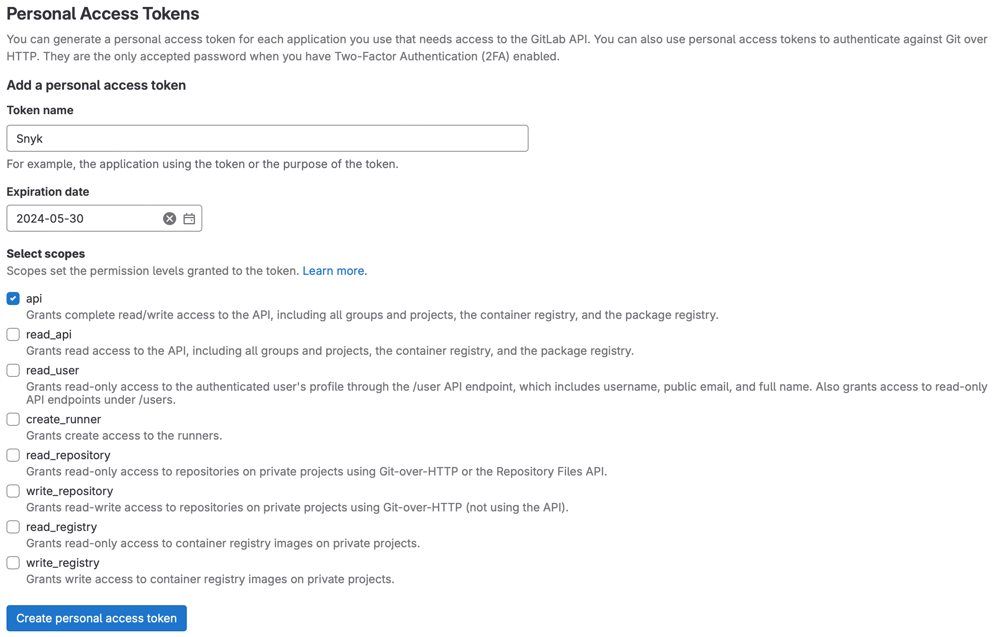
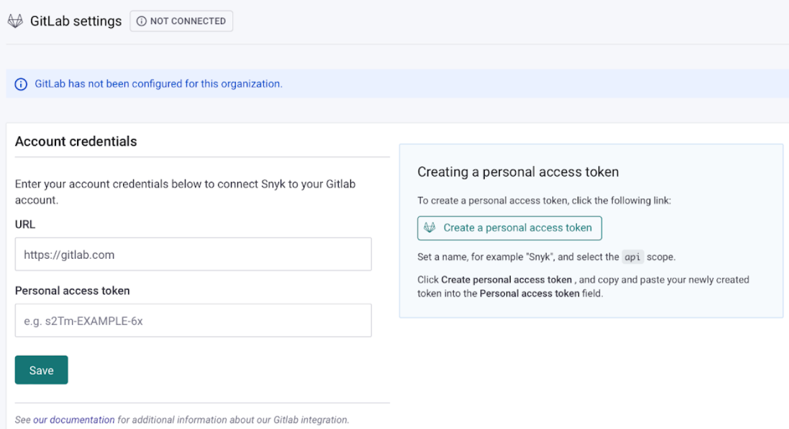
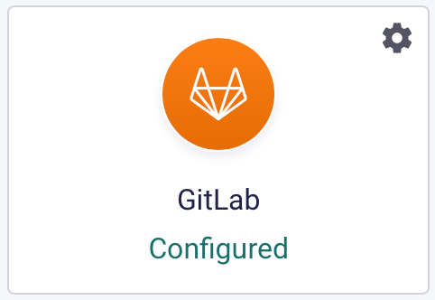
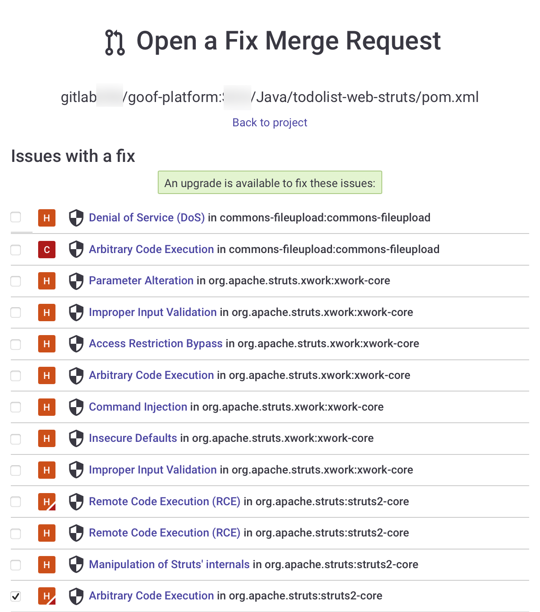
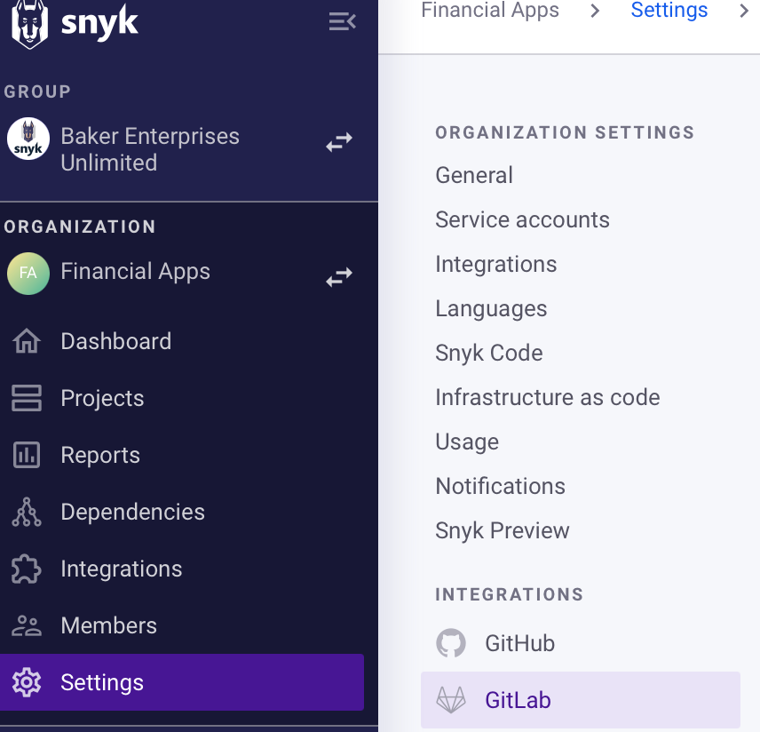

# Snyk GitLab integration


&#x20;**Feature availability**\
The Snyk GitLab integration is available for [Snyk Enterprise plan](https://snyk.io/plans/) customers. [Snyk Broker](../../getting-started-with-the-snyk-enterprise-plan/snyk-broker/) is required if you integrate from a private network.


## Prerequisites for Snyk GitLab integration

* GitLab versions 9.5 and above (API v4).
* A public or private GitLab group or project.

## Snyk GitLab integration features

The Snyk GitLab integration allows you to:

1. Check for vulnerabilities in your pull requests.&#x20;
2. From the **Report** page or the **Project** page on the Snyk Web UI, [trigger a Snyk pull request](snyk-gitlab-integration.md#fix-vulnerabilities-with-snyk-merge-requests) for the fixes listed.
3. Receive [email alerts](snyk-gitlab-integration.md#receive-email-alerts-for-new-vulnerabilities) when new vulnerabilities that affect your repository arise and fixes for those vulnerabilities are shown.
4. Receive [email alerts](snyk-gitlab-integration.md#receive-email-alerts-for-new-upgrades-or-patches) containing a new pull request if a new upgrade or patch is available for a vulnerability.

## GitLab access tokens

To set up the GitLab integration with Snyk, create a GitLab access token and enter this into the Snyk application.&#x20;

Typically, the first user in a Snyk Organization, a [Snyk admin](broken-reference) and GitLab Owner or Maintainer, sets up an integration with a **GitLab Personal Access Token** or **Group Access Token.** This token is then authenticated with GitLab, enabling access by Snyk to the repositories in that GitLab account.

* A **GitLab Personal Access Token** is used to perform actions on and manage personal GitLab projects individually. These differ from Group Access Tokens as they are attached to a user rather than a GitLab group.
* A **GitLab Group Access Token** is used to perform actions for and manage more than one GitLab project within a GitLab group. The Group Access Token also grants access to all GitLab projects in a GitLab group or subgroup without contributing to GitLab's licensed user count.

To trigger the creation of fix pull requests manually, all users in a Snyk Organization can add and work with any related Snyk Projects, while the merge requests themselves will appear in GitLab as having been opened by the Snyk admin who set up the configuration.


Group Access Tokens can only be created by a GitLab Owner using a GitLab Premium or Ultimate [account tier](https://about.gitlab.com/pricing/). This can be done in [GitLab's web UI](https://docs.gitlab.com/ee/user/group/settings/group\_access\_tokens.html), their Rails console, or through the GitLab API.


## How to set up the Snyk GitLab integration

### Add a GitLab Personal Access Token in GitLab

1.  Generate a GitLab Personal Access Token in a GitLab instance.\
    Select the profile icon, then **Edit Profile > Access Tokens**.\
    Set the token name, for example, Snyk, and select the **api** scope.\

    <figure><figcaption>
Create a GitLab Personal Access Token with the api scope.
</figcaption></figure>
2.  Navigate to the Snyk [**Integrations**](https://app.snyk.io/integrations) page, select the GitLab integration tile, and enter the URL of the GitLab instance and the token you generated.\

    <figure><figcaption>
Add the URL of your GitLab instance and the generated Personal access token.
</figcaption></figure>
3. Click **Save**.
4.  When the tile on the **Integrations** page indicates the integration is **Configured**, click the tile and select the GitLab projects to test or select **Add projects** from the **Snyk** **Dashboard**.\

    

    <figure><figcaption>
The Snyk GitLab integration tile shows as Configured.
</figcaption></figure>

    

### Add a GitLab Group Access Token

Generating a GitLab Group Access Token requires selecting the Maintainer role for access.

Selecting the **api** scope with a **Maintainer** role allows Snyk to authenticate user accounts and create webhooks, enabling the following:

* Automation of fix pull requests and Snyk tests on your pull requests.
* Manual creation of fix pull requests.
* Manual creation of re-trigger tests.

#### Create a GitLab Group Access Token

1. Locate the GitLab Group and select **Settings** > **Access Tokens**.
2. Enter a descriptive token name such as `SnykToken`, select the **Maintainer** role, and check the **api** scope**.**

<figure><figcaption>
Generate a GitLab group access token
</figcaption></figure>

#### Add a GitLab Group Access Token to Snyk

1. Copy the token generated from GitLab.
2. Navigate to the Snyk GitLab integration page by selecting the tile.
3.  Paste the GitLab Group Access Token into the Snyk application field the same way you would add a GitLab Personal Access Token.\

    <figure><figcaption>
Enter your GitLab Group Access Token into the Snyk application Personal access token field.
</figcaption></figure>

## **Uses of the Snyk GitLab integration**

### **Fix vulnerabilities with Snyk merge requests**

When viewing a Snyk test report for a Snyk Project that you own or when looking at a GitLab Project that you are watching with Snyk, you see two options for fixing a vulnerability:

* **Fix these vulnerabilities:** generate a Snyk merge request with the minimal changes needed to fix all the Snyk Project's detected vulnerabilities.&#x20;
* **Fix this vulnerability:** generate a Snyk merge request on an individual issue that fixes the vulnerability.

You can review the vulnerabilities that will be fixed, change your selection with the checkboxes, and choose to ignore any vulnerabilities that cannot be fixed now before opening the merge request on the **Open a Fix Merge Request** page.

<figure><figcaption>
Open a Fix Merge Request for an individual vulnerability
</figcaption></figure>


**GitLab webhooks** send out an event to Snyk when merge requests occur. This starts a series of other events, such as pulling GitLab project files, running the test process, and posting the results to GitLab, all of which occur on the Snyk side.


### Receive email alerts for new vulnerabilities

When a new vulnerability is detected on a Snyk Project you are watching, Snyk will send you an email with a generated Snyk merge request to address the vulnerability.

### Receive email alerts for new upgrades or patches

You may find yourself in a situation where no upgrade is found for a vulnerability, and only a patch is available. When a fix does become available, Snyk notifies you by email and generates a merge request containing the new fix.


Patching is only available on Node.js Projects.


## How to disconnect the Snyk GitLab integration


Disconnecting the Snyk GitLab integration removes all Snyk webhooks, along with the Snyk credentials, and deactivates the GitLab Projects in the Snyk Web UI.

The Projects will be set to inactive, and you will no longer get alerts, pull requests, or Snyk tests on your pull requests.


1.  Navigate to the Snyk GitLab integration **Settings**.\

    <figure><figcaption>
Navigate to the Snyk GitLab integration Settings
</figcaption></figure>
2.  At the bottom of the page, select **Remove GitLab**.\

    <figure><figcaption>
Remove GitLab from your configured Snyk integrations
</figcaption></figure>
3.  A confirmation screen opens. To proceed, select **Disconnect GitLab**.\

    <figure><figcaption>
Confirm disconnecting from GitLab
</figcaption></figure>

After GitLab is disconnected, Snyk Projects imported from GitLab will be set to inactive, and you will no longer get alerts, pull requests, or Snyk tests on pull requests. The webhook that enables the integration for this repository will be removed.

You can re-connect anytime; however, re-initiating GitLab projects for monitoring requires setting up the integration again.

## Snyk GitLab Troubleshooting

### Error message: Could not connect to GitLab

When you are adding the environment URL and access token to set up the integration, the following message may appear:

<figure><figcaption>
Could not connect to GitLab integration error message
</figcaption></figure>

This is a permissions issue unless [Snyk Broker](https://support.snyk.io/hc/en-us/articles/360005105598-Gitlab-Broker-is-not-working) is involved. In the PAT settings in GitLab, ensure you have selected the api scope and the **Maintainer** role.
