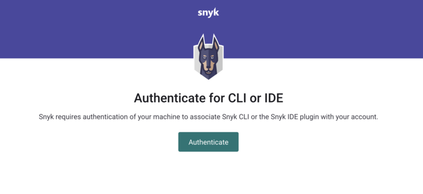
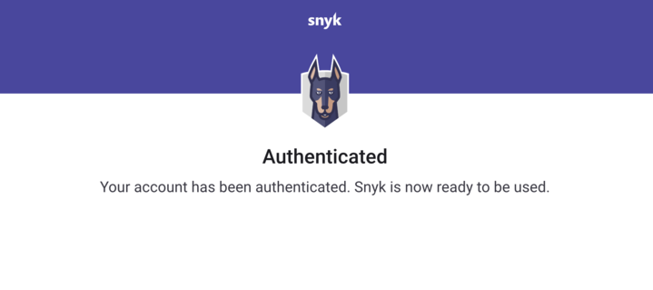
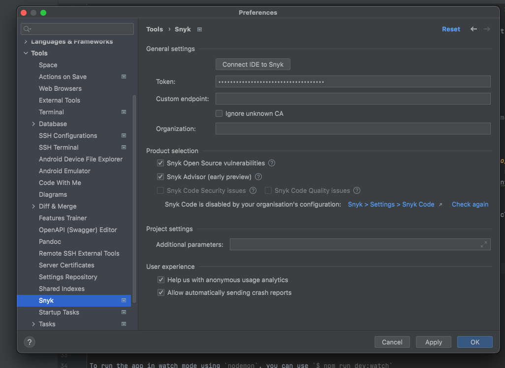
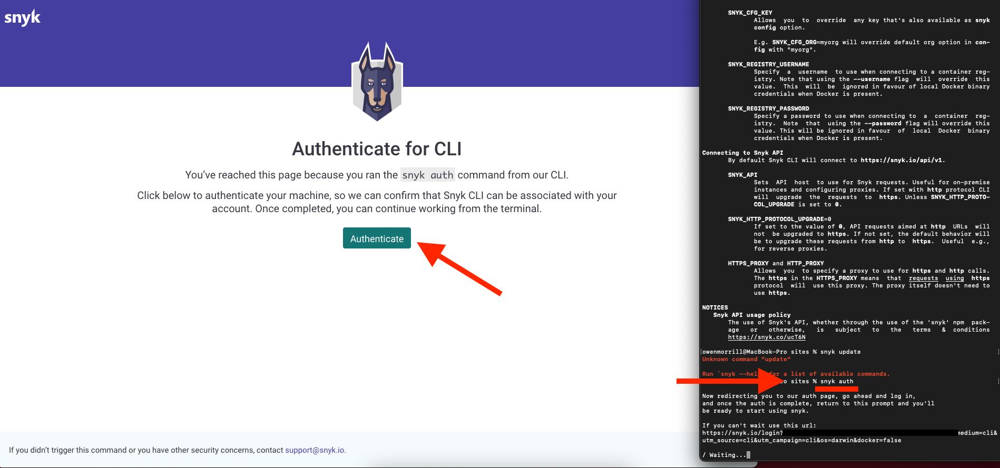

# Authentication for the JetBrains plugins

The first time you start a scan, the plugin automatically downloads the CLI in the background unless you have opted not to download automatically. To use the plugin you must authenticate. There are several ways to authenticate once the plugin is installed.

## Automatic authentication

After the CLI is installed, you are prompted to authenticate and connect the JetBrains plugin to Snyk.

Click **Test code now**. The plugin relies on the Snyk CLI, which authenticates your machine against the Snyk Web UI.

Click **Authenticate** when prompted by Snyk. If you must enter your token, use your personal token. For more information, see [How to obtain and authenticate with your Snyk API token](../../../getting-started/how-to-obtain-and-authenticate-with-your-snyk-api-token.md).

<figure><figcaption>
Authenticate
</figcaption></figure>

When authentication is complete, a confirmation message appears.

<figure><figcaption>
Authenticated
</figcaption></figure>

The IDE reads and saves the authentication on your local machine.

You can now close the browser window and return to the IDE.

The analysis starts automatically:

## Add token manually

1. Get your API token from your Snyk account: [https://app.snyk.io/account](https://app.snyk.io/account)
2. In the JetBrains plugin navigate to **Preferences** > **Tools** > **Snyk**.
3. Paste or enter the token under **Connect IDE to Snyk**.
4. Click **Apply** or **OK**.

## Manual authentication

If you are unable to authenticate automatically or by adding the token, run `snyk auth` from the command line and follow the preceding steps to respond to the prompts. If you need help, submit a request to [Snyk support](https://snyk.zendesk.com/agent/dashboard).

##
