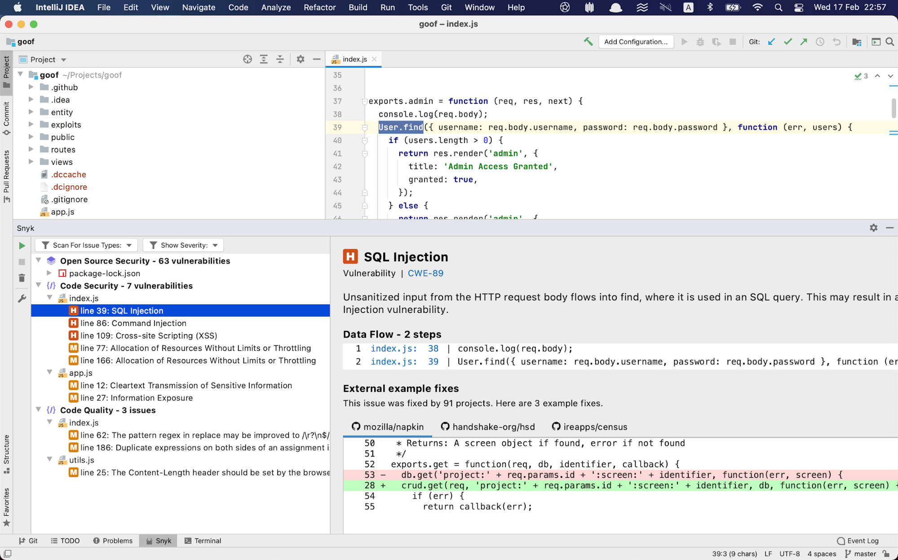

# JetBrains analysis results: Snyk Code

Snyk Code analysis shows a list of security vulnerabilities and code issues found in your application code. For more details and examples of fixes others used to fix the issue, select the security vulnerability or the code security issue:

##
