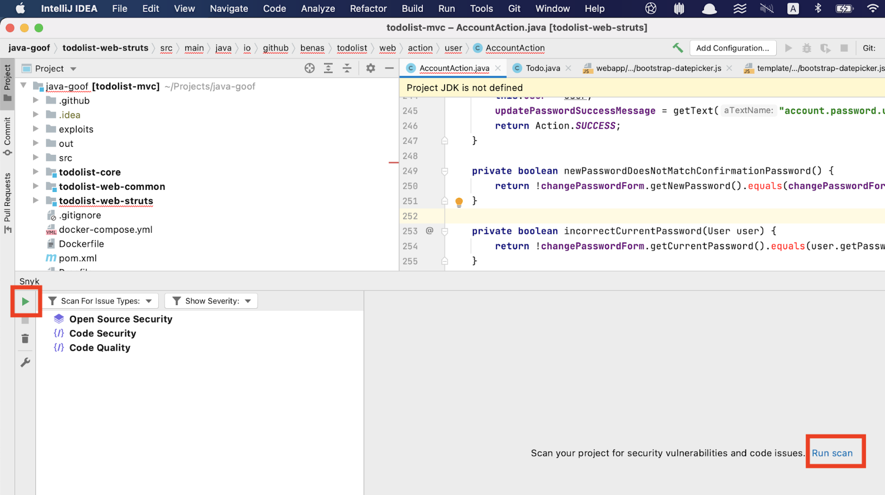

# Run an analysis with the JetBrains plugins


Make sure your project file, for example, requirements.txt, is saved before running an analysis.


To trigger an analysis during your daily coding workflow, click either the run (play) button, or **Run scan**.

Continue by looking at the results:

* [JetBrains analysis results: Open Source](https://docs.snyk.io/ide-tools/jetbrains-plugins/jetbrains-analysis-results-snyk-open-source)
* [JetBrains analysis results: Snyk Code](https://docs.snyk.io/ide-tools/jetbrains-plugins/jetbrains-analysis-results-snyk-code)
* [JetBrains analysis results: Snyk IaC Configuration](https://docs.snyk.io/ide-tools/jetbrains-plugins/jetbrains-analysis-results-snyk-iac-configuration)
* [JetBrains analysis results: Snyk Container](https://docs.snyk.io/ide-tools/jetbrains-plugins/jetbrains-analysis-results-snyk-container)
* [How Snyk Container and Kubernetes JetBrains integration works](https://docs.snyk.io/ide-tools/jetbrains-plugins/how-snyk-container-and-kubernetes-jetbrains-integration-works)

You can also [filter JetBrains results](https://docs.snyk.io/ide-tools/jetbrains-plugins/filter-jetbrains-results).
