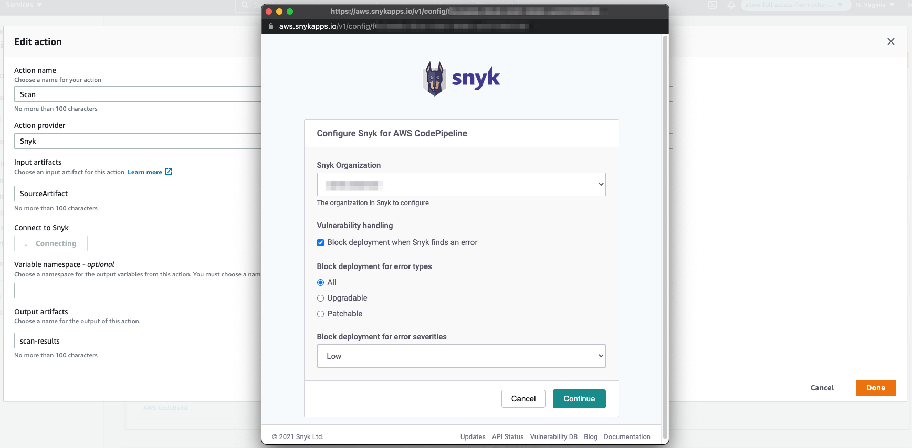

# AWS CodePipeline integration

Snyk integrates seamlessly with AWS CodePipeline to scan your application for open source security vulnerabilities and help you deliver secure applications via continuous delivery service. This integration allows CodePipeline users to make security an automated part of their build, test, and deploy phases.

We currently offer scanning for Node, Ruby Gems, Composer and Pip.


This integration is currently available in AWS’s us-east-1 region, but we are working on expanding to additional regions soon after release


### Setup

You can initiate Snyk’s AWS CodePipeline integration directly from the AWS CodePipeline console.  
Add Snyk to a new or existing pipeline using the following steps.

#### Step 1: Add stage

At any point after the Source stage, you can add a Snyk scan stage, allowing you to test your application at different stages of the CI/CD pipeline.

Click **Edit**, and **add a scan stage**.

#### Step 2: Add action group

Click **Add an Action Group** to open the **Edit Action** window:

Name the action, then select **Snyk** as the **Action Provider**.

Click **Connect with Snyk** to begin the connection process.

#### Step 3: Connect to Snyk

Select how you would like to authenticate with Snyk to give AWS CodePipeline permission to begin scanning your open source code.

#### Step 4: Configure settings

The following options are available for configuration:

1. **Snyk Organization:** Select the Snyk organization where findings reports are saved.
2. **Vulnerability handling**: Select to fail a pipeline if a vulnerability is found. If Fail on issues is selected, the pipeline will fail depending on the sub-options selected. The sub options available are:
   1. **All**: Selecting all fails when there is at least one vulnerability that can be either upgraded or patched.
   2. **Upgradable**: Selecting upgradable fails when there is at least one vulnerability that can be upgraded.
   3. **Patchable**: Selecting patchable fails when there is at least one vulnerability that can be patched.
3. **Block deployment for vulnerabilities of type**
4. **Block deployment for vulnerabilities with a minimum severity of**: \(**low**\|**medium**\|**high**\|**critical**\) Only report vulnerabilities of provided level or higher.


You can change the Configuration settings of a previously-configured stage, by clicking on the **Snyk** link.


Confirm the connection to Snyk when prompted.

Save the pipeline after successfully connecting to Snyk.

This configures your Snyk stage in the CodePipeline, so you can test your application. Users should release the latest changes through the CodePipeline options for the latest changes to take effect.

### View scan results

You can view scan results in the AWS CodePipeline console, by clicking **Details** in the Scan stage:

Click **Link to execution details** to view your detailed vulnerability report.

### Test report details

Snyk analyzes the application’s manifest file and correlates the list of dependencies with Snyk’s vulnerability database. Snyk provides [detailed reports](https://support.snyk.io/hc/en-us/categories/360000598418-Reports-and-remediation) for your open source code. By analyzing the application’s manifest file, Snyk builds a full dependency tree, accurately identifying both direct and transitive dependencies \(transitives account for 78% of the vulnerabilities detected by Snyk\). This enables Snyk to show exactly how a vulnerability was introduced into the application.


Reports are stored for 14 days before they expire. Subsequent pipeline runs will update the report and reset the retention period.


