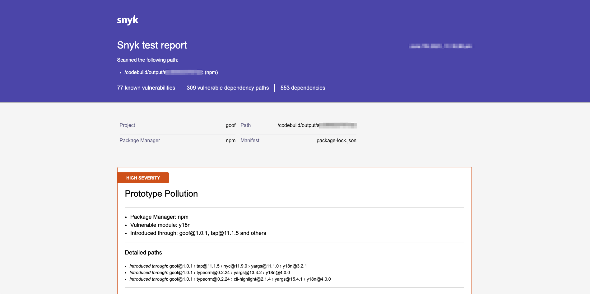

# AWS CodePipeline test report details

Snyk analyzes the manifest file of the application and correlates the list of dependencies with the Snyk vulnerability database. [Snyk provides detailed reports for your open source code](../../../manage-risk/reporting/legacy-reports/legacy-reports-overview.md). By analyzing the manifest file, Snyk builds a full dependency tree, accurately identifying both direct and transitive dependencies (transitive dependencies account for 78% of the vulnerabilities detected by Snyk). This enables Snyk to show exactly how a vulnerability was introduced into the application.


Reports are stored for 14 days before they expire. Subsequent pipeline runs update the report and reset the retention period.

