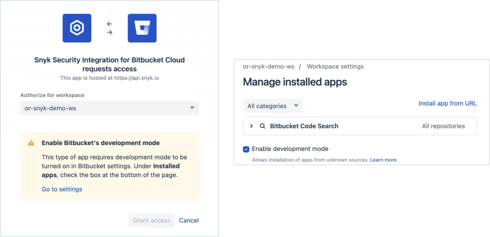

# Bitbucket Cloud application


Support for the Bitbucket Cloud (Legacy) PAT integration will continue for Snyk users who configured it before September 2022.&#x20;


Snyk's Bitbucket Cloud application lets you continuously perform security scanning across all the integrated repositories, detect vulnerabilities in your open source components, and lets you use automated fixes.&#x20;

Connecting Snyk to your Bitbucket Cloud Workspace adds the Snyk extension in Bitbucket and lets you see the Snyk scan results directly in Bitbucket, where you can explore the issues and vulnerabilities for your repository projects!

> **Feature availability**\
> This feature is available for all plans. See [pricing plans](https://snyk.io/plans/) for more details.


Developer-first security in Atlassian Bitbucket Cloud, Bitbucket Pipelines, and Jira with Snyk


_Need a little help from your friends?_ Check out Snyk's [Bitbucket best practices cheat sheet](https://snyk.io/blog/snyk-bitbucket-best-practices-cheat-sheet/) in our blog!&#x20;

## Setting up a Bitbucket Cloud application

To give Snyk access to your Bitbucket account, set up a dedicated service account in Bitbucket, with admin permissions.  See the [Bitbucket documentation ](https://support.atlassian.com/bitbucket-cloud/docs/grant-access-to-a-workspace/)to learn more about adding users to a workspace. &#x20;

> The newly created user must have **Admin** permissions to all the repositories you need to monitor with Snyk.

1. In Snyk, go to **Organization Settings > Integrations >** **Source Control > Bitbucket Cloud App,** and click **Connect** to install the Snyk Bitbucket Cloud App on your Bitbucket cloud workspace.\

2. In the new Bitbucket tab, select the relevant workspace from the list and **Grant access** to let Snyk:&#x20;
   * Read your account information

   * Read and modify your repositories and their pull requests
   *   Read and modify your repositories' webhooks

       <figure><figcaption></figcaption></figure>
3.  If you're prompted, enable Bitbucket's development mode in the Bitbucket Workspace settings. \

    <figure><figcaption></figcaption></figure>

When you grant access, the Snyk **Organization Settings** page opens and confirms that you're connected to the Bitbucket Cloud App. \

Once Snyk is integrated with Bitbucket Cloud, you can see the new Snyk tab in the Workspace menu and explore the issues and vulnerabilities for your repository projects, directly in Bitbucket!

<figure><figcaption></figcaption></figure>

## Adding Bitbucket repositories to Snyk

After you connect Snyk to your Bitbucket Cloud account, you can select repositories for Snyk to monitor.

1. In Snyk, go to **Integrations** > **Bitbucket Cloud** card, and click **Add your Bitbucket Cloud repositories to Snyk** to start importing repositories to Snyk.
2. Choose the repositories you want to import to Snyk and click **Add selected repositories**.l

After you add them, Snyk scans the selected repositories for dependency files in the entire directory tree, (that is, `package.json`, `pom.xml`, and so on) and imports them to Snyk as projects.

The imported projects appear in your **Projects** page and are continuously checked for vulnerabilities.

 (4) (4) (4) (5) (4) (1) (1) (1) (1) (1) (1) (1) (1) (1) (1) (1) (1) (1) (1) (1) (1) (1) (1) (1) (1) (1) (1) (1) (1) (1) (1) (1) (1) (1) (1) (1) (1) (1) (1) (1) (1) (1) (10) (12).png>)

## Bitbucket integration features

Once the integration is in place, you'll be able to use capabilities such as:

* [Project level security reports](bitbucket-cloud-application.md#project-level-security-reports)
* [Project monitoring and automatic fix pull requests](bitbucket-cloud-application.md#project-monitoring-and-automatic-fix-pull-requests)
* [Pull request testing](bitbucket-cloud-application.md#pull-request-tests)

### Project level security reports

Snyk produces advanced [security reports](https://docs.snyk.io/features/reports/reports-overview) that let you explore the vulnerabilities found in your repositories, and fix them immediately by opening a fix pull request directly to your repository, with the required upgrades or patches.

The example below presents a project level security report.&#x20;

### Project monitoring and automatic fix Pull Requests

Snyk scans your projects on either a daily or a weekly basis. When new vulnerabilities are found, Snyk notifies you by email and by opening [automated pull requests](https://docs.snyk.io/products/snyk-open-source/open-source-basics/fix-pull-requests-for-new-vulnerabilities) with fixes for your repositories.

The example below presents a fix Pull Request opened by Snyk.

To review and adjust the automatic fix pull request settings:

1. In Snyk, go to   (Organization settings) > **Integrations > Source control > Bitbucket Cloud**, and click **Edit Settings**.
2. Scroll to the **Automatic fix pull requests** section and configure the relevant options.

.png>)


Unlike manual pull requests opened from the Bitbucket interface, Snyk pull requests are not automatically assigned to the default reviewer set in your Bitbucket Cloud or Bitbucket Server account. More info on [Snyk automated pull requests](https://docs.snyk.io/products/snyk-open-source/open-source-basics/fix-pull-requests-for-new-vulnerabilities).


### Pull request tests

Snyk tests any newly created pull request in your repositories for security vulnerabilities and sends a build check to Bitbucket Cloud. You can see whether the pull request introduces new security issues, directly from Bitbucket Cloud.

The example below presents a Snyk pull request build check on the Bitbucket Cloud **Pull Request** page.

To review and adjust the pull request tests settings,

1. In Snyk, go to   (Organization settings) > **Integrations > Source control > Bitbucket Cloud**, and click **Edit Settings**.
2. Scroll to **Default Snyk test for pull requests > Open Source Security & Licenses**, and configure the relevant options.

## Required permissions scope for the Bitbucket Cloud App

All the operations, whether triggered manually or automatically, are performed for a Bitbucket Cloud [service account](https://docs.snyk.io/features/user-and-group-management/managing-groups-and-organizations/service-accounts) that has its token (App Password) configured in the **Integration settings**.&#x20;

The table below presents the required access scopes for the Bitbucket Cloud App.

| **Action**                                          | **Purpose**                                                                                                                                                                                      | **Required permissions in Bitbucket**                                                                                                              |
| --------------------------------------------------- | ------------------------------------------------------------------------------------------------------------------------------------------------------------------------------------------------ | -------------------------------------------------------------------------------------------------------------------------------------------------- |
| Daily / weekly tests                                | Used to read manifest files in private repos                                                                                                                                                     | Repositories_:_ **Read**                                                                                                                           |
| Manual fix pull requests (triggered by the user)    | Used to create fix PRs in the monitored repos                                                                                                                                                    | Repositories: **Read, Write** __ Pull requests: **Read, Write** __                                                                                 |
| Automatic fix and upgrade pull requests             | Used to create fix / upgrade PRs in the monitored repos                                                                                                                                          | Repositories: **Read, Write** __ Pull requests: **Read, Write** __                                                                                 |
| Snyk tests on pull requests                         | Used to send pull request status checks whenever a new PR is created / an existing PR is updated                                                                                                 | Repositories: **Read, Write** __ Pull requests: **Read, Write** __                                                                                 |
| Importing new projects to Snyk                      | Used to present a list of all the available repos in the Bitbucket in the "Add Projects" screen (import popup)                                                                                   | 
Account: <em></em> <strong>Read</strong>

Workspace membership: <strong>Read</strong> 

Projects: <em></em> <strong>Read</strong>
 |
| Snyk tests on pull requests - initial configuration | Used to add [Snyk webhooks ](https://docs.snyk.io/integrations/snyk-webhooks)to the imported repos, to notify Snyk when pull requests are created or updated, and enable Snyk to trigger a scan. | Webhooks: **Read, Write** __                                                                                                                       |

## Required permissions scope for repositories 

For Snyk to perform the required operations on monitored repositories (such as reading manifest files on a frequent basis and opening fix or upgrade PRs), the integrated Bitbucket Cloud service account needs **Admin** permissions on the imported repositories:

| **Action**                                          | **Purpose**                                                                                                                                                                                      | **Required permissions on the repository** |
| --------------------------------------------------- | ------------------------------------------------------------------------------------------------------------------------------------------------------------------------------------------------ | ------------------------------------------ |
| Daily / weekly tests                                | Used to read manifest files in private repositories.                                                                                                                                             | **Write** or above                         |
| Snyk tests on pull requests                         | Used to send pull request status checks when a new PR is created, or an existing PR is updated.                                                                                                  | **Write** or above                         |
| Opening fix and upgrade pull requests               | Used to create fix PRs in monitored repositories.                                                                                                                                                | **Write** or above                         |
| Snyk tests on pull requests - initial configuration | Used to add [Snyk webhooks ](https://docs.snyk.io/integrations/snyk-webhooks)to the imported repos, to notify Snyk when pull requests are created or updated, and enable Snyk to trigger a scan. | **Admin**                                  |

## Disabling the Bitbucket Cloud integration

To disable this integration, in   (Organization settings)> **Integrations:**&#x20;

1. In your list of integrations, select the Bitbucket integration you want deactivate and click **Edit settings** to open a page with the current status of your integration. \
   \
   The page includes sections that are specific to each integration, where you can manage your credentials, API key, Service Principal, or connection details.
2. Scroll to the relevant section and click **Disconnect.**


**WARNING**\
****When you disconnect Snyk from your repository projects, your credentials are removed from Snyk and any integration-specific projects that Snyk is monitoring are deactivated in Snyk.\
If you choose to re-enable this integration later, you'll need to re-enter your credentials and activate your projects.


## Bitbucket 1st Party Integration (Connect App)

The Connect App integration is a layer on top of the regular App Password integration, which allows your developers to consume Snyk from the Bitbucket interface.

> The Connect App currently supports only the [Snyk Open Source](../../products/snyk-open-source/) and [Snyk Container](../../products/snyk-container/) products.

By adding the Connect App to your Bitbucket workspaces, your workspaces members can import repos and see the security data in a dedicated Snyk tab in Bitbucket Cloud:

### Installing the Connect App

To install the app, navigate to the **Security** tab in one of your workspace's repos in Bitbucket Cloud, then click **Try now**:

### Uninstalling the Connect App

To remove the Connect App from your workspace in Bitbucket Cloud:

1. Navigate to the **workspace settings** page > **Installed apps**.
2. Find **Snyk Security for Bitbucket Cloud** in the installed applications list.
3. Click **remove**.

### Associating the Connect App to a different Snyk account or organization

The Connect App is associated to a specific Snyk account and organization, as defined during the app onboarding process.

To change these settings later, navigate to the workspace settings and select **Security for Bitbucket Cloud Integration Settings**:

