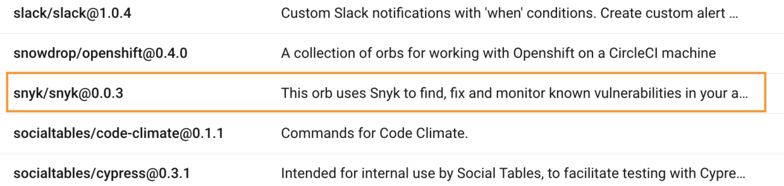
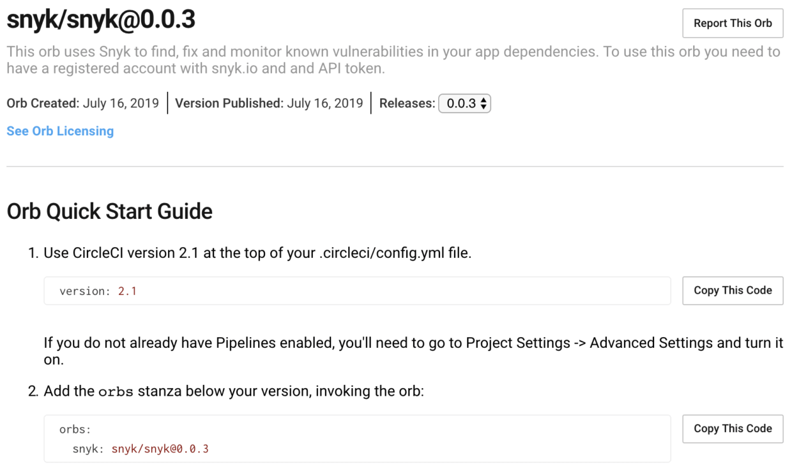

# Getting Snyk Orb details from the CircleCI registry

1. From the [Orbs registry](https://circleci.com/orbs/registry/), CircleCI displays a list of available Orbs customized for you directly, similar to the following image:

   

2. From this list, find and click the relevant \#Snyk line to view the Orb's information with examples, parameters, and values:

   

