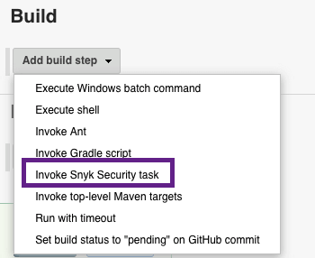
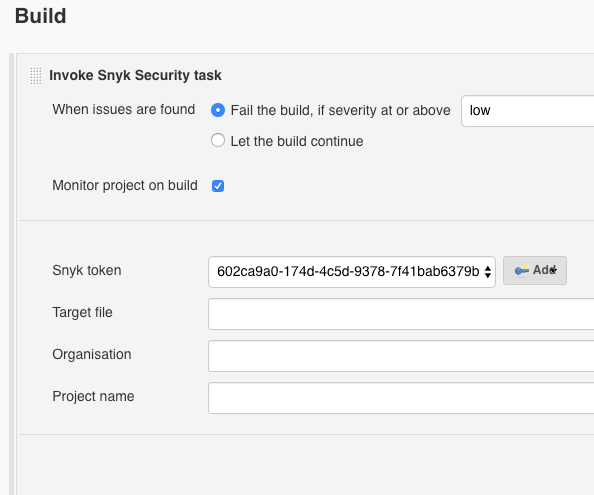

# Jenkins integration: Snyk for freestyle

For any Freestyle project, you can add Snyk to your build to scan the code while you build and to fail the build for vulnerabilities, based on your configurations.

**Steps:**

1. Navigate to any freestyle project from within Jenkins and click Configure.
2. From the dropdown list in the Build section, add the Invoke Snyk Security task as an additional step in your build.

   

3. Configure the security task as follows:
   * **When issues are found:**
     * **Fail the build, if severity at or above**—fails the build when a single vulnerability of the severity level selected from the dropdown is identified in the project
     * **Let the build continue**—display vulnerabilities and details, but allow the build to continue
   * **Monitor project on build**—push a snapshot of the project to the Snyk UI. Snyk then continues to monitor your project for newly disclosed vulnerabilities.
   * **Snyk token**—select the token that you already created from the Jenkins Credentials area.
   * **Target file**—indicate the path to the manifest file; if the file is in the root folder, leave blank.
   * **Organization**—the Snyk organization to which this project should be associated.
   * **Project name**—enter a unique name by which to identify this project from the Snyk UI. If left blank, Snyk assigns a project name based on the manifest file data.

     
4. From the **Advanced** area: leave the Snyk installation default and enter any additional valid Snyk CLI arguments and their values in the **Arguments** box.
5. Snyk checks the CLI version that is installed and automatically installs/upgrades it in the background \(if necessary, and as based on your policy configuration\).
6. Save the build and run it.
7. Snyk checks the CLI version that is installed and automatically installs/upgrades it in the background \(if necessary, and as based on your policy configuration\).
8. Snyk runs the snyk test command, analyzing the manifest file of your project to find its direct and transitive dependencies and testing your pipeline against the Snyk vulnerability database for known vulnerabilities.
9. From the **Jenkins Console Output**, the test results summary is displayed, indicating the number of known issues and the number of associated dependency paths identified.
10. Based on the Monitor project on build configuration for this project:
    * If you did not choose **Monitor project on build**, then Snyk displays all vulnerability results and details from the **Snyk Security Report** area of the Build menu. If a severity threshold was defined for a severity that is assigned to any vulnerability in your project, Jenkins breaks the **build**. Otherwise, Jenkins continues to run the build to completion \(success or failure\) and Snyk activity ends.
    * If you checkmarked the **Monitor project on build** option, then Snyk displays all vulnerability results and details from the **Snyk Security Report** area of the **Build** menu and pushes a snapshot for continuous monitoring to the Snyk UI. If a severity threshold was defined for a severity that is assigned to any vulnerability in your project, Jenkins breaks the build. Otherwise, Jenkins continues to run the build to completion \(success or failure\) and Snyk activity ends.

      
11. From the top of the report, click **View on Snyk.io** to view the snapshot and vulnerability information directly from our app.

