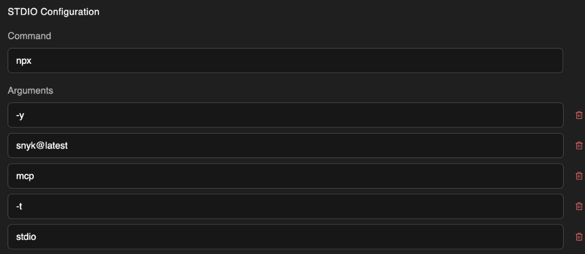
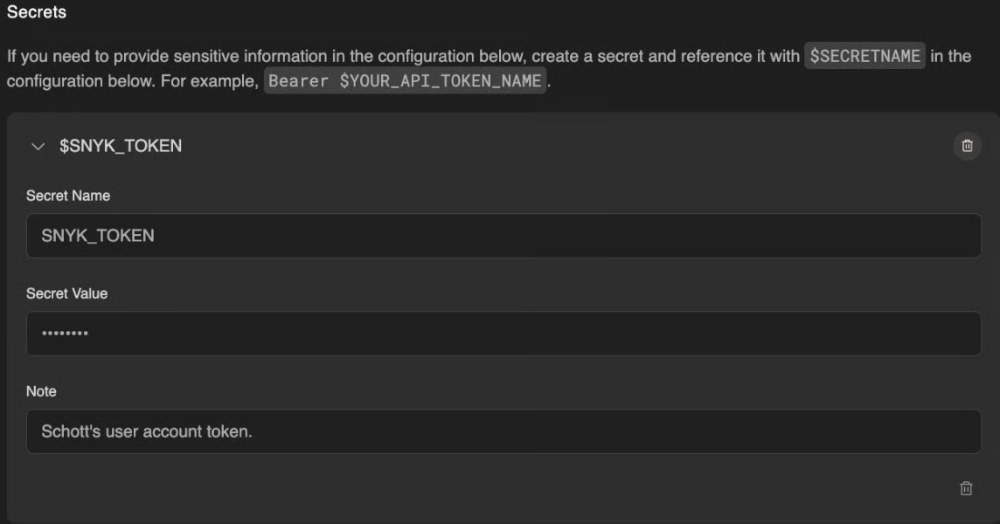
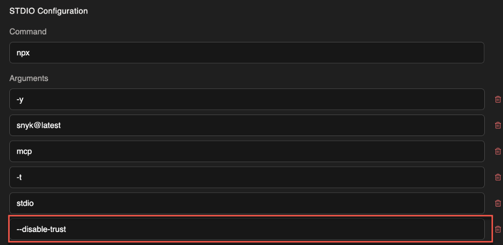

# Devin guide

You can access Snyk Studio, including Snyk's MCP server, in Devin to secure code generated with agentic workflows through an LLM. You can achieve this in several ways. When you use it for the first time, the MCP server will ask for trust and trigger authentication if necessary.

## Prerequisites

* [Get Started with Devin](devin-guide.md#get-started-with-devin)
* [Install the Snyk MCP](devin-guide.md#install-the-snyk-mcp-server-in-devin)

### Get started with Devin

Navigate to [Devin.ai](https://devin.ai/) to get started using the AI software engineer.

### Install the Snyk MCP Server in Devin

Install the Snyk MCP Server by navigating to **Settings** > **Organization settings** > **MCP marketplace** > **Add your own**.

The command to run the Snyk MCP server is `npx -y snyk@latest mcp -t stdio`. Add this command to your Devin configuration in the **STDIO Configuration** section, as shown in the screenshot below.

<figure><figcaption></figcaption></figure>

Select **Add a new secret** and add your API token. To learn more, visit [How to obtain your personal token](../../../snyk-api/authentication-for-api/#how-to-obtain-your-personal-token). You must use `SNYK_TOKEN` for the **Secret Name** and **Environment Variable** name.


The `SNYK_TOKEN` **Secret** is stored securely and referenced with `$SNYK_TOKEN`. Do not put your full Snyk token in the **Environment Variables** section.


<figure><figcaption></figcaption></figure>

Finally, you can optionally add the `--disable-trust` argument to the command, as pictured below.

<figure><figcaption></figcaption></figure>

The Snyk MCP Server includes a folder trust mechanism that helps safeguard users from executing Snyk on untrusted code. To learn more, visit [Visual Studio workspace trust](../../../developer-tools/snyk-ide-plugins-and-extensions/visual-studio-extension/visual-studio-workspace-trust.md). Without this option, the Snyk MCP Server will open a browser window asking the user to trust the folder path that Snyk is attempting to scan. Devin will complete this process automatically using its built-in web browser, so you may want to add `--disable-trust` to skip this process.

## Examples

### Scanning for security vulnerabilities

In the chat, you can tag specific files or functions and ask Devin to scan your code for safely deploying to production:


```
Scan this directory for code security & dependency vulnerabilities security issues
```


Devin indicates that this request is related to security vulnerability scanning and calls the Snyk MCP Server for various scans.

Devin is then able to gather all the security scanning results, both code (SAST) and dependencies (SCA), and based on recommendations and contextual information provided by the Snyk MCP Server, it is now able to provide code changes that address some or all of the security vulnerabilities that were found.

<figure><figcaption></figcaption></figure>

<figure><figcaption></figcaption></figure>

### "Secure at inception" rules

To practice [Secure at Inception](../../../discover-snyk/getting-started/glossary.md#secure-at-inception), Snyk recommends adopting rules that align the LLM for secure code generation and workflows. The rules can be added to [Devin Knowledge](https://docs.devin.ai/product-guides/knowledge).

The following is a suggested instruction for Devin Knowledge:


```
- Always run **snyk_code_scan** tool for new first party code that is generated in a Snyk-supported language.
- If any security issues are found based on newly introduced or modified code or dependencies, attempt to fix the issues using the results context from **Snyk**.
- Rescan the code after fixing the issues to ensure that the issues were fixed and that there are no newly introduced issues.
- Repeat this process until no new issues are found.
```


<figure><figcaption></figcaption></figure>
