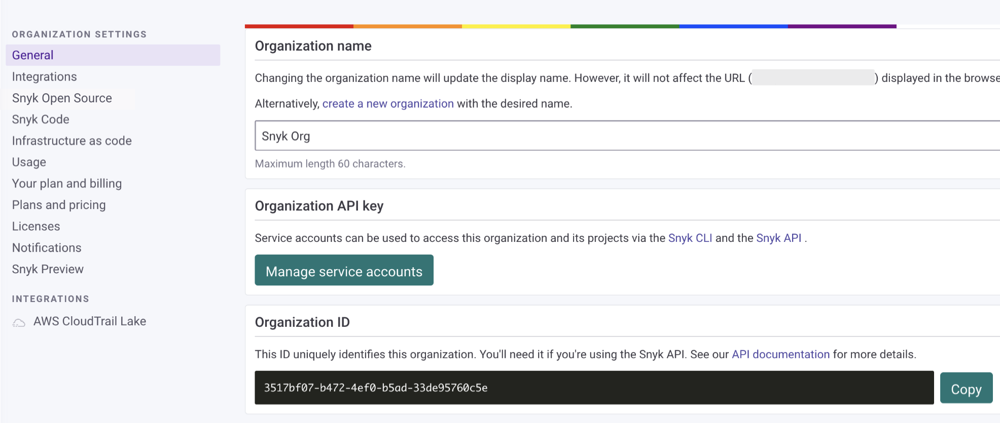
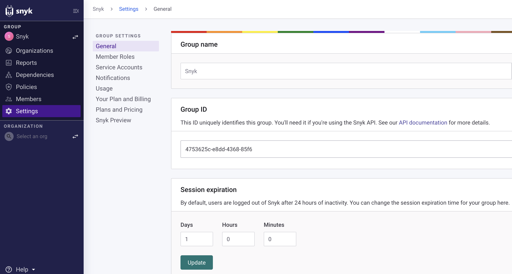
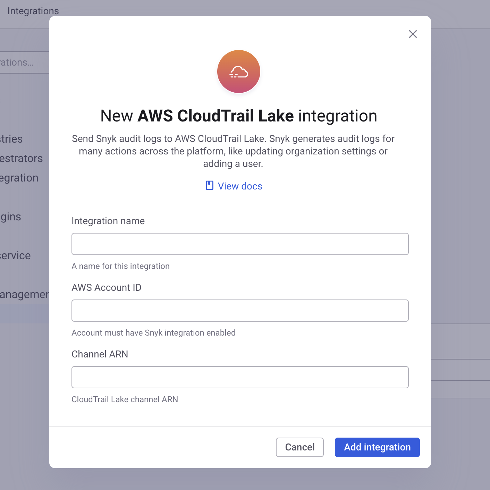
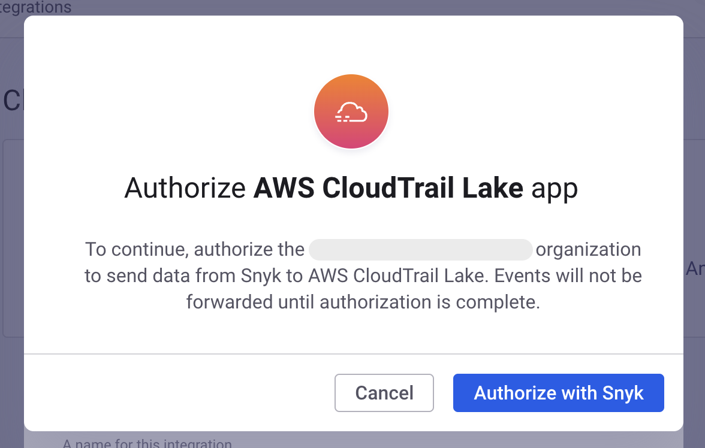

# AWS CloudTrail Lake


**Feature availability**\
The AWS CloudTrail Lake integration is available only with Snyk Enterprise plans. For more information, see [plans and pricing](https://snyk.io/plans/).


The AWS CloudTrail Lake integration allows you to forward [Snyk audit logs](../../snyk-platform-administration/user-management-with-the-api/retrieve-audit-logs-of-user-initiated-activity-by-api-for-an-org-or-group.md) to AWS CloudTrail Lake, which lets you run SQL-based queries on your logs and retain them for up to seven (7) years.

This integration can be configured to forward audit logs for a **single Snyk Organization**, or for a **Snyk Group and all of its child Organizations**. In either case, there are two steps required to set up the integration:

1. Add a Snyk integration in AWS CloudTrail Lake.
2. Configure the integration in Snyk.


This integration sends logs beginning when you enable it. Logs generated before enabling the integration are not sent but may be available from the API endpoint [Search Organization audit logs](../../snyk-api/reference/audit-logs.md#orgs-org_id-audit_logs-search).


## Group-level versus Organization-level audit logs

Audit logs are captured when Snyk users perform actions on the Snyk platform, such as making changes to settings, adding other users, or accessing protected APIs. When you are setting up this integration, it is important to understand how audit logs are captured, based on how a customer's Snyk account is set up:

* For customers using Snyk with a single Snyk Organization (or with multiple disconnected Organizations), all audit logs are captured within the scope of the single Organization.
* For customers who have a Snyk Group with child Organizations, actions such as adding new Organizations to the group or adding users to the group are audited at the Group level, and are not typically associated with an Organization.

This integration supports both use cases:

1. Integrate CloudTrail Lake with a **single Snyk Organization**
   1. All audit logs associated directly with that Organization will be sent to CloudTrail Lake.
   2. If the Organization has a parent Group, actions taken on that Group **are not sent to CloudTrail Lake**.
   3. If the Organization has members who are also members of other Organizations and Groups, actions taken by those members will only be sent to CloudTrail Lake if they are directly associated with the Organization.
2. Integrate CloudTrail Lake with a **Snyk Group and all of its child Organizations**
   1. All audit logs associated with the Group or any of its child Organizations will be sent to CloudTrail Lake.
   2. When new Organizations are added to the Group, audit logs for those Organizations will be sent automatically to CloudTrail Lake.

## Add a Snyk integration in AWS CloudTrail Lake

To get started setting up a CloudTrail Lake integration, whether for a group or a single Organization, follow the setup [instructions](https://docs.aws.amazon.com/awscloudtrail/latest/userguide/query-event-data-store-integration.html) in the AWS CloudTrail Lake documentation, choosing Snyk as the integration type.

<div align="left"><figure><figcaption><p>Choose Snyk, Add integration for Snyk</p></figcaption></figure></div>

During the setup, you must supply an **External ID** for the integration. The value for this ID depends on whether you are setting up the integration for a single Snyk Organization, or for a Snyk Group that includes all child Organizations.

### External ID for a Single Snyk Organization

If you are creating this integration for a single Snyk Organization, you will use your Snyk **Organization ID** as the **External ID.** You can find your Organization ID under Snyk **Organization Settings**.

<div align="left"><figure><figcaption><p>Organization ID on Snyk Organization Settings page</p></figcaption></figure></div>

Copy the value in the **Organization ID** field to the **External ID** field in the AWS CloudTrail Lake integration setup and continue following the instructions in the AWS CloudTrail Lake documentation.

### External ID for a Snyk group

If you are setting up this Organization for a Snyk Group, which will automatically include all child organizations, you will use your **Snyk Group ID** as the **External ID**. You can find your Group ID by clicking on the name of your Snyk group in the Snyk dashboard, and then navigating to the **Settings** page.&#x20;

<figure><figcaption><p>Group settings page</p></figcaption></figure>

Copy the value in the **Group ID** field to the **External ID** field in the AWS CloudTrail Lake integration setup and continue following the instructions in the AWS CloudTrail Lake documentation.

### CloudTrail Lake Channel ARN

When you are finished creating the Snyk integration in AWS CloudTrail Lake, copy the **Channel ARN** that is displayed on the integration page. You will need this for the next step.

## Configure the integration in Snyk (single Organization)

After creating the integration in **AWS CloudTrail Lake**, you can complete the setup in the Snyk dashboard.

To do this, go to [the Snyk integrations page](https://app.snyk.io/integrations), navigate to **Cloud events**, and click the **AWS CloudTrail Lake** tile:

<div align="left"><figure><figcaption><p>CloudTrail Lake tile on Snyk integrations page</p></figcaption></figure></div>

Enter a **name** for this integration, your **AWS Account ID**, and the **Channel ARN** from the previous step.

<div align="left"><figure><figcaption><p>Integration name, AWS Account ID, Channel ARN</p></figcaption></figure></div>

After this step is complete, Snyk immediately begins forwarding audit logs to AWS CloudTrail Lake. You can click **View settings** or go to the [AWS CloudTrail Lake settings](https://app.snyk.io/manage/integrations/aws-cloudtrail) page to view and manage the integration.

## Snyk App authorization

If this is the first time you have set up an AWS CloudTrail Lake integration for your Organization, you will be prompted to complete the Snyk App authorization flow.

<figure><figcaption><p>Snyk App authorization</p></figcaption></figure>

After completing the authorization flow you will be redirected to the settings page for the integration.&#x20;

## Configure the integration in Snyk (Snyk Group and child Organizations)


Configuring and managing this integration for a group is only supported by the Snyk REST API.&#x20;


To complete the setup of the integration for a Snyk Group, you must use the API endpoint [Create a group registration](https://apidocs.snyk.io/experimental?version=2023-05-29%7Eexperimental#post-/groups/-group_id-/cloud_events/group_registrations).

You can use this sample request as a starting point:

```sh
curl --location --request POST 'https://api.snyk.io/rest/groups/<YOUR GROUP ID>/cloud_events/group_registrations?version=2023-01-25~experimental' \
--header 'Content-Type: application/vnd.api+json' \
--header 'Authorization: token <YOUR SNYK API TOKEN>' \
--data-raw '{
    "data": {
        "type": "group_registration",
        "attributes": {
            "type": "aws-cloudtrail",
            "name": "<NAME YOUR INTEGRATION>",
            "config": {
                "account_id": "<YOUR AWS ACCOUNT ID>",
                "channel_arn": "<CHANNEL ARN FROM PREVIOUS STEP>"
            }
        }
    }
}'
```

Be sure to replace each indicated placeholder value in the example appropriately:

* `<YOUR GROUP ID>` - the Snyk **Group ID** you used in the previous step as the **External ID**
* `<YOUR SNYK API TOKEN>` - your personal Snyk API token, which you can find in the Snyk dashboard under **Account settings**
* `<NAME YOUR INTEGRATION>` - a name for this integration
* `<YOUR AWS ACCOUNT ID>` - the AWS account ID for the AWS account form the previous step.
* `<CHANNEL ARN FROM PREVIOUS STEP>` - the **Channel ARN** generated in the previous step when you added the Snyk integration in the CloudTrail Lake console.

If the call is successful, the API response will include an `id` for the registration. You can use this ID to manage and delete the integration later.

## Remove an AWS CloudTrail Lake integration (single Organization)

Navigate to the [AWS CloudTrail Lake settings](https://app.snyk.io/manage/integrations/aws-cloudtrail) page and select the name of the integration you want to remove.

<figure><figcaption><p>Select AWL CloudTrail Lake integration to remove</p></figcaption></figure>

Select **Remove integration** and confirm that you want to remove the integration.

<figure><figcaption><p>Remove integration button</p></figcaption></figure>

This action removes Snyk’s configuration for this integration, which will **prevent any further audit logs from being sent to AWS CloudTrail Lake**. This does not remove the Snyk integration in AWS CloudTrail Lake. To do this, navigate to AWS CloudTrail Lake and delete the Snyk integration from the **Integration** list.

## Remove an AWS CloudTrail Lake integration (Snyk Group and child Organizations)

Configuring and managing this integration for a Group is supported only by the Snyk API. You can remove an integration using the endpoint [Delete a group registration](https://apidocs.snyk.io/experimental?version=2023-05-29%7Eexperimental#delete-/groups/-group_id-/cloud_events/group_registrations/-group_registration_id-). For tips on how to use the API, see the section [about configuring a group-level integration](aws-cloudtrail-lake.md#configure-the-integration-in-snyk-snyk-group-and-child-organizations).


To delete a Group-level integration, retrieve the integration ID. This is the same ID that is returned by the API when you create a Group-level integration. You can also get all currently configured Group integrations with the endpoint [List all group registrations](https://apidocs.snyk.io/experimental?version=2023-05-29%7Eexperimental#get-/groups/-group_id-/cloud_events/group_registrations).


## Query Snyk audit logs in AWS CloudTrail Lake

When your Snyk audit logs are being forwarded to AWS CloudTrail Lake, you can access them with the AWS CloudTrail Lake **Query** functionality. You can use this example query to get started:

```sql
select 
    eventtime, 
    eventdata.useridentity, 
    eventdata.eventname,
    eventdata.additionaleventdata
from <EVENT-DATA-STORE-ID>
order by eventTime desc
limit 10
```

Replace `<EVENT-DATA-STORE-ID>` with the ID of the event data store that is associated with the Snyk integration in AWS CloudTrail Lake.

## Understanding the log data

There are three (3) key fields to note when using the Snyk audit log data in AWS CloudTrail Lake.

`eventdata.useridentity`

The event `useridentity` contains a field called `principalid`, which represents the Snyk user ID for the user associated with the audit event. You can use Snyk API v1 endpoint [Get organization level audit logs](../../snyk-api/reference/audit-logs.md#orgs-org_id-audit_logs-search) to match the Snyk user ID with a user in your Organization.

`eventdata.eventname`

This represents the type of audit event, for example, `api.access` or `org.cloud_config.settings.edit`, and can be used to group or filter events.

`eventdata.additionaleventdata`

This field contains a raw JSON payload with more detailed information about the audit event. The content of the payload depends on the type of the event. For example, an API access event will include the accessed URL, while a settings change event will include before and after values for the changed setting.
