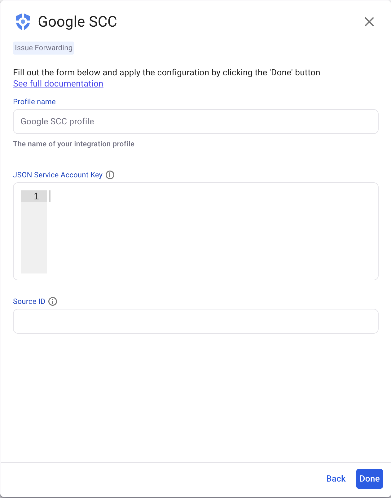

# Google Security Command Center


**Release status**

The Google Cloud Security Command Center integration is in [Early Access](../../discover-snyk/getting-started/snyk-release-process.md#early-access-features), and is available only with Snyk Enterprise plans. For more information, see [Plans and pricing](https://snyk.io/plans/).


The Google Cloud Security Command Center (SCC) integration sends Snyk issues to SCC, enabling you to view and manage Snyk issues alongside cloud security findings from Google Cloud in a single viewpoint. Snyk issues are represented in SCC as code security findings. When Snyk issues are updated, corresponding SCC findings are automatically updated as well. All details are available at the Organization level in the Google Cloud Security Command Center (SCC) integration.

Use the following instructions to set up the integration:

* Navigate to **Marketplace** in the SCC Console and search for Snyk.
* Follow the guided path to create a Findings Source and Service Account.


Service Accounts are not available at the Organization level in Google Cloud IAM. You must create a Service Account in a specific Project. Snyk recommends creating the Service Account in a Project that is already being monitored by SCC. You must [enable the SCC API](https://console.cloud.google.com/apis/library) in the same Project as the Service Account.


* Copy the Findings Source ID and Service Account Token (JSON) into the Snyk Web UI

## Prerequisites

* **Snyk:** A Snyk user account with [permissions](../../snyk-platform-administration/user-roles/user-role-management.md) to edit and view Group integrations
* **Google** **Cloud:** A Google Cloud organization with Security Command Center enabled. See the Google Cloud [Activate Security Command Center](https://cloud.google.com/security-command-center/docs/activate-scc-for-an-organization) page for more details on how to enable it.
* **Google SCC API**: You must [enable the SCC API](https://console.cloud.google.com/apis/library) in the same Project as the Service Account

## Create the Finding Source using the Google Cloud SCC Console&#x20;

* In the SCC console, navigate to **Marketplace** and search for **Snyk**. Alternatively, navigate directly to the [Snyk for SCC marketplace listing](https://console.cloud.google.com/marketplace/product/snyk-marketplace/snyk-google-scc).
* Click **SIGN UP WITH PARTNER** to install the Snyk for SCC integration. During this process, you will create a **Findings Source** for Snyk and a **Service Account** with [Security Center Findings Editor](https://cloud.google.com/security-command-center/docs/access-control-org#securitycenter.findingsEditor) permissions.


**Important Identity and Access Management (IAM) Configuration for Security Command Center**

The setup process will grant the Snyk Service Account the `Security Center Findings Editor` role on the Project you select. However, how you use Security Command Center determines if an additional step is needed.

* **If you use Google SCC at the Organization level** (most common for businesses):&#x20;
  * You must also add an IAM policy binding at the Organization level.&#x20;
  * Grant the Snyk Service Account the `Security Center Findings Editor` role there as well. This is required because Snyk posts findings to your Organization's central SCC dashboard.
* **If you use Google SCC in a standalone, Project-level mode**: No extra steps are needed. The Project-level permission is sufficient.


* Navigate to Google Cloud IAM and locate the **Service Accoun**t you created in the previous step, then [create a service account key](https://cloud.google.com/iam/docs/keys-create-delete#creating) in JSON format.
* Make a note of the **Source ID** (Findings Source name) and the **Service Account Ke**y, as you will need to provide them to the Snyk Web UI.

You can then set up the integration in Snyk using the Snyk Web UI or REST API.

## Set up the integration using the Snyk Web UI

### **Required parameters**

* **Source ID** (Finding Source Name) - Identifies the name of the organization source. The Google organization ID is parsed automatically from this field.
* **JSON Service Account Key File** - Authenticates with Google Cloud.

### **Integration setup**

* In the Snyk Web UI, at the Group level, navigate to Integrations > Add integration.
* Select the Issue Forwarding tag and search for Google SCC.
* Click the Add button.
* Add the Profile name for this integration.
* Add the Org ID for the Google Cloud project that holds the Kubernetes cluster.
* Add the JSON Service Account Key File.
* Add the Source ID (Findings Source Name).
* Click the Done button.
* When the connection is established, the Google SCC integration status changes to Connected.

<figure><figcaption>
Google SCC - Setup screen
</figcaption></figure>
