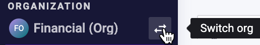
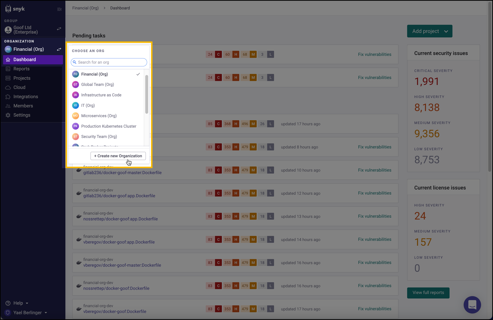
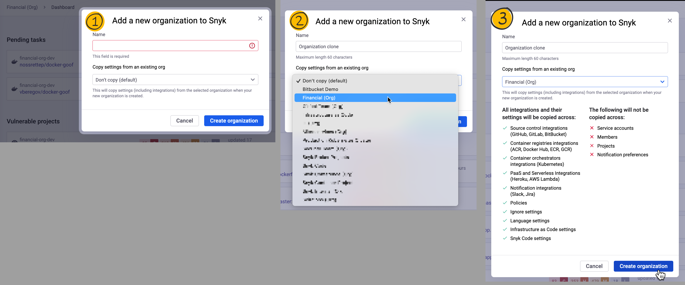

# Clone an integration across your Snyk Oraganizations

You can choose to use the same brokered Git integration across multiple Organizations in Snyk by copying and duplicating the Organization you've already configured.

For example, you can integrate Snyk Organizations X, Y, and Z with your single Git repo X.

**Prerequisites**: to clone Organization configurations, you must have teams and groups enabled.

1. From the **Organization** list, choose an Organization in the Group that you're working with.\
   
2.  From the same **Organization** dropdown, click **+Create new Organization.**

    <figure><figcaption></figcaption></figure>
3. In the next window, enter a name for your new Organization.
4. In the **Copy settings from an existing org** section, choose an Organization that you've already configured for the Broker token.
5.  Review the summary of what will be copied across to the new Organization, and click **Create organization** to confirm.

    <figure><figcaption>
Three steps to create or clone a new Snyk Organization
</figcaption></figure>

The **Dashboard** for the organization that you just created opens: the Broker integration is duplicated and set up, and the Broker token is identical to the token for the original organization.
