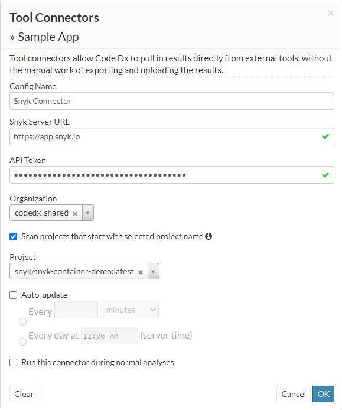
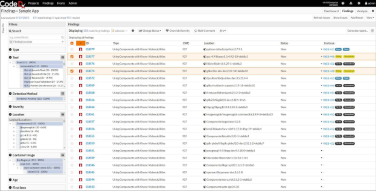

# Code Dx Enterprise

**Introduction to Snyk and Code Dx Integration:**

Code Dx Enterprise automates the arduous workflows needed to centralize finding, analyzing and fixing security vulnerabilities across disparate security tools—at DevOps speed. Code Dx orchestrates scan automation, automates triage, and prioritizes tracking and fixing of vulnerabilities. It does this while continuously assessing the security risks across the entire software lifecycle. The Code Dx-Snyk connector allows Snyk SCA & Container Scanning customers to pull in open source & container vulnerabilities programmatically into Code Dx to allow it to de-duplicate, normalize and correlate all the findings & offer a single, coherent thread of prioritized issues.

## How it Works:

The Code Dx connector leverages the Snyk APIs directly to retrieve project issues, format the results, and ingest it into Code Dx Enterprise. Code Dx optionally also supports JSON file based ingestion techniques if needed. Follow these steps to get started:

1. Retrieve the Snyk API Key from the Snyk UI. Read about [Service Accounts](https://docs.snyk.io/integrations/managing-integrations/service-accounts) in Snyk Docs.
2. Select the Snyk Connector from the Tool Connectors Section for your Code Dx Project - For additional details on configuring data sources see [here](https://codedx.com/Documentation/UserGuide.html#ToolConnectors).
3. Specify the Snyk Server URL, the API token and the Organization and check the ‘Allow ingesting nested projects with selected project name’ option to pull in consolidated results for all related projects (including nested projects within a parent

## **Visualizing the Results from Snyk in Code Dx:**


**Feature availability**\
This integration relies on the Snyk API which is only available to paid Snyk plans. [Find out more about the API](https://github.com/snyk/user-docs/tree/54e0dec0fe0e081d49f34119a9018499ad5c9e96/integrations/vulnerability-management-tools/code-dx-enterprise/README.md), or [review your own plan and start a free trial](https://app.snyk.io/manage/billing) to experience the full value Snyk offers.

