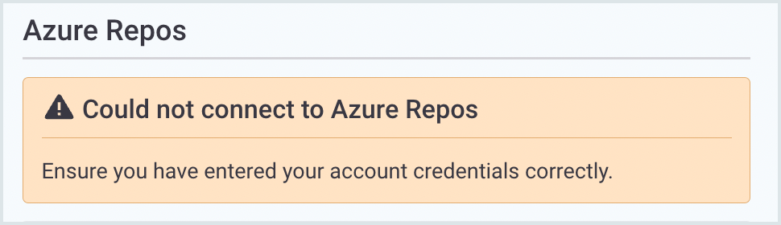

# Azure Repositories integration


**Feature availability**\
Integration with Azure Repos Cloud is available with all of Snyk pricing plans. Integration with Azure DevOps Server 2020 and above (also known as TFS) is available with Enterprise plans. See [pricing plans](https://snyk.io/plans/) for more details.

Snyk supports only Git: Snyk does not currently support integration with Team Foundation Version Control (TFVC).


Snyk integrates with Microsoft Azure Repository to let you import your Projects and monitor the source code for your repositories. Snyk tests the Projects you have imported for known security vulnerabilities in the application’s dependencies, testing at a frequency you control.

Snyk's Azure Repository integration lets you:

* Continuously perform security scanning across all the integrated repositories
* Detect vulnerabilities in your open-source components
* Provide automated fixes and upgrades

## Setting up an Azure Repository integration

The process to connect Snyk with your Azure repositories includes the following steps:

1. Generate a unique Azure DevOps personal access token (PAT) for Snyk, based on a username and password combination, and configured with the specific permissions Snyk needs to access your Azure repositories.\
   For more information, see [Configure your Azure Repository integration](azure-repositories-integration.md#configure-your-azure-repository-integration).
2. Select the Projects and repositories you want to associate with Snyk for testing and monitoring.\
   You can also enter custom file locations for any manifest files that are not located in the root folders of your repositories.

Snyk then does the following:

1. Evaluates the items you selected and imports the ones that have the relevant manifest files in their root folder and all the subfolders at any level.
2. Communicates directly with your repository for each test it runs using the permissions you associated with your PAT, to determine exactly which code is currently pushed by Snyk application and which dependencies are being used. Each dependency is tested against the Snyk vulnerability database to see if it contains any known vulnerabilities.
3. Notifies you via email or a dedicated Slack channel if vulnerabilities are found according to the preferences you configured) so that you can take immediate action to fix the issues.

## Add Projects to Snyk for Azure Repos

Snyk tests and monitors Azure Repos by evaluating root folders and custom file locations for the [languages that Snyk supports](../../scan-application-code/snyk-open-source/snyk-open-source-supported-languages-and-package-managers/).

To add a default Project:

1. In Snyk, go to **Projects** > **Add projects**.
2. Choose the relevant repository or tool from which to import your Projects.\
   The available repositories for the integration you picked are displayed in a new window.
3. Select the repositories that you want Snyk to monitor for security and license issues.
4. To import all the repos for a specific Organization, check the Organization.
5. Click **Add selected repositories**.\
   Snyk scans the entire file tree for dependency files and imports them to Snyk as Projects.

<figure><figcaption>
Import Projects
</figcaption></figure>

## Adding custom file locations and excluding folders

### Add a custom file location

Use this procedure to add an Azure Repository dependency from a non-default path.

1. In Snyk, go to **Projects** > **Add projects > Azure repos > Settings**.
2. Open the **Add custom file location (optional)** list and **select a repository...** to configure a custom path.
3. In the text field, enter the relative path for the manifest file location.


The relative path field is case-sensitive.


<figure><figcaption>
Select Azure repos
</figcaption></figure>

### Exclude folders from import

The Azure Repository integration works like the other Snyk [Git integrations](./). To continue to monitor, fix, and manage your Projects, see the related pages in the Snyk User Docs.


The optional **Exclude folders** field is case-sensitive. The pattern you enter is applied to all the Azure repositories.


## **Confirming the repository import**

After repositories are imported, a confirmation appears in green at the top of the screen. The selected files are indicated with a unique icon, they are named by Organization and repo. You can filter to view only those Projects, as shown in the example that follows:

<figure><figcaption>
View import results
</figcaption></figure>

The Azure Repository integration works like the other Snyk [Git integrations](./).

## Configure your Azure Repository integration

### Prerequisites for Azure Repository integration


Only a Snyk admin user can configure the integration within the UI.\
Collaborator users cannot complete this task.


To enable integration between Azure Repository and Snyk:

* Set up your Azure Repos account and your Snyk account: you must have an Azure Project. If you do not have a Project yet, create one in [Azure DevOps](https://docs.microsoft.com/en-us/azure/devops/user-guide/sign-up-invite-teammates?view=azure-devops) or set one up in an [on-premise Azure DevOps](https://docs.microsoft.com/en-us/azure/devops/organizations/projects/create-project?view=azure-devops).
* &#x20;Create a Personal Access Token (PAT). You must be a member of the [**Project Administrators** Group](https://docs.microsoft.com/en-us/azure/devops/organizations/security/change-project-level-permissions?view=azure-devops) so that the PAT has the _**edit**_ _**subscriptions**_ _**permissions**_ required to enable webhooks.

### **Integrate in your Azure Repository**

1. Generate and copy a unique PAT to use for Snyk. For more information, see the [Azure DevOps documentation](https://docs.microsoft.com/en-us/azure/devops/organizations/accounts/use-personal-access-tokens-to-authenticate?view=azure-devops).
2. When you are prompted in Azure, enable the following permissions for Snyk access:
   * **Expiry**: to avoid breaking the integration, Snyk recommends that you choose a token expiration date that is far in the future.
   * **Scopes**: _Custom defined_
   * **Code**: _Read & write_.

### Integrate in the Snyk Web UI

1. Log in to [your Snyk account](https://app.snyk.io) and go to **Integrations**.
2. In the **Azure Repos** tile, click the settings icon to open **Organization Settings > Integrations >Azure Repos> Account credentials**.\
   
3.  Set the Azure DevOps Organization that you want to integrate with by entering the slug for your Organization (.png>)) and the PAT that you generated.

    Enterprise customers can also provide a custom URL for an Azure Repos Server private instance that is publicly reachable.
4. Click **Save**.\
   Snyk tests the connection values, and the page reloads, displaying the Azure Repos integration information. A message to confirm that the details were updated is displayed at the top of the screen.

If the connection to Azure fails, a notification is displayed under the **Azure Repos** card title.

