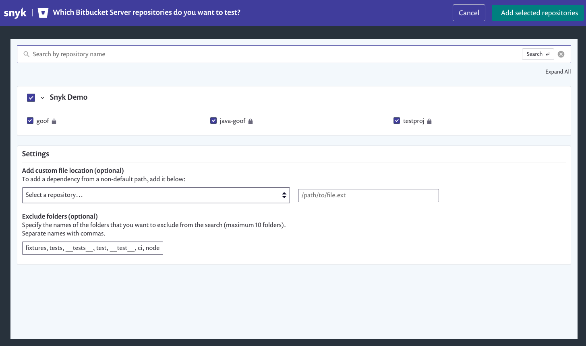

# Bitbucket Cloud App integration

Snyk offers two Bitbucket Cloud integrations: the Personal Access Token (PAT) integration and the new App integration.

Snyk's Bitbucket Cloud App integration lets you connect your Snyk Organization to a Bitbucket Cloud Workspace and get all Snyk's core SCM integration features:

* Continuously perform security scanning across all the integrated repositories
* Detect vulnerabilities in your Open Source components
* Provide automated fixes and upgrades
* Provides developer teams with first-party visibility for security issues directly in the Bitbucket interface


Snyk recommends using the Bitbucket Cloud App integration for smoother integration and to ensure long-term support.

If you're already using the [Bitbucket Cloud Personal Access Token (Legacy) integration](bitbucket-cloud-legacy-integration.md), see [Migrate a Bitbucket Cloud Legacy integration](migrate-a-bitbucket-cloud-legacy-integration.md) for details.


> **Feature availability**\
> This feature is available for all plans. See [pricing plans](https://snyk.io/plans/) for more details.

## Setting up a Bitbucket Cloud App

To give Snyk access to your Bitbucket account, you need to install the Snyk App on your Bitbucket Cloud workspace.


To install the Snyk App on your Bitbucket Cloud workspace, you must have **Admin** permissions for the Workspace in Bitbucket.


1. In Snyk, go to **Integrations (Source control) >** **Bitbucket Cloud App** tile, and click **Connect** to install the Snyk Bitbucket Cloud App on your Bitbucket Cloud workspace.
2.  In the new Bitbucket tab, select the relevant workspace to connect to your Snyk Organization from the list and [**Grant access** to let Snyk](bitbucket-cloud-app-integration.md#required-snyk-bitbucket-cloud-app-permissions-scope):

    * Read your account information

    * Read and modify your repositories and their pull requests
    * Read and modify your repositories' webhooks

    <figure><figcaption>
Allow Snyk to access to Bitbucket Cloud
</figcaption></figure>
3.  Grant access to your Snyk Organization when you're prompted.\\

    <figure><figcaption>
Allow Bitbucket Cloud to access your Snyk Organization 
</figcaption></figure>

    After you allow access to the Snyk Organization, the Snyk **Organization Settings** page opens and confirms that you're connected to the Bitbucket Cloud App.\

After Snyk is integrated with Bitbucket Cloud, you can see the new Snyk security tab in the repository page, and [import and explore the issues and vulnerabilities for your repository projects](../../getting-started/quickstart/import-a-project.md), directly in Bitbucket.

<figure><figcaption>
Bitbucket security insights with Snyk Bitbucket Cloud App
</figcaption></figure>

_Watch this short video to see how to set up **Snyk security**_ _in Bitbucket Cloud!_



### Installing the Snyk App from Bitbucket Cloud

If you need to, you can also install the Snyk Bitbucket Cloud App integration while you're in Bitbucket Cloud.

In one of your Bitbucket Cloud workspaces, go to the **Security** tab in one of your repositories, click **Try now**, and follow the procedure.

## Adding Bitbucket repositories to Snyk

After you connect Snyk to your Bitbucket Cloud account, you can select repositories for Snyk to monitor.

1. In Snyk, go to **Integrations** > **Bitbucket Cloud App** card and click to start importing repositories to Snyk.
2. Choose the repositories you want to import to Snyk and click **Add selected repositories**.

After you add them, Snyk scans the selected repositories for dependency files in the entire directory tree, (that is, `package.json`, `pom.xml`, and so on) and imports them to Snyk as projects.

The imported projects appear on your **Projects** page and are continuously checked for vulnerabilities.

<figure><figcaption></figcaption></figure>

## Bitbucket integration features

Once the integration is in place, you'll be able to use capabilities such as:

* [Project-level security reports](bitbucket-cloud-app-integration.md#project-level-security-reports)
* [Project monitoring and automatic fix pull requests](bitbucket-cloud-app-integration.md#project-monitoring-and-automatic-fix-pull-requests)
* [Pull request testing](bitbucket-cloud-app-integration.md#pull-request-tests)
* [First-party interface in Bitbucket Cloud](bitbucket-cloud-app-integration.md#first-party-interface-in-bitbucket-cloud)

### Project-level security reports

Snyk produces advanced [security reports](https://docs.snyk.io/features/reports/reports-overview) that let you explore the vulnerabilities found in your repositories, and fix them immediately by opening a fix pull request directly to your repository, with the required upgrades or patches.

The example below presents a project-level security report.

<figure><figcaption></figcaption></figure>

Snyk scans your projects on either a daily or a weekly basis. When new vulnerabilities are found, Snyk notifies you by email and by opening [automated pull requests](https://docs.snyk.io/products/snyk-open-source/open-source-basics/fix-pull-requests-for-new-vulnerabilities) with fixes for your repositories.

The example below presents a fix Pull Request opened by Snyk.

To review and adjust the automatic fix pull request settings:

1. In Snyk, go to  (Organization settings) > **Integrations > Source control > Bitbucket Cloud App**, and click **Edit Settings**.
2.  Scroll to the **Automatic fix PRs** section and configure the relevant options.

    <figure><figcaption>
Automatic fix PR settings 
</figcaption></figure>


Unlike manual pull requests opened from the Bitbucket interface, Snyk pull requests are _not_ automatically assigned to the default reviewer set in your Bitbucket Cloud account.

Click for more info on [Snyk automated pull requests](https://docs.snyk.io/products/snyk-open-source/open-source-basics/fix-pull-requests-for-new-vulnerabilities).


### Pull request tests

Snyk tests any newly created pull request in your repositories for security vulnerabilities and sends a build check to Bitbucket Cloud. You can see whether the pull request introduces new security issues, directly from Bitbucket Cloud.

The example below presents a Snyk pull request build check on the Bitbucket Cloud **Pull Request** page.

To review and adjust the pull request tests settings,

1. In Snyk, go to  (Organization settings) > **Integrations > Source control > Bitbucket Cloud App**, and click **Edit Settings**.
2. Scroll to **Default Snyk test for pull requests > Open Source Security & Licenses**, and configure the relevant options. See [Configure PR Checks](../../scan-application-code/run-pr-checks/configure-pr-checks.md) for more details.

### First-party interface in Bitbucket Cloud

When you install the Snyk Bitbucket Cloud App integration on your Bitbucket workspace, the members of your workspace can import repositories and see the security issues related to their repositories in a dedicated Snyk security tab in Bitbucket Cloud.


The first-party interface currently supports only the [Snyk Open Source](../../scan-application-code/snyk-open-source/) and [Snyk Container](../../scan-containers/) products. Issues from other Snyk products do not show up on this page.


#### Associating a first-party interface with a different Snyk account or Organization

During the first time Bitbucket Cloud App onboarding process, the first-party interface is associated with a specific Snyk Organization. This is the Snyk Organization to which Bitbucket users will import repositories and for which they'll view Snyk issues.

To change the Snyk Organization after onboarding, go to the workspace settings > **Security for Bitbucket Cloud > Integration Settings** and click **Connect via a different Snyk user/organization**.

<figure><figcaption></figcaption></figure>

The installation process begins again and you can choose the relevant Snyk Organization.

## Required permissions scope for the Snyk Bitbucket Cloud App integration

The table below presents the required access scopes for the Bitbucket Cloud App.

| Action                                              | Purpose                                                                                                                                       | Required Scope                                            |
| --------------------------------------------------- | --------------------------------------------------------------------------------------------------------------------------------------------- | --------------------------------------------------------- |
| Daily / weekly tests                                | Used to read manifest files in private repositories.                                                                                          | Read and modify your repositories and their pull requests |
| Snyk tests on pull requests                         | Used to send pull request status checks when a new PR is created, or an existing PR is updated.                                               | Read and modify your repositories and their pull requests |
| Opening fix and upgrade pull requests               | Used to create fix PRs in monitored repositories.                                                                                             | Read and modify your repositories and their pull requests |
| Snyk tests on pull requests - initial configuration | Used to add Snyk webhooks to the imported repos, to notify Snyk when pull requests are created or updated, and enable Snyk to trigger a scan. | Read and modify your repositories' webhooks               |

## Disabling the Bitbucket Cloud App integration

To disable this integration, in  (Organization settings)> **Integrations > Source Control > Bitbucket Cloud App:**

1. In your list of integrations, select the Bitbucket Cloud App integration you want to deactivate and click **Edit settings** to open a page with the current status of your integration.\
   \
   The page includes sections that are specific to each integration, where you can manage your credentials, API key, Service Principal, or connection details.
2. Scroll to the **Disconnect** section and click **Remove** to remove the integratio


Disconnecting the integration from the Snyk side does not uninstall the app from your workspace in Bitbucket Cloud. To uninstall the Bitbucket app, go to your workspace settings in Bitbucket.org --> Installed Apps and remove the _Snyk Security for Bitbucket Cloud_ app.



**WARNING**\
When you disconnect Snyk from your repository projects, your credentials are removed from Snyk and any integration-specific projects that Snyk is monitoring are deactivated in Snyk.

If you choose to re-enable this integration later, you'll need to re-enter your credentials and activate your projects.

