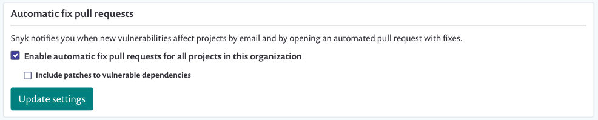

# GitHub Enterprise integration


Scanning of self-managed source code, like GitHub Enterprise, is available with our Enterprise plan. See[ the Snyk plans and pricing page](https://snyk.io/plans) for more info.


Snyk's GitHub Enterprise integration lets you:

* Continuously perform security scanning across all the integrated repositories
* Detect vulnerabilities in your open source components
* Provide automated fixes and upgrades

## Setting up a GitHub Enterprise Integration

The process to connect Snyk with your GitHub Enterprise repositories includes the following steps:

1. Create a dedicated service account in GitHub Enterprise, with _**write**_ level (or higher) permissions for the repos you want to monitor with Snyk permissions.\
   See [Required permissions scope for the GitHub integration](github-enterprise-integration.md#required-permissions-scope-for-the-github-integration) for details.
2. Generate a personal access token for that account, with **repo (all)**, **admin:read:org**, and **admin:repo\_hooks (read & write)** permissions scope.\
   See [GitHub Enterprise documentation ](https://docs.github.com/en/enterprise-server@2.22/github/authenticating-to-github/creating-a-personal-access-token)for details.
3. **Authorize** your personal access token and Enable SSO:
   1. In Snyk, go to the **Integrations** page and click the **GitHub Enterprise** card.
   2. Enter your Github Enterprise URL, the personal access token (PAT) for the [service account](https://docs.snyk.io/features/user-and-group-management/managing-groups-and-organizations/service-accounts) you created, and **Save** your changes.\
      \
      Snyk connects to your GitHub Enterprise instance. When the connection succeeds, the list of available repositories is displayed.\
      \
      **Note**: To use this integration to integrate with your GitHub Enterprise Cloud, provide the following URL: [https://api.github.com](https://api.github.com).
   3. If your Github Enterprise organization enforces SAML/SSO, select **Configure SSO** next to the PAT in GitHub once the PAT has been created.\
      \
      **Note:** Occasionally SSO is enforced in GitHub Enterprise organizations after a PAT and Integration are configured. If this happens, any projects that have already been imported show in Snyk but retests, PR Checks, and so on will not be performed.\
      \
      If this happens, check the **Configure SSO** settings here to ensure that the Github Enterprise organization is Authorized.\
      \
      On occasion, an organization shows as Authorized, but the retests and PR checks do not work. If this is happens, deauthorizing the organization and then reauthorizing it may help.
4. Select the repositories you want to import to Snyk and click **Add selected repositories**.

Snyk starts scanning the selected repos for dependency files (such as package.json) in the entire directory tree and imports them to Snyk as projects.

The imported projects appear on your **Projects** page and are continuously checked for vulnerabilities.

<figure><figcaption><p>Imported projects on Projects page</p></figcaption></figure>

## GitHub Enterprise Broker startup script

Use the script below to start up the Snyk [Broker](https://docs.snyk.io/features/snyk-broker).

```
docker run --restart=always \
           -p 8000:8000 \
           -e BROKER_TOKEN=secret-broker-token \
           -e GITHUB_TOKEN=secret-github-token \
           -e GITHUB=your.ghe.domain.com \
           -e GITHUB_API=your.ghe.domain.com/api/v3 \
           -e GITHUB_GRAPHQL=your.ghe.domain.com/api \
           -e PORT=8000 \
           -e BROKER_CLIENT_URL=http://my.broker.client:8000 \
       snyk/broker:github-enterprise
```

## GitHub Enterprise Integration Features

After the integration is set up, you can use the following capabilities:

### **Project-level security reports**

Snyk produces advanced security reports, allowing you to explore the vulnerabilities found in your repositories and fix them by opening a fix pull request directly to your repository, with the required upgrades or patches.

The example below presents a project-level security report.

<figure><figcaption><p>Project-level security report</p></figcaption></figure>

### **Project monitoring and automatic fix pull requests**

Snyk scans your projects on either a daily or a weekly basis. When new vulnerabilities are found, Snyk notifies you by email and opens an automated pull request with fixes for your repositories.

The example below presents a fix pull request opened by Snyk:

<figure><figcaption><p>Fix pull request created by Snyk</p></figcaption></figure>

To review and update the automatic fix pull request settings:

1. In Snyk, go to  **Settings >** **Integrations > Source control > GitHub Enterprise**, and click **Edit Settings**.
2. Scroll to the **Automatic fix pull requests** section, make the relevant changes, and **Update settings.**

<figure><figcaption><p>Automatic pull requests setting enabled</p></figcaption></figure>

### **Pull request testing**

Snyk tests any newly created pull requests in your repositories for security vulnerabilities and sends a status check to GitHub Enterprise. This allows you to see whether the pull request introduces new security issues, directly from GitHub Enterprise.

The example below presents how Snyk pull request checks appear on the GitHub Enterprise Pull Request page.

<figure><figcaption><p>Pull request checks shown in GitHub Enterprise</p></figcaption></figure>

To review and adjust the pull request tests settings:

1. In Snyk, go to  (Organization settings) > **Integrations > Source control > GitHub Enterprise**, and click **Edit Settings**.
2. Scroll to **Default Snyk test for pull requests.**

<figure><figcaption><p>Default Snyk test for pull requests setting enabled</p></figcaption></figure>

## Required permissions scope for the GitHub integration

All the operations, triggered manually or automatically, are performed for a GitHub service account that has its token configured in the integrations settings. This shows the required access scopes for the configured token:

| **Action**                                              | **Purpose**                                                                                                                                                                                                                                                    | **Required permissions in GitHub** |
| ------------------------------------------------------- | -------------------------------------------------------------------------------------------------------------------------------------------------------------------------------------------------------------------------------------------------------------- | ---------------------------------- |
| Daily / weekly tests                                    | Used to read manifest files in private repos                                                                                                                                                                                                                   | _repo (all)_                       |
| Manual fix pull requests (triggered by the user)        | Used to create fix PRs in the monitored repos                                                                                                                                                                                                                  | _repo (all)_                       |
| Automatic fix and upgrade pull requests                 | Used to create fix or upgrade PRs in the monitored repos                                                                                                                                                                                                       | _repo (all)_                       |
| Snyk tests on pull requests                             | Used to send pull request status checks whenever a new PR is created or an existing PR is updated                                                                                                                                                              | _repo (all)_                       |
| Importing new projects to Snyk                          | Used to present a list of all the available repos in the GitHub org in the **Add Projects** screen (import popup)                                                                                                                                              | _admin:read:org, repo (all)_       |
| Snyk tests on pull requests - **initial configuration** | <p>Used to add SCM webhooks to the imported repos. Snyk uses these webhooks  to:</p><ul><li>Track the state of Snyk pull requests, that is, when PRs are created, updated triggered, merged, and so on</li><li>Send push events to trigger PR checks</li></ul> | _admin:repo\_hooks (read & write)_ |

## **Required permissions scope for repositories**

For Snyk to perform the required operation on monitored repositories, such as reading manifest files on a frequent basis, the accounts connected to Snyk (either directly or using Snyk Broker) need the following access on the repositories:

| **Action**                                              | **Why?**                                                                                                                                                                                                                                                     | **Required permissions on the repository** |
| ------------------------------------------------------- | ------------------------------------------------------------------------------------------------------------------------------------------------------------------------------------------------------------------------------------------------------------ | ------------------------------------------ |
| Daily / weekly tests                                    | Used to read manifest files in private repos                                                                                                                                                                                                                 | _Write_ or above                           |
| Snyk tests on pull requests                             | Used to send pull request status checks whenever a new PR is created or an existing PR is updated                                                                                                                                                            | _Write_ or above                           |
| Opening fix and upgrade pull requests                   | Used to create fix or upgrade PRs in the monitored repos                                                                                                                                                                                                     | _Write_ or above                           |
| Snyk tests on pull requests - **initial configuration** | <p>Used to add SCM webhooks to the imported repos. Snyk uses these webhooks to:</p><ul><li>Track the state of Snyk pull requests, that is, when PRs are created, updated triggered, merged, and so on</li><li>Send push events to trigger PR check</li></ul> | _Admin_                                    |
