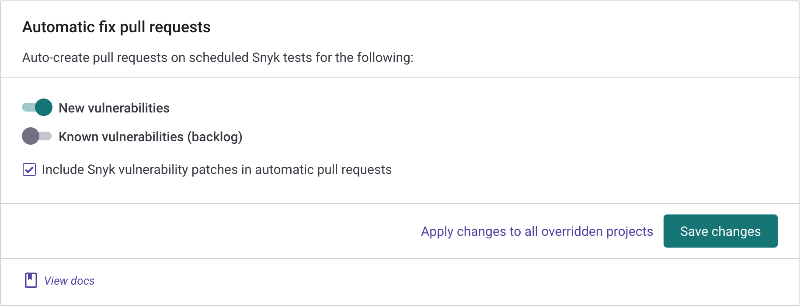
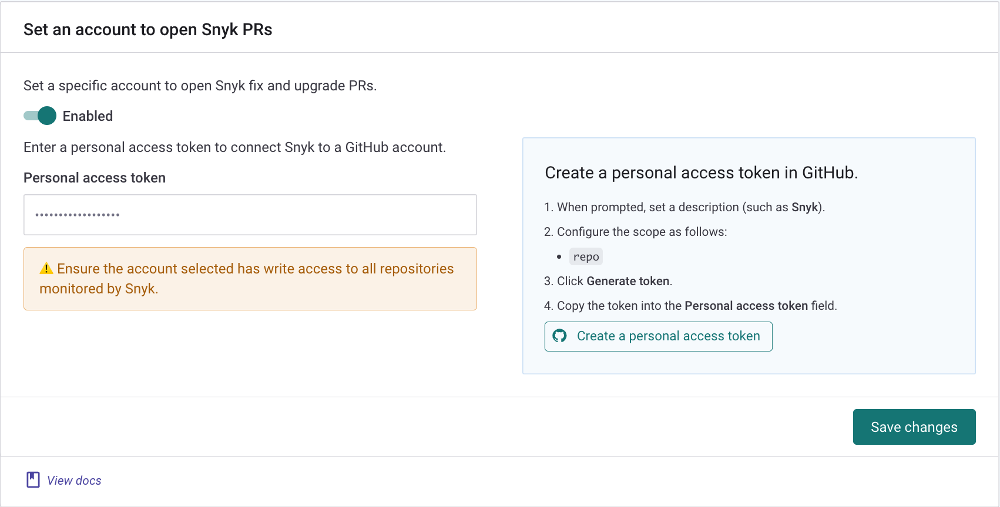
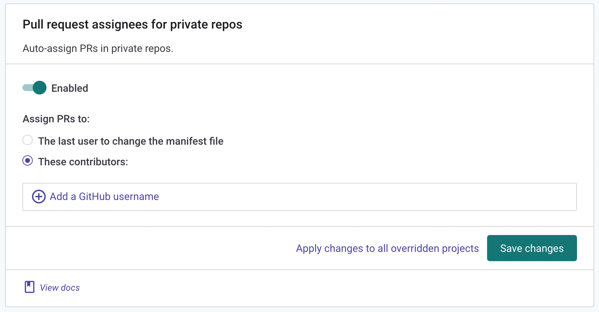

# GitHub integration

Snyk's GitHub integration lets you:

* Continuously perform security scanning across all the integrated repositories
* Detect vulnerabilities in your open-source components
* Provide automated fixes and upgrades


Before using GitHub integration, Snyk recommends Enterprise plan customers consider whether to use GitHub integration or GitHub Enterprise integration. For details, see [Using GitHub or GitHub Enterprise integration](using-github-or-github-enterprise-integration.md) and the information that follows about Snyk integration settings for GitHub.


## About Snyk integration settings for GitHub

The GitHub integration works _per user account_ and _**not**_ per Snyk Organization.\
Each person in the Organization sets up the integration and their own unique integration settings: there are no shared Organization level settings for the GitHub integration.


Setting up this integration means it will be used for _**all**_ the Snyk Organizations associated with your user \_\_ account.


When you import a Snyk Project via your GitHub integration with the Snyk PR functionality enabled, Snyk PRs are created for that Project. Similarly, if _another_ person imports Projects with _their_ GitHub integration after _disabling_ the Snyk PR functionality, Snyk PRs are _not_ created for the Projects they import.


You cannot use a GitHub integration to import public and private Projects via the Snyk API with a Snyk Service Account. This functionality is not available because the GitHub integration is associated with _your_ _user account_ and _**not**_ with the Snyk Organization.\
\
To import public and private Projects via the API with a Snyk Service Account, use the [GitHub Enterprise integration](github-enterprise-integration.md).


## Setting up a GitHub integration

The process to connect Snyk with your GitHub repositories includes the following steps:

1. In Snyk, go to **Integrations > GitHub**.
2. Choose whether to give Snyk access to both public and private repositories or only to public repositories.\
   The GitHub authorization screen opens.
3. In the GitHub authorization screen, click **Authorize Snyk** to provide Snyk with access to your repositories.
4. Select the repositories you want to import to Snyk and click **Add selected repositories** (upper right corner of the page).

After you add them, Snyk scans the selected repositories for dependency files in the entire directory tree, that is, `package.json`, `pom.xml`, and so on, and imports them to Snyk as Projects.

The imported Projects appear on your **Projects** page and are continuously checked for vulnerabilities.

<figure><figcaption><p>Add selected repositories</p></figcaption></figure>

## GitHub integration features

Once the integration is in place, you can use capabilities such as:

* [Project-level security reports](github-integration.md#project-level-security-reports)
* [Project monitoring and automatic fix pull requests](github-integration.md#project-monitoring-and-automatic-fix-pull-requests)
* [Commit signing](github-integration.md#commit-signing)
* [Pull request testing](github-integration.md#pull-request-testing)

### **Project-level security reports**

Snyk produces advanced [security reports](../../manage-issues/snyk-reports/reports-overview.md) that let you explore the vulnerabilities found in your repositories and fix them right away by opening a fix pull request directly in your repository, with the required upgrades or patches.


**Feature availability**\
Reports are available with Enterprise plans. See the [plans and pricing](https://snyk.io/plans/) page for details.


The example that follows shows a Project-level security report.

<figure><figcaption><p>Project-level security report</p></figcaption></figure>

### **Project monitoring and automatic fix pull requests**

Snyk scans your Projects on either a daily or a weekly basis. When new vulnerabilities are found, Snyk notifies you via email and opens automated pull requests with fixes for your repositories.

The example that follows shows a fix pull request opened by Snyk.

<figure><figcaption><p>Fix pull request opened by Snyk</p></figcaption></figure>

To review and adjust the automatic fix pull request settings in the Snyk GitHub Integration settings page, go to  Organization **Settings** **>** **Integrations > Source control > GitHub**.

<figure><figcaption><p>Automatic fix pull request settings</p></figcaption></figure>

### Commit signing

All the commits in Snyk's pull requests are done by `snyk-bot@snyk.io` (a verified user on GitHub), and signed with a PGP key. All Snyk pull requests appear as verified on GitHub, thus providing your developers with the confidence that the fix and upgrade pull requests are generated by a trusted source.


**Feature availability**

This feature is _not_ supported for brokered GitHub integrations.


### **Pull request testing**

Snyk tests any newly-created pull request in your repositories for security vulnerabilities and sends a status check to GitHub. This lets you see, directly in GitHub, whether the pull request introduces new security issues.

The example that follows shows how Snyk pull request checks appear on the GitHub pull request page.

<figure><figcaption><p>Snyk pull request checks on GitHub pull request page</p></figcaption></figure>

You can review and adjust the pull request test settings via the Snyk GitHub Integration settings page in  Organization **Settings** **>** **Integrations > Source control > GitHub**.

<figure><figcaption><p>Pull request test settings</p></figcaption></figure>

## Required permissions scope for the GitHub integration

If you are on a Snyk Enterprise plan, you can use [Snyk Broker](../snyk-broker/) as a proxy between Snyk and your Source Code Management (SCM) system on-premise platforms, including Snyk Code Support, or your publicly-accessible Git-based repositories.

Snyk Broker lets you view and control Snyk activity in those repositories for increased data security.

### Brokered GitHub integrations

All the operations, both those that are triggered via the Snyk Web UI and the automatic operations, are performed for a GitHub service account that has its token configured with the Broker.

The table below provides a summary of the required access scopes for the configured token.

| **Action**                                              | **Purpose**                                                                                                                                                                                                                                         | **Required permissions in GitHub** |
| ------------------------------------------------------- | --------------------------------------------------------------------------------------------------------------------------------------------------------------------------------------------------------------------------------------------------- | ---------------------------------- |
| Daily / weekly tests                                    | Used to read manifest files in private repositories                                                                                                                                                                                                 | _repo (all)_                       |
| Manual fix pull requests (triggered by the user)        | Used to create fix PRs in the monitored repositories                                                                                                                                                                                                | _repo (all)_                       |
| Automatic fix and upgrade pull requests                 | Used to create fix or upgrade PRs in the monitored repositories                                                                                                                                                                                     | _repo (all)_                       |
| Snyk tests on pull requests                             | Used to send pull request status checks whenever a new PR is created or an existing PR is updated                                                                                                                                                   | _repo (all)_                       |
| Importing new projects to Snyk                          | Used to present a list of all the available repos in the GitHub org in the **Add Projects** screen (import popup)                                                                                                                                   | _admin:read:org, repo (all)_       |
| Snyk tests on pull requests - **initial configuration** | <p>Used to add SCM webhooks to the imported repos. Snyk uses these webhooks to:</p><ul><li>Track the state of Snyk pull requests when PRs are created, updated triggered, merged, and so on</li><li>Send push events to trigger PR checks</li></ul> | _admin:repo\_hooks (read & write)_ |

### Non-brokered GitHub integrations

1. Operations that are triggered via the Snyk Web UI, for example, opening a Fix PR or retesting a project, are performed on behalf of the acting user. Therefore, a user who wants to perform this operation on GitHub via the Snyk UI must connect their GitHub account to Snyk, and have the required permissions scope for the repositories they want to perform these operations for. See the [Required permissions scope for repositories](github-integration.md#h\_01eefvj14p8b3depeffvyvdwzj) section for details.
2. Operations that are not triggered via the Snyk Web UI, such as daily / weekly tests and automatic PRs (fix and upgrade), are performed on behalf of random Snyk Organization members who have connected their GitHub accounts to Snyk and have the required permission scope for the repository.
3. For public repositories that are non-brokered, some operations, such as creating the PR, may occasionally be performed by `snyk-bot@snyk.io`.


A Snyk Organization administrator can [designate a specific GitHub account to use for opening fix and upgrade PRs](opening-fix-and-upgrade-pull-requests-from-a-fixed-github-account.md).

Note that Snyk will continue to use a random Snyk Organization member’s GitHub account to perform all the other operations. Therefore using this feature does not eliminate the need to connect users' GitHub accounts to Snyk.


## Required permission scope for repositories <a href="#h_01eefvj14p8b3depeffvyvdwzj" id="h_01eefvj14p8b3depeffvyvdwzj"></a>

For Snyk to perform the required operation on monitored repositories, that is, reading manifest files on a frequent basis and opening fix or upgrade PRs, the accounts that are connected to Snyk, either directly or via Snyk Broker, must have the following access to the repositories:

| **Action**                                              | **Purpose**                                                                                                                                                                                                                                           | **Required permissions on the repository** |
| ------------------------------------------------------- | ----------------------------------------------------------------------------------------------------------------------------------------------------------------------------------------------------------------------------------------------------- | ------------------------------------------ |
| Daily / weekly tests                                    | Used to read manifest files in private repos                                                                                                                                                                                                          | _Read_ or higher                           |
| Snyk tests on pull requests                             | Used to send pull request status checks whenever a new PR is created or an existing PR is updated                                                                                                                                                     | _Write_ or higher                          |
| Opening fix and upgrade pull requests                   | Used to create fix and upgrade PRs in the monitored repos                                                                                                                                                                                             | _Write_ or higher                          |
| Snyk tests on pull requests - **initial configuration** | <p>Used to add SCM webhooks to the imported repos. Snyk uses these webhooks to:</p><ul><li>Track the state of Snyk pull requests (when PRs are created, updated triggered, merged, and so on)</li><li>Send push events to trigger PR checks</li></ul> | _Admin_                                    |

### **Setting an account to open Snyk PRs**

Snyk lets you designate a specific GitHub account to open fix and upgrade pull requests.

Note that the configured account is only used for _opening_ PRs. All the other operations are still performed on behalf of a random Snyk Organization member who has connected their GitHub accounts to Snyk.

To use this feature, follow the steps below:

1. Go to the GitHub Integrations settings page in the Snyk Web UI, via  Organization **Settings** **>** **Integrations > Source control > GitHub.**
2. In the **Set an account to open Snyk PRs** section, set the toggle to **Enabled**.
3. In the right side of the section, follow the instructions to **Create a personal access token in GitHub**.
4. In the **Personal access token** field, paste the newly generated token into Snyk so it can be used to perform operations on GitHub, opening Fix PRs, and so on.

<figure><figcaption><p>Set an account to open Snyk PRs</p></figcaption></figure>


Make sure that the GitHub account that you designate to open Snyk PRs has **write** level permissions or higher for the repos you want to monitor with Snyk.

See [repository permission levels on GitHub](github-integration.md#required-permissions-scope-for-the-github-integration) for more information.


### **Assigning pull requests to users** <a href="#pr-assignment" id="pr-assignment"></a>

Snyk can automatically assign the pull requests it creates to ensure that they are handled by the right team members.

Auto-assign for PRs can be enabled for the GitHub integration and all projects imported via GitHub, or on a per-project basis.


**Feature availability**

The Auto-assign PRs feature is supported only for private repositories.


Users can either be manually specified, and all will be assigned, or automatically selected based on the last commit user account.

#### **Enable Auto-assign for all projects in the GitHub integration**

To configure the Auto-assign settings for all the Projects from an imported private repository, go to the Github integration settings via  Organization **Settings** **>** **Integrations > Source control > GitHub**, enable **Auto-assign PRs in private repos**, and choose to assign PRs to the last user to change the manifest file or specified contributors.

<figure><figcaption><p>Auto-assigne PRs in proviate repos</p></figcaption></figure>

#### **Enable Auto-assign for a single project in the Github integration**

To configure the Auto-assign settings for a specific project from an imported private repository.

1. In the **Projects** tab for your Organization, select and expand the relevant private repository, select a Target, and click the **Settings** cog.\
   \
   The Project page opens.
2. On the Project page, to apply unique settings for that specific Project, select the **Settings** tab in the upper right, and the **Github integration** \_\_ option in the left sidebar.
3. Go to the **Pull request assignees for private repos** section at the bottom of the page and choose to **Inherit from integration settings** or **Customize only for this project**. Ensure **Auto-assign PRs for this private project** is enabled. Choose to assign PRs to the last user to change the manifest file or named contributors.

<figure><figcaption><p>Auto-assign PRs for this private project</p></figcaption></figure>

## Disconnecting the GitHub integration

Snyk’s GitHub SCM integration leverages the OAuth app integration. If you integrated GitHub without using Snyk Broker, you can disconnect it by following these steps:

1. In GitHub, log in to the GitHub account that you used to create the integration.
2. Go to your GitHub account settings and select the **Applications** option in the left sidebar.
3. Select the **Authorized OAuth Apps** tab.\
   You can also reach the [Authorized OAuth Apps tab directly](https://github.com/settings/applications).
4. Find the **Snyk** entry, click the three (3) dots on the right, and select **Revoke**.

<figure><figcaption><p>Revoke OAuth authorization</p></figcaption></figure>

Revoking this access effectively disconnects Snyk’s access to that GitHub account. Existing imported snapshots will persist in Snyk and continue to be re-scanned based on the existing snapshots until deleted. Snyk will no longer be able to import new projects from the GitHub integration and will no longer re-scan on new code merges.

In addition, you must confirm that Snyk is not enabled on any existing **Branch protection rules**: From the main page of your GitHub repository, go to **Settings > Branches > Branch protection rules,** and make sure there are no **Status checks found in the last week for this repository.**

## GitHub badges

Once you are vulnerability-free, you can put a badge on your README page to let the world know that your package has no known security holes. This shows your users that you care about security, and tells them that they should care too.

The badge indicates the vulnerability state of the latest commit on the master branch.

### Repository badges

To show a badge for a specific Node.js, Ruby, or Java GitHub repository, copy the relevant HTML or markdown snippet below and replace `{username}/{repo}` with the GitHub username and repo you want to test.

**HTML**

```
<a href="https://snyk.io/test/github/{username}/{repo}">
```

**Markdown**

```
[](https://snyk.io/test/github/{username}/{repo})
```

#### Badges for a branch, release version, or other tag

To show the vulnerability state of a specific branch, release, or tag, add its name after the repo name in the URL.

For example, to show a badge for the 4.x branch of the express repo, you would use the URL: [https://snyk.io/test/github/expressjs/express/4.x/badge.svg](https://snyk.io/test/github/expressjs/express/4.x/badge.svg).

#### Badge results

* A green badge indicates that there are no vulnerabilities. 
* A red badge indicates how many vulnerabilities were found. 
* A grey badge indicates that the repository has not been scanned. 

#### **Badge styles**

To change the style of the badge, you can add the following query parameters after `badge.svg`:

* Flat rectangle with squared edges: `?style=flat-square` 
* "Plastic" rectangle with rounded edges and shading `?style=plastic` 

### **npm badges**

To show a badge for a given npm package, copy the relevant snippet that follows, and replace `{name}` with the name of your package.

**HTML**

```

```

**Markdown**

```
[](https://snyk.io/test/npm/{name})
```

The badge shows the vulnerability state of the latest version of this package. To show the vulnerability state of a specific package, you can specify the version in the URL.

For example, to test version 1.2.3 of package name, you would use the URL: [https://snyk.io/test/npm/name/1.2.3/badge.svg](https://snyk.io/test/npm/name/1.2.3/badge.svg).

### **Badges for private packages and repos**

Badges currently work only for public npm packages and GitHub repositories, and fail if pointed at a private repository. To continuously watch for vulnerabilities in your GitHub repositories, both public and private, consider integrating them with Snyk.

### **Badges for custom manifest file locations**

By default, the badge will test against the first [valid manifest file](../../scan-application-code/snyk-open-source/snyk-open-source-supported-languages-and-package-managers/) it detects in the root of your project.

If your manifest file is in different location from the root of the repository, or if you have multiple manifest files for which you would like to show a badge , you can pass a targetFile query string parameter to direct the badge to test against another supported manifest file.

**HTML**

```
<a href="https://snyk.io/test/github/{username}/{repo}">
```

**Markdown**

```
[](https://snyk.io/test/github/{username}/{repo})
```
