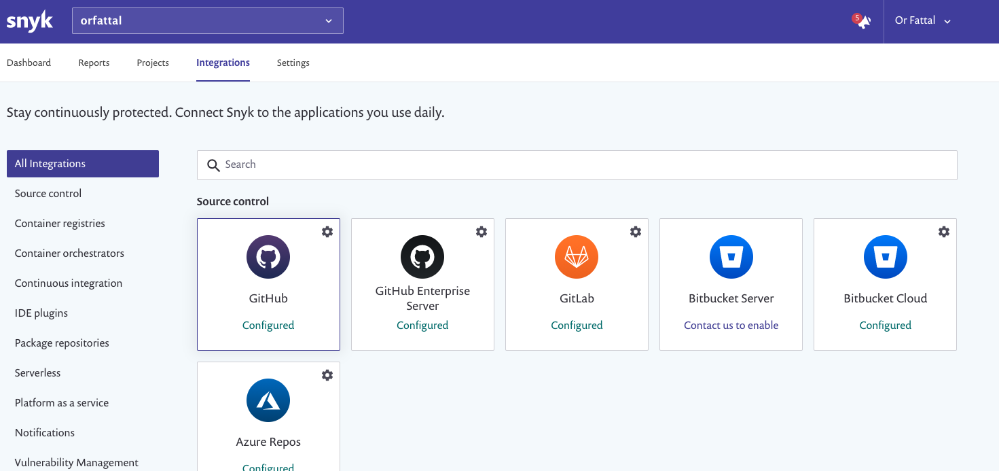
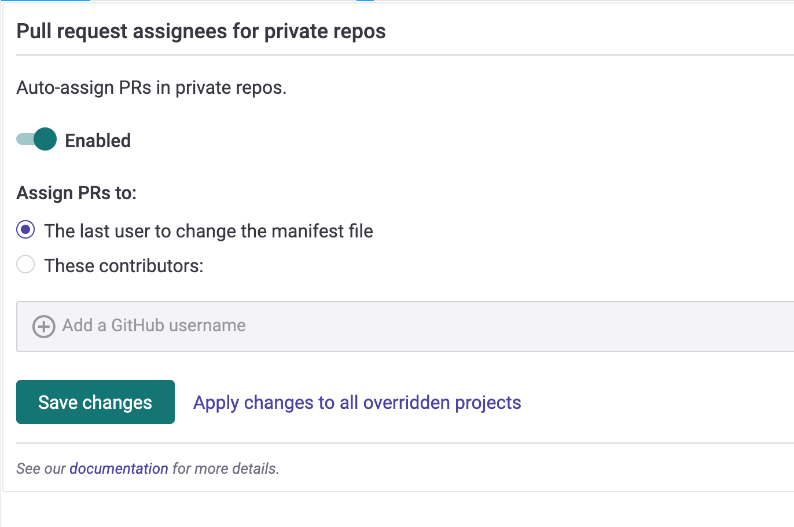

# GitHub integration

Snyk's GitHub integration allows you to continuously perform security scanning across all the integrated repositories, detect vulnerabilities in your open source components and provide automated remediation and upgrade fixes.

Please note, GitHub integrates per user rather than per org. Setting up this integration means it will be used for all organizations associated with your account.

## Setting up a GitHub Integration

1. Go to the Integrations page and click on “GitHub”:
2. Choose whether you'd like to give Snyk access to both public and private repositories or only to public repositories:

   

3. When the GitHub authorization screen opens, click on "Authorize snyk" to provide it with an access to your repositories:

   

4. Select the repos you'd like to import to Snyk. When done, click on the **Add selected repositories** button, at the top of the page. Once clicked, Snyk will start scanning the selected repos for dependency files \(i.e. package.json, pom.xml, etc\) in the entire directory tree and import them to Snyk as projects:

   

5. The imported projects now appear in your Projects page and are continuously checked for vulnerabilities.

## GitHub Integration Features

Once the integration is in place, you'll be able to enjoy the following capabilities:

### **1. Project level security reports**

Snyk will produce advanced security reports, allowing you to explore the vulnerabilities found in your repositories and fix them right away by opening a fix pull request directly to your repository, with the required upgrades or patches.

This is an example of a project level security report:

### **2. Projects monitoring and automatic fix pull requests**

Snyk will frequently scan your projects on either a daily or a weekly basis. When new vulnerabilities are found, it will notify you by email and by opening an automated pull requests with fixes to repositories. Here is an example of a fix pull request opened by Snyk:  

You can review and adjust the automatic fix pull request settings by navigating to the GitHub's Integration Settings page in Snyk \(Settings --&gt; Integration --&gt; GitHub\):

\* All the commits in Snyk's PRs are done by [snyk-bot@snyk.io](mailto:snyk-bot@snyk.io) - a verified user in GitHub, and signed with a PGP key. Therefore, all Snyk PRs will appear as verified in GitHub, providing your developers confidence that the fix / upgrade PRs are generated by a trusted source. This feature is supported only on non Brokered GitHub integrations.

### **3. Pull request testing**

Snyk will test any newly created pull request in your repositories for security vulnerabilities and send a status check to GitHub so you can see whether the pull request introduces new security issues, directly from GitHub.

This is how Snyk pull request checks appear in the Pull Request page in GitHub:

### 

You can review and adjust the pull request tests settings by navigating to the GitHub's Integration **Settings** page in Snyk \(Settings --&gt; Integration --&gt; GitHub\):

## Required permissions scope for the GitHub integration

### Non Brokered GitHub Integrations

1. Operations that are triggered via the Snyk UI, for example, opening a Fix PR or retesting a project are performed on behalf of the acting user. Therefore, a user that wants to perform this operation in GitHub via the Snyk UI, must connect their GitHub account to Snyk and have the required permissions scope for the repositories they would like to perform these operations for, [see this for more details](github-integration.md).
2. Operations which are not triggered via the UI, as daily / weekly tests and automatic PRs \(fix and upgrade\) are performed on behalf of a random Snyk organization members who have connected their GitHub accounts to Snyk and have the required permissions scope for the repository.

**Note:** a Snyk organization admin can configure a [specific GitHub account on whose behalf the PRs will be opened](opening-fix-and-upgrade-pull-requests-from-a-fixed-github-account.md). In this case, Snyk will continue using a random Snyk organization member’s GitHub account to perform all the other operations. Therefore, using this feature does not eliminate the need for connecting users’ GitHub accounts to Snyk.

### Brokered GitHub Integrations

All the operations, both the ones that are triggered via the UI and the automatic ones, are performed on behalf of a GitHub service account that its token is configured with the Broker. This is the breakdown of the required access scopes for the configured token:

| **Action** | **Why?** | **Required permissions in GitHub** |
| :--- | :--- | :--- |
| Daily / weekly tests | For reading manifest files in private repos | _repo \(all\)_ |
| Manual fix pull requests \(triggered by the user\) | For creating fix PRs in the monitored repos | _repo \(all\)_ |
| Automatic fix and upgrade pull requests | For creating fix / upgrade PRs in the monitored repos | _repo \(all\)_ |
| Snyk tests on pull requests | For sending pull request status checks whenever a new PR is created / an existing PR is updated | _repo \(all\)_ |
| Importing new projects to Snyk | For presenting a list of all the available repos in the GitHub org in the "Add Projects" screen \(import popup\) | _admin:read:org, repo \(all\)_ |
| Snyk tests on pull requests - initial configuration | For adding Snyk's webhooks to the imported repos, so Snyk will be informed whenever pull requests are created or updated and be able to trigger scans | _admin:repo\_hooks \(read & write\)_ |

### Required permissions scope for repositories 

In order for Snyk to be able to perform the required operation on monitor repositories, i.e. reading manifest files on a frequent basis, opening fix or upgrade PRs and etc, the accounts which are connected to Snyk \(either directly or via Broker\) need to have the following access on the repositories:

| **Action** | **Why?** | **Required permissions on the repository** |
| :--- | :--- | :--- |
| Daily / weekly tests | For reading manifest files in private repos | _Write_ or above |
| Snyk tests on pull requests | For sending pull request status checks whenever a new PR is created / an existing PR is updated |  |
| Opening fix and upgrade pull requests | For creating fix / upgrade PRs in the monitored repos |  |
| Snyk tests on pull requests - initial configuration | For adding Snyk's webhooks to the imported repos, so Snyk will be informed whenever pull requests are created or updated and be able to trigger scans | _Admin_ |

**1. Opening fix and upgrade pull requests from a fixed GitHub account**

Snyk allows you to configure a specific GitHub account on whose behalf the fix and upgrade PRs will be opened. Please note that the configured account is only used for opening PRs. All the other operation will still be performed on behalf of a random Snyk organization members who have connected their GitHub accounts to Snyk.

In order to use this feature, you'll need to do the following:

1. Open GitHub's Integrations Settings page in Snyk app by clicking on _Settings_ → _Integrations_ →  _GitHub_
2. Enable the toggle button under the _Open fix and upgrade pull requests from a fixed GitHub_ _account_  setting: 
3. Follow the in-page instructions for creating a personal access token in GitHub
4. Provide the newly generated token to Snyk so it can be used to perform operations in GitHub \(i.e. opening Fix PRs and etc\)

**Important note:**

Make sure that the GitHub account for which the token is provided, has _**write**_ level permissions or above, to the repos you'd like to monitor with Snyk.

Read more about [repository permission levels in GitHub](github-integration.md#required-permissions-scope-for-the-github-integration).   

### **2. Pull request assignees** 

Snyk can automatically assign pull requests it creates to help ensure that they are actioned by the right people.

This can be enabled for the GitHub integration \(and all projects imported via GitHub\), or on a per-project basis. This feature is supported only for private repositories.

Users can either be manually specified \(and all will be assigned\) or automatically select based on the last committing-user.

**Enabling for all projects within the Github integration**

Go to GitHub's Integration _Settings_ page in Snyk \(Settings --&gt; Integration --&gt; GitHub\):

**Enable for one project**

Go to the project's settings, and the "Integration settings" tab within the project settings:

