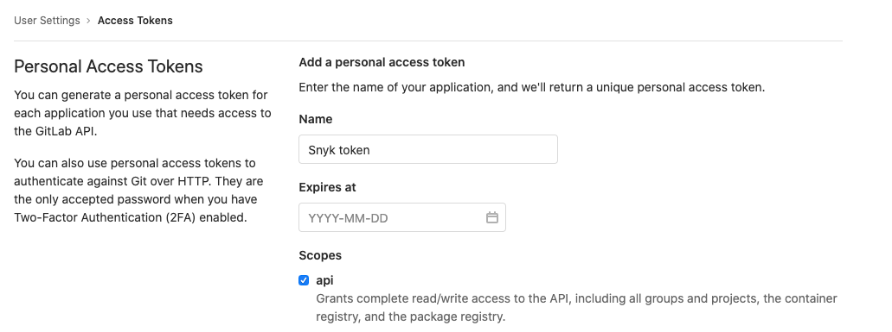
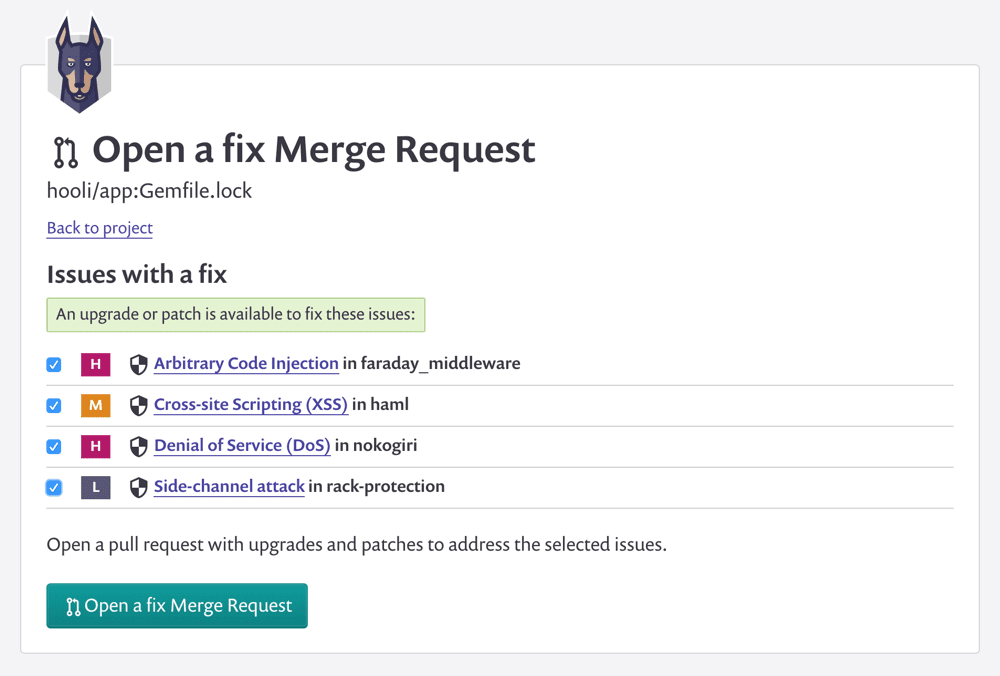
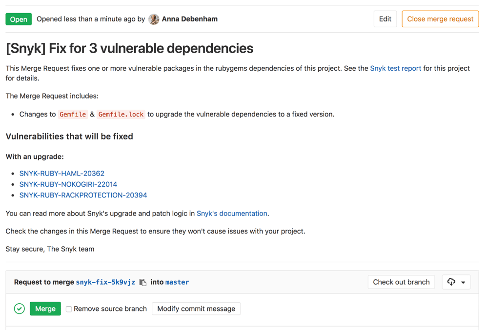

# GitLab integration

## Prerequisites

* GitLab versions 9.5 and above (API v4).
* Publicly reachable GitLab instance.
* To integrate from within a private network, [Snyk Broker](../../enterprise-setup/snyk-broker/) is required.


**Feature availability**\
Scanning of self-managed and self-hosted source code on GitLab Enterprise is available with the Snyk Enterprise plan. For details, see[ the Snyk plans and pricing page](https://snyk.io/plans).


## Snyk GitLab integration features

***

The Snyk GitLab integration allows you to:

1. See Snyk tests in your pull requests that check for vulnerabilities.
2. Get email alerts and a Snyk pull request with fixes when new vulnerabilities that affect your repo are disclosed.
3. Get email alerts and a Snyk pull request if a new upgrade or patch is available for a vulnerability that affects you.
4. Trigger a Snyk pull request on snyk.io with fixes from the test report page or the Project page for your repo.


**GitLab webhooks** send out an event to Snyk when merge requests occur. This starts a series of other events, such as pulling Project files, running the test process, and posting the results to GitLab, all of which occur on the Snyk side.


## How to set up the GitLab integration

1. Generate a Personal Access Token in your GitLab instance. Find this option in your user account settings area in the **Access Tokens** section. Alternatively, you can use a [Group Access Token](https://docs.gitlab.com/ee/user/group/settings/group\_access\_tokens.html) to grant access to all Projects within a GitLab group or subgroup without contributing to GitLab's licensed user count.
2. Go to the Snyk [integrations](https://app.snyk.io/integrations) page and click **Connect to GitLab**.
3. In your GitLab integrations settings, in **General** > **Account settings**, enter your account credentials and the token you generated.

<figure><figcaption>
GitLab account settings, enter Personal Access Token
</figcaption></figure>

## Required permissions and roles

The following explains the permissions needed for integration with GitLab.

Follow these steps to integrate with GitLab as a Snyk admin user or as a member of the Organization.

### User with Personal Access Token

1. Ensure that the GitLab user you are generating the access token for is either the **Owner** of the Projects (repos) to be monitored with Snyk or has **Maintainer** permissions to them.
2. Generate a [personal access token](https://gitlab.com/-/profile/personal\_access\_tokens) enabling the **api** scope for access.

<figure><figcaption>
Generate GitLab personal access token
</figcaption></figure>

### Group Access Token

1. Locate your group in GitLab, and select **Settings > Access Tokens**.
2. Enter a descriptive token name such as "Snyk token", select the **Maintainer** role, and check the **api** scope**.**

<figure><figcaption>
Generate GitLab group access token
</figcaption></figure>

The **api** scope with a **Maintainer** role enables the following:

* Snyk to authenticate user accounts and to create webhooks, which are necessary for automating fix pull requests and Snyk test on your pull requests
* Continuous write access to enable the Snyk Organization users to manually trigger the creation of fix pull requests
* Continuous read access, enabling Snyk to monitor your Projects and enabling you and the other members of the Organization to manually re-trigger tests.

When the first user in a Snyk Organization (a Snyk admin account user) sets up an integration with a GitLab personal access token or group access token, the token is authenticated with GitLab, enabling access by Snyk to the repositories in that account. After thatto trigger the creation of fix pull requests manually, all users in that Snyk Organization can add and work with any related Projects, while the merge requests themselves will appear in GitLab as having been opened by the original GitLab user, the Snyk admin who set up the configuration.

## **Fix vulnerabilities with Snyk merge requests in GitLab**

When viewing a Snyk test report for a Project that you own or when looking at a Project that you are watching with Snyk, you see two options for fixing a vulnerability:

* **Open a fix Merge Request:** generate a Snyk merge request with the minimal changes needed to fix the vulnerabilities affecting the Project.
* **Fix this vulnerability:** generate a Snyk merge request that fixes only this vulnerability.

You can review the vulnerabilities that will be fixed, change your selection, and choose to ignore any vulnerabilities that cannot be fixed now before opening the merge request on the **Open a fix Merge Request** page.

<figure><figcaption>
Open a fix Merge Request
</figcaption></figure>

When you open a merge request via snyk.io, Snyk notifies you. An example follows:

<figure><figcaption>
Notification of merge request
</figcaption></figure>

### Get a Snyk merge request for newly disclosed vulnerabilities that affect you

Whenever a vulnerability is disclosed that affects a Project you are watching, Snyk will email you about it and generate a Snyk merge request that addresses the vulnerabilities. You will receive a merge request similar to the preceding example.

### Get a Snyk merge request when new upgrades or patches are available

When no upgrade is available, you can ignore or patch the vulnerability; patching is available only for Node.js Projects. When a fix option has become available, for example, an upgrade for a vulnerability you previously ignored, Snyk notifies you about this via email and also generates a merge request with the new fix.

## How to disable the GitLab integration


Disabling a GitLab integration effectively removes all Snyk integrations and webhooks, along with the Snyk credentials, and deactivates the GitLab Projects in the Snyk Web UI.


The Project will be set to inactive, and you will no longer get alerts, pull requests, or Snyk tests on your pull requests. Again, the webhook that enables the integration for this repo will be removed.

You can restart watching at any time; however, re-initiating GitLab Projects for monitoring requires setting up the integration again.
