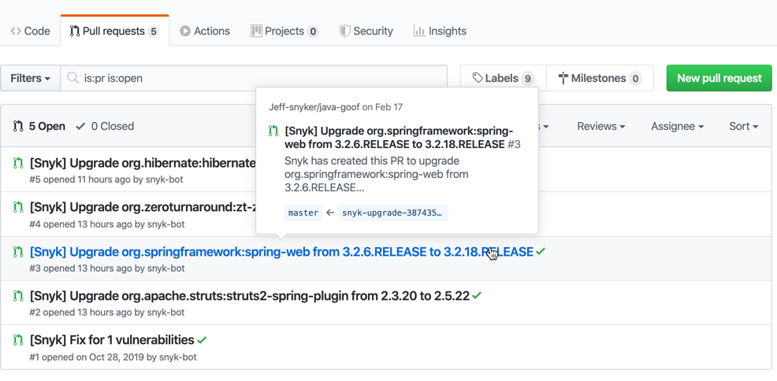
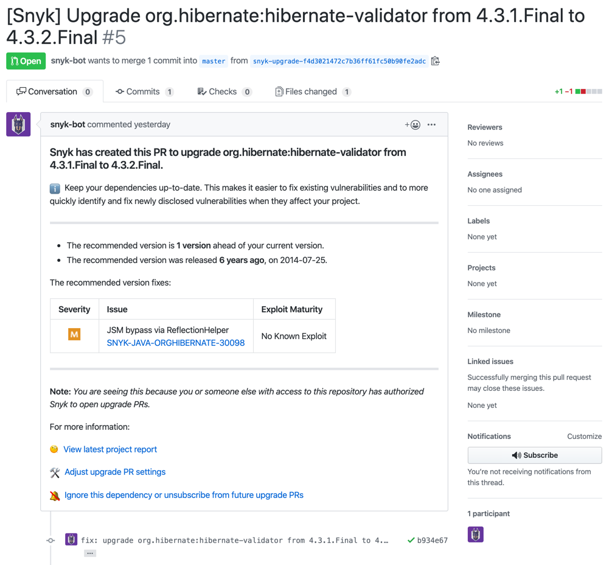

# View and understand Snyk upgrade pull requests

In addition to fix advice, Snyk can automatically create pull requests (PRs) on your behalf in order to upgrade your dependencies based on the scan results. Snyk currently supports this feature for npm, Yarn, Maven-Central, NuGet (C#), Pip and PyPI (Python), and Bundler (Ruby) Projects through GitHub, GitHub Enterprise Server, BitBucket Cloud, GitLab, and Azure repos.

To create PRs automatically in implementations with Snyk Broker, your administrator should first upgrade to v4.55.0 or later.


Administrators and account owners manage settings for Snyk upgrade pull requests from the Snyk Web UI on both the Organization and the Project levels by configuring whether the feature is on (enabled by default) and under what conditions Snyk should submit upgrade pull requests, if at all.


The steps follow to **view pull request details before merging**.

After Snyk submits an upgrade pull request on your behalf, you can view the pull request and all related details directly from the relevant repository.

To quickly review the pull request, hover over it. You can see the recommended upgrade and other pull request summary details:

<figure><figcaption>
Recommended upgrade
</figcaption></figure>

Open the pull request to view in-depth details, including package release notes and vulnerabilities included in the recommended upgrade.:

<figure><figcaption>
Pull request details
</figcaption></figure>

Click the Issue link from the table to view all details for the specified vulnerability directly from the Snyk database.

After you have reviewed the pull request, you can approve the merge.
