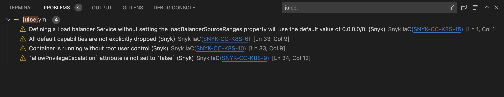
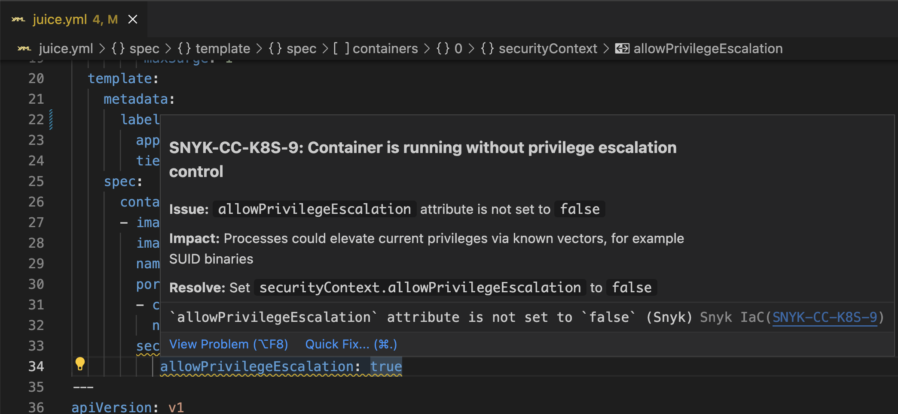
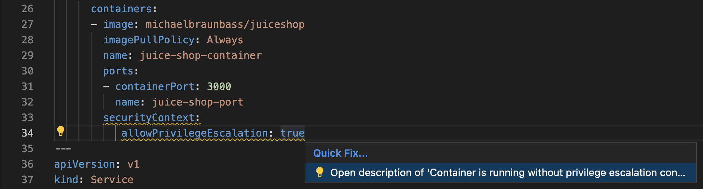

# Visual Studio Code extension analysis results: Snyk IaC Configuration

Snyk IaC Configuration analysis shows issues in your Terraform, Kubernetes, AWS CloudFormation, and Azure Resource Manager (ARM) code with every scan. Based on the Snyk CLI, the scan is fast and friendly for local development. The scan runs in the background and is enabled by default.

Misconfigurations in Infrastructure as Code files are reported as diagnostics, appearing in the **Problems** tab of VS Code.

<figure><figcaption>
VS Code Problems tab
</figcaption></figure>

For convenience, the issues are visible within the editor with the detailed information available on hover.

<figure><figcaption>
Issues visible within the editor
</figcaption></figure>

The issue description can also be opened in the browser via Code Action.

<figure><figcaption>
Issue description
</figcaption></figure>

Note: there is currently no dedicated tree view or details panel for the Snyk IaC results.
