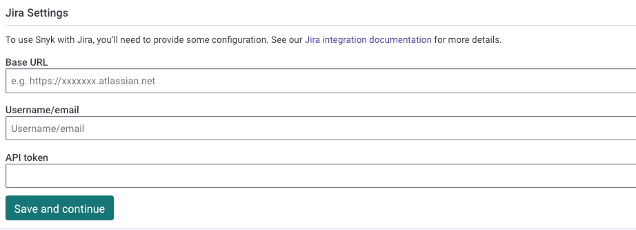
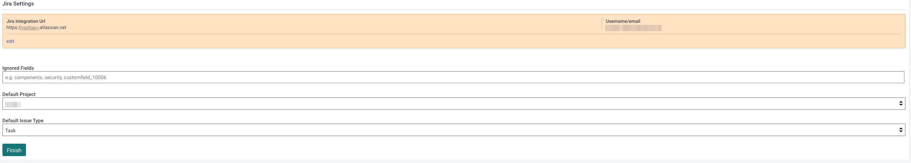
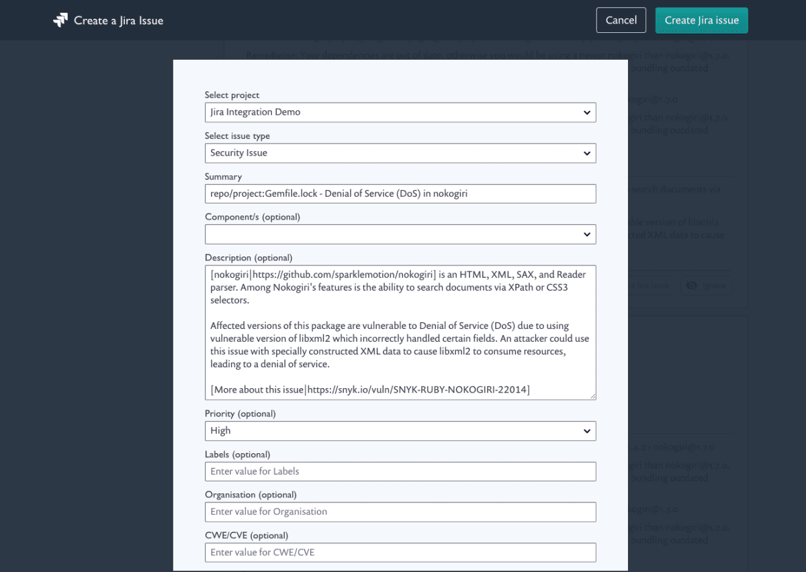

# Jira integration


For Snyk Infrastructure as Code, see [Jira Integration for IaC](../../scan-with-snyk/snyk-iac/snyk-iac-integrations/jira-integration-for-iac.md).


## **Set up your Jira integration**

Snyk Jira integration allows you to manually raise Jira issues in the Snyk UI for vulnerabilities or license issues. The Jira integration also includes the API endpoints [Create jira issue](../../snyk-api/reference/jira-v1.md#org-orgid-project-projectid-issue-issueid-jira-issue) and [List all jira issues](../../snyk-api/reference/jira-v1.md#org-orgid-project-projectid-jira-issues).


If your Jira instance is private, use [the Snyk Broker deployment method](../../implementation-and-setup/enterprise-setup/snyk-broker/classic-broker/install-and-configure-snyk-broker/jira-prerequisites-and-steps-to-install-and-configure-broker/jira-install-and-configure-using-docker.md).


## Prerequisites for Jira integration with Snyk

* Snyk supports Jira from version 5 to version 10.
* The following [Jira permissions](https://confluence.atlassian.com/adminjiraserver073/managing-project-permissions-861253293.html) are required: **Browse Projects** and **Create Issues.**

## How to set up your Jira integration

It is best practice to set up a new user in Jira for this integration, instead of using the credentials of an existing account.

Cloud-hosted Jira implementations require a username and API token authentication. Jira API tokens are generated in [Atlassian API tokens](https://id.atlassian.com/manage/api-tokens). Self-hosted implementations can also authenticate with a username and password.

Enter the Jira account credentials in the Snyk Web UI: **Organization Settings > Integrations** page: Base URL, Username/email, and API token.

<figure><figcaption>
Jira settings
</figcaption></figure>

After the details have been entered into the integration, press **Save and continue**.


If the connection is not successful, check that the Base URL starts with exactly `https://` It must not have capitals or be http.


If the connection is successful, you will see the connection details in orange at the top of the page.

Fill in the following fields:

* Default Project (required) - Select a Jira Project from the list.
* Default Issue Type (required) - Select an issue type from the list. The list is populated from available issue types within your project.
* Ignored Fields (optional) - Specified fields will be excluded from the prompt users see when creating Jira issues within Snyk. For custom fields, use the [custom field id](https://confluence.atlassian.com/jirakb/find-my-custom-field-id-number-in-jira-744522503.html) in the format `customfield_XXXXXX`.

<figure><figcaption>
A successful connection
</figcaption></figure>

## **Create a Jira issue**

After you set up the Jira integration connection, open one of your Snyk Projects in the Snyk Web UI. A new button, **Create an issue**, appears at the bottom of each vulnerability and license issue card. This button allows you to create a Jira issue.

<figure><figcaption>
Create an issue button
</figcaption></figure>

If the `Create an issue` button is not visible in the UI, ensure that `Group by none` is selected at the top of the Project's vulnerabilities table. This will then show the `Create an issue` button against the Project vulnerabilities.

<figure><figcaption>
Setting Group by none will show the Create Jira ticket button
</figcaption></figure>

When you select **Create an issue**, a Jira issue creation form appears. This form includes the Snyk issue details, which are copied into the associated fields. You can review and edit this form before creating the issue.

Select the Jira project to which you want to send the issue. The fields in the example that follows are based on the fields that the specific Project has, so switching between Projects may show different options.

<figure><figcaption>
Crate a Jira issue
</figcaption></figure>

After you create a Jira issue, the Jira key with a link is displayed on the issue card. If you are using the Jira API, you can generate multiple Jira issues for the same issue in Snyk.

<figure><figcaption>
Jira key on issue card
</figcaption></figure>

## Integrate with Jira using Snyk Broker

See [Set up Snyk Broker with Jira](../../implementation-and-setup/enterprise-setup/snyk-broker/classic-broker/install-and-configure-snyk-broker/jira-prerequisites-and-steps-to-install-and-configure-broker/jira-install-and-configure-using-docker.md).

## See also

[Snyk Security in Jira Cloud](snyk-security-in-jira-cloud-integration.md)
