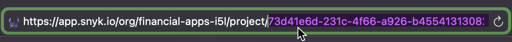
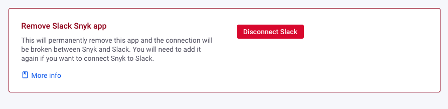

# Slack app


Snyk recommends that all customers use the Snyk Slack app, as the [Slack integration](slack-integration.md) is outdated.


The Snyk app for Slack is built as an official [Slack App](https://api.slack.com/start/overview#apps).

The Slack app provides the following benefits and more:

* Improved support for Snyk products: Open Source, Code, Container, and IaC
* Support for filtering on severity levels
* Support for overriding notifications at the Project level

## Overview of the Snyk app for Slack

The Snyk app for Slack highlights newly disclosed vulnerability information across your software from imported Projects and presents actionable context within your Slack workspace channels. Your teams get the issue notifications that matter the most and can act on them without leaving Slack.

This has the advantage of:

* Enhancing collaboration to discuss and resolve vulnerabilities quickly
* Maintaining awareness of relevant and emerging vulnerabilities
* Minimizing disruptions with issue notification thresholds

The Snyk app for Slack is based on [Snyk Apps](../../snyk-api/using-specific-snyk-apis/snyk-apps-apis/), providing you with the benefit of more granular scopes and more ability to configure issue notifications at the Organization and Project levels.


Vulnerabilities detected on initial import of Projects are not sent to Slack. Only newly disclosed vulnerabilities from imported Projects are sent to Slack.


## Enable the Snyk app for Slack

To enable the Snyk app for Slack, you must do the following:

1. Authorize the app with Snyk to get new issues data that can be forwarded to your Slack workspace.
2. Authorize the app with your Slack workspace to allow Snyk to send notifications to your channels in the workspace.
3. Configure the default notification settings in Snyk for all Projects in your Organization and add [Project-level notification overrides](slack-app.md#manage-project-level-notification-overrides) if you would like.

## Configure the Snyk app for Slack

Ensure the user performing this installation has the permission **Snyk Apps Management - Install Apps** before continuing. See [documentation for member roles](../../snyk-platform-administration/user-roles/user-role-management.md).

1. Open the [Snyk integrations page](https://app.snyk.io/integrations), navigate to **Notifications**, and click the **Slack App** tile.
2. You must give authorization for Snyk to access data from Slack by selecting **Authorize with Snyk**.
3. Additional authorization is requested for Snyk to access the Snyk Slack workspace. This involves content and info about channels and conversations, as well as enabling Snyk to perform action in those channels and conversations. To proceed, select **Allow**.


If multiple Slack workspaces are available, a dropdown will be visible at the top right of the page. Select the desired Slack workspace.


You can configure the integration to provide a Slack channel ID for the channel where issue notifications for the Organization are sent, and also filter by severity level.

<figure><figcaption>
Choose Slack channel and severity level for the notifications for the Organization
</figcaption></figure>

To find the channel ID of a Slack Channel, open Slack, right-click on the channel name, select **View channel details**, then scroll down to the bottom of the window where you will see the channel ID, for example, C2TB2222N.

To add the Snyk for Slack app to a private channel, you must first add the app manually to the channel from within Slack and then select the channel within the Snyk integration. In the Private channel, select **Channel settings - Integrations**, and then **Add an app**. Search for **Snyk for Slack** and select **add**. After you have done this, the channel is displayed on the **Settings** page for the integration.

If you are a Slack Admin, you can manually add the Snyk for Slack app to a private channel. To do this, type **@Snyk for Slack** in the chosen channel to summon the setup bot.

## Issue notifications

After the Slack app has been configured, new issue notifications are forwarded to the selected Slack channel according to the desired severity level threshold. \
New issue notifications may take up to an hour to start propagating to your Slack workspace after it is configured.&#x20;

<figure><figcaption>
Example of a new critical vulnerability notification received in Slack
</figcaption></figure>

## Manage Project-level notification overrides

To override Slack notification settings for a Project, use the **Customize per project** table.

Customization options include:

* Project ID
* Severity level
* Slack channel ID

### Add notification customizations

1. Select `Add customization` to open the creation dialog from the Slack App integration page.&#x20;
2. Paste your previously copied **Project ID** value.&#x20;
3. Select the desired issue **Severity level**.
4. Enter the **Slack channel ID** to target.&#x20;
5. Click **Save customization**.

### Find your Project ID

To set a Project level override, find the ID of the Project for which you want to send notifications.

1. Navigate to the Projects page using the application sidebar.
2. Select the desired Project.
3. Copy the UUID value that follows the `project/` path in the URL bar.

<figure><figcaption>
UUID value for your Project ID
</figcaption></figure>

### Edit or delete notification customizations

After a notification customization has been created, you can edit its configuration or delete it at any time. To do so, select the action in the ellipsis menu for the customization table entry.

<figure><figcaption>
Edit and Delete options for notification customizations
</figcaption></figure>

## Manage notification customizations using the REST API

To override Slack notification settings on a per-Project basis, you can use the API [Slack settings ](../../snyk-api/reference/slacksettings.md)endpoints.

Before attempting to use these endpoints, ensure that you have retrieved your authentication token and Organization ID (`org_id`) as outlined in the steps of the [guide for getting started using Snyk REST API.](../../snyk-api/rest-api/getting-started-with-the-rest-api.md)

### P**rerequisites** for managing Project-level notification overrides

#### Find the Slack App Bot ID

To interact with the Project-level notification customization endpoints, you must have a `bot_id`. You can obtain it with a request to the endpoint [Get a list of bots authorized to an organization](../../snyk-api/reference/apps.md#orgs-org_id-app_bots).

`GET /orgs/{org_id}/app_bots`


Ensure you apply the `expand=app` query string on your request. This enables you to find the Bot for the related Snyk App named **Slack App**.


#### Find your Project ID

To target the desired Project, you must have its `project_id`. You can obtain this with a GET request to the endpoint [List all Projects for an Org with the given Org ID](../../snyk-api/reference/projects.md#orgs-org_id-projects):

GET [/orgs/{org\_id}/projects](https://apidocs.snyk.io/?version=2023-08-04#get-/orgs/-org_id-/projects)

### Relevant REST APIs

After retrieving the `org_id`, `bot_id`, and `project_id` values, you can use the following create, read, update, and delete API operations:

#### [List all  Slack notification customizations for Projects](../../snyk-api/reference/slacksettings.md#orgs-org_id-slack_app-bot_id-projects)

`GET /orgs/{org_id}/slack_app/{bot_id}/projects`

#### [Create a Slack notification customization for a Project](../../snyk-api/reference/slacksettings.md#orgs-org_id-slack_app-bot_id-projects-project_id)

`POST /orgs/{org_id}/slack_app/{bot_id}/projects/{project_id}`

#### [Update a Slack notification customization for a Project](../../snyk-api/reference/slacksettings.md#orgs-org_id-slack_app-bot_id-projects-project_id-1)

`PATCH /orgs/{org_id}/slack_app/{bot_id}/projects/{project_id}`

#### [Delete a Slack notification customization for a Project](../../snyk-api/reference/slacksettings.md#orgs-org_id-slack_app-bot_id-projects-project_id-2)

`DELETE /orgs/{org_id}/slack_app/{bot_id}/projects/{project_id}`

## Remove the Snyk app for Slack

To remove the Snyk app for Slack, navigate to the settings page, locate **Remove Slack Snyk app** at the bottom of the page, and click the **Disconnect Slack** button:

<figure><figcaption>
Remove Slack App integration
</figcaption></figure>
