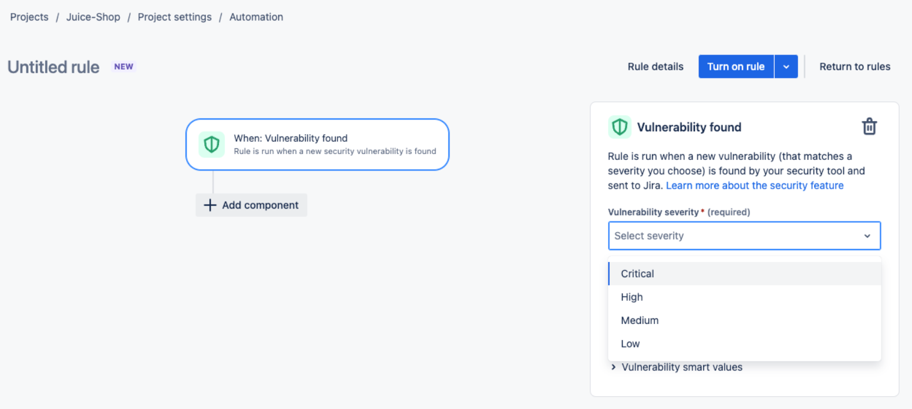
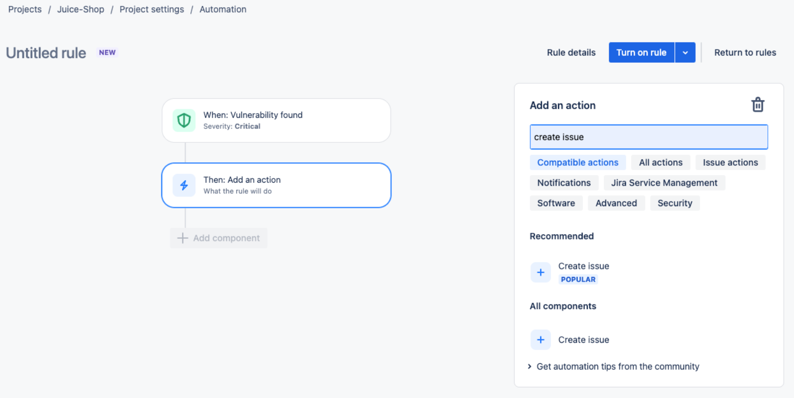
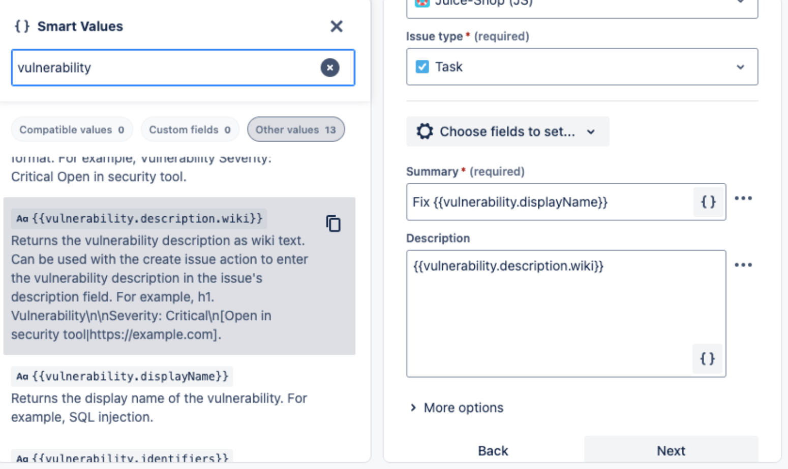
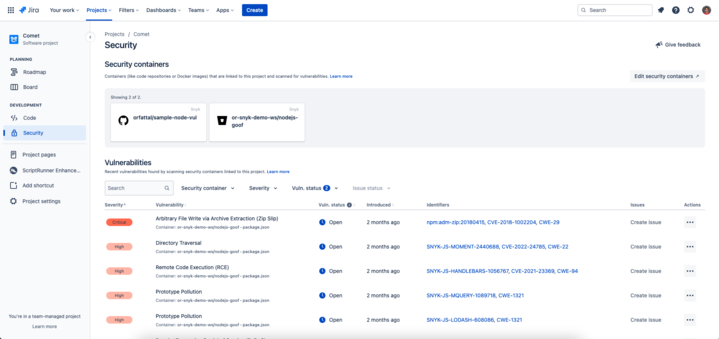
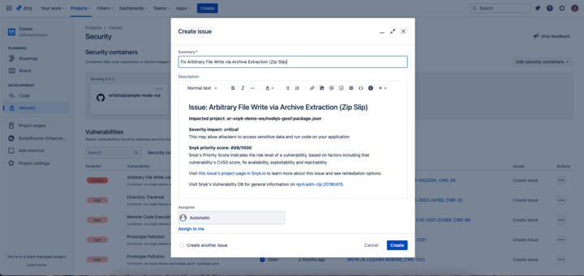
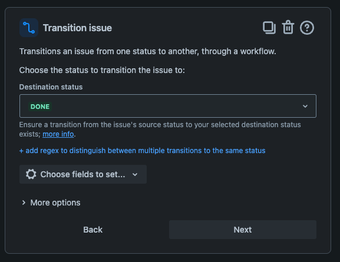

# Snyk Security in Jira Cloud integration


Jira Server and Jira Data Center are not supported.


Snyk Security in Jira Cloud helps developers identify, prioritize, and triage security vulnerabilities related to their code repositories directly from the Jira interface.

The Snyk Security in Jira Cloud integration mirrors your Snyk scan results from the Snyk platform to Jira. You can view Snyk results in your native Jira environment and create Jira issues for your results as needed. You can see which Snyk Organizations are connected and which Snyk Targets are associated with your Jira projects.

## Prerequisites for installation of Snyk Security in Jira Cloud

Snyk Security in Jira Cloud is a Jira app.

To install and configure the Jira app, you must be a Jira Cloud administrator in the site-admins, administrators, or jira-administrators group. Contact your IT team to support your effort in installing the Snyk Security in Jira Cloud app.

To connect the Jira app to Snyk, you must be a [Snyk Organization administrator](../../snyk-platform-administration/user-roles/pre-defined-roles.md).

To activate Security in Jira Cloud in Jira, navigate to **Project Settings > Features > Development > Security** and toggle **Security** **ON**.&#x20;

Ensure you have the following permission scopes in Jira, which are required for the integration to operate.

<table><thead><tr><th width="344.5">Required scope in Jira</th><th>Purpose</th></tr></thead><tbody><tr><td>Write data to the host application</td><td>Synchronize vulnerabilities in Snyk with Jira so they appear in the Security tab in Jira.</td></tr><tr><td>Read data from the host application</td><td>Read vulnerabilities from Jira to optimize the issues synchronization process.</td></tr><tr><td>Delete data from the host application</td><td>Remove vulnerabilities from Jira when a Snyk Organization is removed from Jira. </td></tr></tbody></table>


To add containers, you must have the **project admin** Jira permissions.


## Install Snyk Security in Jira Cloud

Follow these steps to install [**Snyk Security in Jira Cloud**](https://marketplace.atlassian.com/apps/1230482/snyk-security-in-jira-cloud) from the Atlassian Marketplace.

1. In Jira, navigate to **Apps** > **Find new apps.**
2. Search for **Snyk Security in Jira Cloud**.\
   If you are installing Jira for [EU](https://marketplace.atlassian.com/apps/1232502/snyk-security-in-jira-cloud-eu?hosting=cloud\&tab=overview) or [AU](https://marketplace.atlassian.com/apps/1232503/snyk-security-in-jira-cloud-au?hosting=cloud\&tab=overview) you must install the dedicated EU or AU app from the Atlassian app marketplace.\
   If you are installing Jira and are using SNYK-US-02 ([https://app.us.snyk.io/](https://app.us.snyk.io/)) you must install the [SNYK-US-02](https://marketplace.atlassian.com/apps/1232598/snyk-security-in-jira-cloud-snyk-us-02?hosting=cloud\&tab=overview) app from the Atlassian app marketplace.
3. Click the app and then select **Get it now.**
4. Review the information about the app, and select **Get it now**.
5. Follow the instructions to install the app.

## Configure the Snyk Security in Jira Cloud app

1. Go to **Apps** > **Manage apps.**
2. In the left menu, select **Snyk Security in Jira**.
3. Log in to your Snyk account, or sign up for a new Snyk account.
4. In Snyk, select **Grant access** to allow Snyk to read your Jira Software account information.
5. Select the specific Snyk Organizations to connect to your Jira site, and select **Grant app access**.

## Link code repositories to Jira projects

When you have completed the following steps to connect Snyk to Jira, you can start triaging security issues in Jira.


Typically research and development engineering managers do this task because they own the Jira projects and know their team's code repositories.


1. In Jira, navigate to your **Project** and select the **Security** tab.
2. Click the **Connect security containers** button.
3.  Click on the Snyk application and then select **Connect security containers**.

    <figure><figcaption>
Connect security containers in Jira via the Security tab and panels
</figcaption></figure>

4. Select your Snyk Organization from the list, and choose the Snyk Targets to connect to Jira.

<figure><figcaption>
Connect a security container in Jira via the Security panel
</figcaption></figure>

Developers can now use the security feature to view recent vulnerabilities found in the linked code repositories and start [creating Jira issues](snyk-security-in-jira-cloud-integration.md#create-a-jira-issue-from-a-vulnerability) from those vulnerabilities or [linking them to existing Jira issues](snyk-security-in-jira-cloud-integration.md#link-an-existing-jira-issue-to-a-vulnerability).


Issue syncing between Snyk and Jira happens asynchronously, meaning there may be a delay before issues appear in Jira.



Only **security vulnerabilities** will be shown on the Jira Security tab.


### Deleting a target or repository

To delete a target or repository from Snyk that you have connected to Jira, you must first delete the container code repository in Jira, through the **Security** panel in each Jira Project. Then you can remove the target or repository from Snyk:

1. In Jira, navigate to your **Project** and select the **Security** tab.
2. Click on the **Connect security containers** button.
3. Click on the Snyk application
4. Select the security container you want to remove from the list using the **Remove connection** option

<figure><figcaption>
Remove connected security containers in the Jira Security panel
</figcaption></figure>

## Automate ticket creation in Jira

The following steps describe how to use Jira automation to automatically create tickets for Snyk Vulnerabilities:

1. In Jira, in your project, navigate to **Project Settings** and then **Automation**.
2. Click **Create Rule**.
3.  Set **Vulnerability Found** as the Trigger. Choose a minimum ticket severity.\

    <figure><figcaption>
Select vulnerability severity for the new rule
</figcaption></figure>
4.  Click **Add Component**, **Then,** and select **Create Issue**. Select a project and issue type.\

    <figure><figcaption>
Add an action and create issue for the new rule
</figcaption></figure>
5.  In the summary field add “Fix \{{vulnerability.displayName\}}”. In the **Description** put \{{vulnerability.description.wiki\}}.\

    <figure><figcaption>
Add summary field and description for the new rule
</figcaption></figure>
6. Click **Add Component**, **Then**, and select **Link vulnerability to issue** under Security.
7. Select **Turn on rule**.

## Manage security vulnerabilities in Jira

After installing and configuring the Snyk Security in Jira Cloud app, you can view vulnerabilities on the security tab on the Jira project page.

<figure><figcaption>
Snyk Security in Jira Cloud tab
</figcaption></figure>

To find vulnerabilities, navigate to the **Vulnerabilities** section. Snyk shows the severity, status, and identifiers. Click the title to see the details in Snyk Web UI.

### Search, filter, and sort vulnerabilities

Use the search bar and filters in the **Vulnerabilities** section to customize the list of vulnerabilities to show those relevant to your Organization.

Ignored and closed vulnerabilities are not shown in the **Vulnerabilities** section by default, but you can view them using the **Vuln. status filter**.

Select the title of a column in the table to sort all vulnerabilities by that attribute.

### Create a Jira issue from a vulnerability&#x20;

When triaging issues, you can add a Jira issue to the sprint or backlog to ensure the required work for resolving the vulnerability is planned and tracked.

Snyk provides vulnerability information to Jira, enabling users to have comprehensive data for resolving issues.

To add a Jira issue, navigate to the Snyk Security tab, find a vulnerability, and click **Create issue**.

<figure><figcaption>
Jira issue created from a vulnerability found by Snyk
</figcaption></figure>

### Link an existing Jira issue to a vulnerability

If the vulnerability already has a Jira issue, you can link the vulnerability to the existing Jira issue by clicking the three dots in the Actions column and selecting **Link issue.**

### Auto-close resolved vulnerabilities in security in Jira

These steps describe how to use Jira automation and JQL to automatically close or change the status of tickets for vulnerabilities that are now in a closed state.

1. In Jira on your Project, navigate to **Project Settings** and then **Automation.**
2. Click he **Create Rule** button.
3. Click **Scheduled** and then **Scheduled**.

<figure><figcaption>
Add Scheduled trigger
</figcaption></figure>

4. Select the checkbox that says **`Run a JQL search`** and enter `status != Done AND vulnerability[status] = CLOSED` in the field. Then click **Next**.

<figure><figcaption>
Set up a scheduled JQL search
</figcaption></figure>

5. Add a new component and choose **THEN: Add an action**_._ Select **Issue actions**`and`choose **Transition issue**.

<figure><figcaption>
Transition issue action
</figcaption></figure>

5. Set the **Destination statu**_s_ to `Done` or another status depending on your workflow.

<figure><figcaption>
Set up the transition to Done status
</figcaption></figure>

6. Now that the setup is complete, give it a name and click on **Turn on rule.**

Now, according to your schedule, Jira will search for any issues for which the vulnerability is closed, but the issues are not closed, and close each Jira issue.

## Uninstall Snyk Security in Jira Cloud


Uninstalling Snyk Security in Jira Cloud will disconnect Snyk vulnerabilities from their associated Jira issues.\
\
To uninstall a Jira app, you must be an administrator in the site-admins, administrators, or jira-administrators groups.


1. In Jira, navigate to **Apps** in the main menu and select **Manage your apps.**
2. Select **Snyk Security in Jira.**
3. Click the **Uninstall** button.

