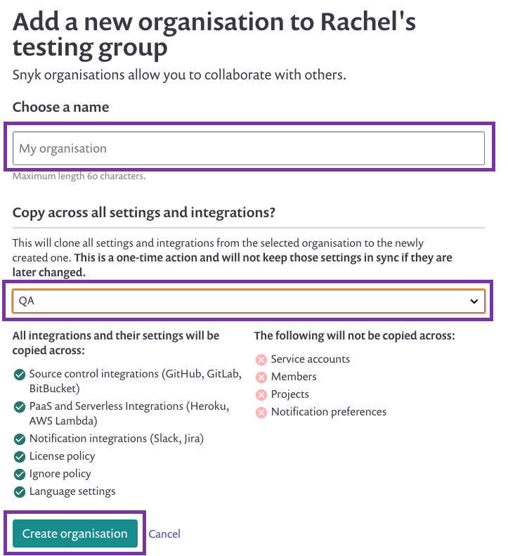

# Clone an integration across your Snyk orgs

You can choose to use the same brokered Git integration across multiple organizations in Snyk by  copying and duplicating the organization you've already configured. For example, you can integrate Snyk organizations X, Y and Z with your single Git repo X.

**Prerequisites**: in order to clone organization configurations, teams and groups must first be enabled.

* From the **organization** dropdown, navigate to any organization within the group that you are working with.
* Now, from the same **organization** dropdown, navigate to and click **Create a new organization**:

* On the page that loads, enter a name for the new organization that you are creating.
* From the **Copy across all settings and integrations?** area, select the organization that you've already configured for the Broker token and then click **Create organization**.

A screenshot follows/

* The browser navigates to the **Dashboard** for the organization that you just created. The Broker integration is duplicated and set up, and the Broker token is identical to the token for the original organization.
* To double-check your cloned configuration, click on settings (gear icon) > **Integrations.**
* On the row for the integration you’re setting up, click **Edit settings** to see the cloned Broker integration.
