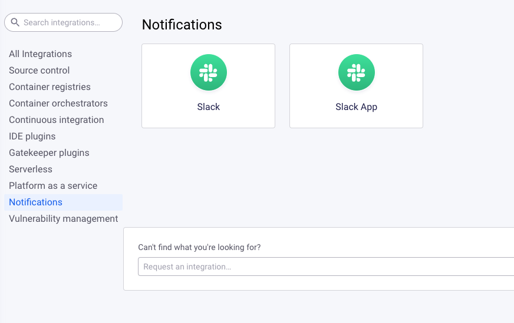
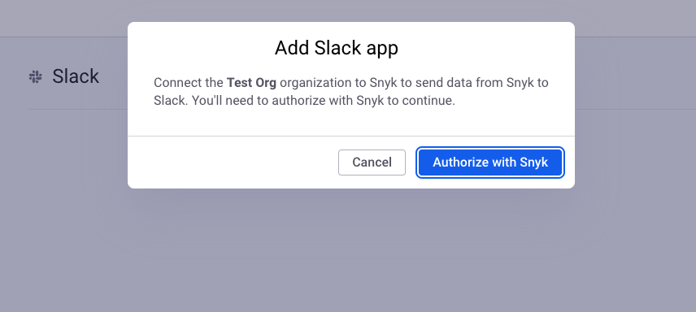
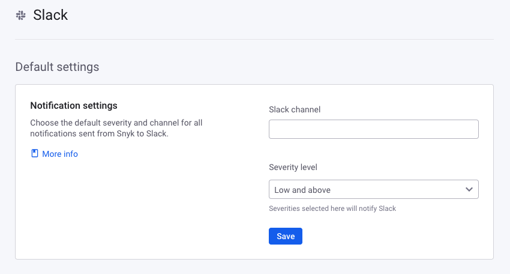

# Slack app

The Snyk app for Slack is built as an official [Slack App](https://api.slack.com/start/overview#apps), unlike the [Slack integration](slack-integration.md), which uses Slack’s [Incoming Webhooks](https://api.slack.com/legacy/custom-integrations/messaging/webhooks); this is considered outdated.

Snyk encourages all customers using the Slack integration to adopt the Snyk app for Slack and get the following benefits and more:

* Improved support for Snyk products: Open Source, Code, Container, and IaC
* Support for filtering on severity levels
* Support for overriding notifications at a Project level


Vulnerabilities detected on initial import of Projects are not sent to Slack. Only newly disclosed vulnerabilities from imported Projects are sent to Slack.&#x20;


## Overview of the Snyk app for Slack

The Snyk app for Slack highlights vulnerability information across your software Projects and presents actionable context within your Slack workspace channels. Your teams get the issue notifications that matter the most and can act on them without leaving Slack.

This has the advantage of:

* Enhancing collaboration to quickly discuss and resolve vulnerabilities
* Maintaining awareness of relevant and emerging vulnerabilities
* Minimizing disruptions with issue notification thresholds

The Snyk app for Slack is based on [Snyk Apps](../../snyk-api-info/snyk-apps/), providing you with the benefit of more granular scopes and more ability to configure issue notifications at the Organization and Project levels.

## Steps to enable the Snyk app for Slack

To enable the Snyk app for Slack, you must do the following:

1. Authorize the app with Snyk to get new issues data that can be forwarded to your Slack workspace.
2. Authorize the app with your Slack workspace to allow Snyk to send notifications to your channels in the workspace.
3. Configure the default notification settings in Snyk for all Projects in your Organization and add [Project-level notification overrides](slack-app.md#managing-project-level-notification-overrides) if you would like.

## Configure the Snyk app for Slack

Open the [Snyk integrations page](https://app.snyk.io/integrations), navigate to **Notifications**, and click the **Slack App** tile:

<figure><figcaption>
Snyk integrations Slack App tile
</figcaption></figure>

This launches the authorization flow, allowing Snyk access to your Snyk app for Slack:

<figure><figcaption>
Add Slack to Snyk
</figcaption></figure>

After Snyk has been authorized, you will be asked to authorize Slack to connect to Snyk for Slack. Click **Allow**:

<figure><figcaption>
Authorize Slack to connect to Snyk
</figcaption></figure>


If multiple Slack workspaces are available, a drop-down will be visible at the top right of the page. Select the desired Slack workspace.


After this step is complete, you can configure the integration to choose which Slack channel the Organization's issue notifications are sent to and also filter by severity level:

<figure><figcaption>
Choose Slack channel and severity level for the notifications from the Organization
</figcaption></figure>


To add the Snyk for Slack app to a private channel, you must first add the app manually to the channel from within Slack and then select the channel within the Snyk integration.

In the Private channel, select **Channel settings - Integrations**, and then **Add an app**. Search for **Snyk for Slack** and select **add**. \
After you have done this, the channel is displayed on the **Settings** page for the integration.


## Issue notifications

After the Slack app has been configured, new issue notifications will be forwarded to the selected Slack channel according to the desired severity level threshold. \
New issue notifications may take up to an hour to start propagating to your Slack workspace once configured.&#x20;

<figure><figcaption>
Example of a new critical vulnerability notification received in Slack
</figcaption></figure>

## Remove the Snyk app for Slack

To remove the Snyk app for Slack, navigate to the settings page, locate **Remove Slack Snyk app** at the bottom of the page, and click the **Disconnect Slack** button:

<figure><figcaption>
Remove Slack App integration
</figcaption></figure>

## Manage Project-level notification overrides

To override Slack notification settings on a per-Project level, a set of [Snyk REST API](https://apidocs.snyk.io/) endpoints are available.

Before attempting to use these endpoints, ensure that you have retrieved your authentication token and Organization ID (`org_id`) as outlined in the steps of the [Getting started using Snyk REST API ](../../snyk-api/try-a-simple-call-to-the-snyk-rest-api.md)guide.

### P**rerequisites** for managing Project-level notification overrides

#### Find the Slack App Bot ID

To interact with the Project level notification override endpoints, you must have a `bot_id`. You can obtain it with a request to the [Get a list of app bots](https://apidocs.snyk.io/?version=2023-08-04#get-/orgs/-org\_id-/app\_bots) endpoint.

GET [/orgs/{org\_id}/app\_bots](https://apidocs.snyk.io/?version=2023-08-04#get-/orgs/-org\_id-/app\_bots)


Ensure you apply the `expand=app` query string on your request. This enables you to find the Bot with a related Snyk App named **Slack App**.


#### Find your Project ID

To target the desired Project, you must have its `project_id`. This can be obtained with a GET request to the [List all Projects for an Org](https://apidocs.snyk.io/?version=2023-08-04#get-/orgs/-org\_id-/projects) endpoint:

GET [/orgs/{org\_id}/projects](https://apidocs.snyk.io/?version=2023-08-04#get-/orgs/-org\_id-/projects)

### Manage Slack notifications per Project

After retrieving the `org_id`, `bot_id`, and `project_id` values, you can use the following create, read, update, and delete API operations:

#### List all  Slack notification overrides for Projects

GET [/orgs/{org\_id}/slack\_app/{bot\_id}/projects](https://apidocs.snyk.io/?version=2023-08-04#get-/orgs/-org\_id-/slack\_app/-bot\_id-/projects)

#### Create a Slack notification override for a Project

POST [/orgs/{org\_id}/slack\_app/{bot\_id}/projects/{project\_id}](https://apidocs.snyk.io/?version=2023-08-04#post-/orgs/-org\_id-/slack\_app/-bot\_id-/projects/-project\_id-)

#### Update a Slack notification override for a Project

PATCH [/orgs/{org\_id}/slack\_app/{bot\_id}/projects/{project\_id}](https://apidocs.snyk.io/?version=2023-08-04#patch-/orgs/-org\_id-/slack\_app/-bot\_id-/projects/-project\_id-)

#### Delete a Slack notification override for a Project

DELETE [/orgs/{org\_id}/slack\_app/{bot\_id}/projects/{project\_id}](https://apidocs.snyk.io/?version=2023-08-04#delete-/orgs/-org\_id-/slack\_app/-bot\_id-/projects/-project\_id-)
