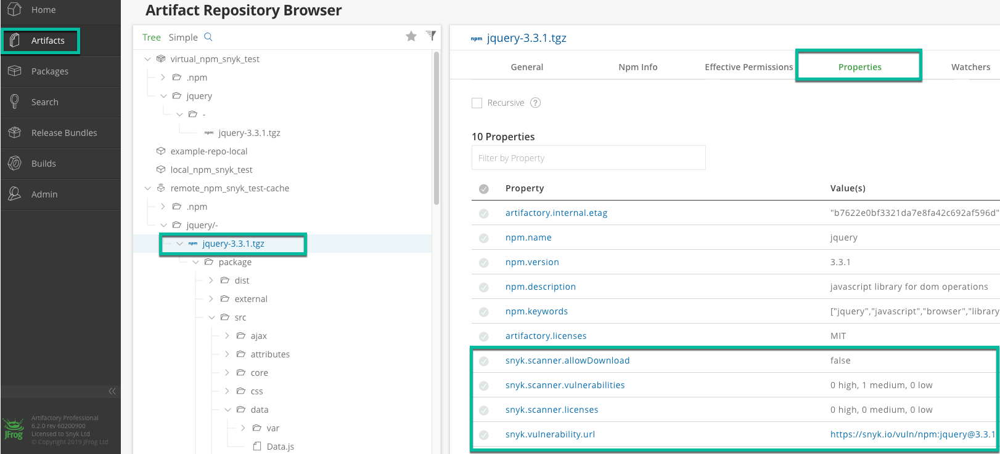

# Artifactory Gatekeeper plugin overview


**Feature availability**  
This feature is available with Enterprise plans. See [pricing plans](https://snyk.io/plans/) for more details.


With the Snyk plugin for Artifactory, you can scan your artifacts for open source vulnerabilities and license issue.

Once installed, the plugin runs in the background and can automatically:

1. Add vulnerability and license issue counts from Snyk as properties in artifact.
2. Block developers from downloading packages with vulnerability and license issues according to a configured threshold.

By scanning artifacts as part of your workflow and then displaying those test results directly from the Artifactory UI, the Snyk Artifactory Plugin enables you to more quickly track and identify issues that risk your application’s security and avoid using those artifacts in your projects.


**Note**  
This article refers to the Artifactory _Plugin_, an independent piece of software that is installed on the Artifactory machine and serves as a gatekeeper, blocking vulnerable packages from being downloaded from the Artifactory instance rather than the [Artifactory _Integration_](integrations/private-registry-integrations/artifactory-registry-for-maven/) - an internal integration in Snyk app, that allows configuring SCM / CLI scans to use custom package registries


### Supported Package Managers

* npm
* Maven \(.jar files\/)
* Gradle \(.jar files\/)
* sbt \(.jar files\/)
* pip \(PyPi\/)

### Prerequisites

* Snyk Enterprise Account
* Artifactory Version 7.4.3 and up.

### Installation

1. Log in to your Snyk account.
2. Click on settings  &gt; **General** to locate, copy and save the following on the side:
   1. Service account token or Organization API token:
   2. The Organization ID for \(any\) one of your organizations
3. Go to [our repo in GitHub](https://github.com/snyk/artifactory-snyk-security-plugin/) and navigate to the **Releases**. 
4. From the most current release, expand the **Assets** section to download the artifactory-snyk-security-plugin-&lt;version&gt;.zip archive. 
5. Extract the archive. It should have the following structure: 
   1. plugins \(directory\/)
      * snykSecurityPlugin.groovy — plugin
      * snykSecurityPlugin.properties — plugin configuration
      * lib \(directory\/)
        * artifactory-snyk-security-core.jar - plugin library
        * snykSecurityPlugin.version - plugin version
6. Open "snykSecurityPlugin.properties" in a text editor. 
   1. Set the API Token and Organization ID from the above steps as "snyk.api.token" and "snyk.api.organization" respectively.
   2. Configure the rest of the properties as needed or leave them as defaults. 
   3. For a full list of properties, [view the file on GitHub](https://github.com/snyk/artifactory-snyk-security-plugin/blob/master/core/src/main/groovy/io/snyk/plugins/artifactory/snykSecurityPlugin.properties).
7. Place all the files under "${ARTIFACTORY\_HOME}/etc/plugins/"
8. Restart your Artifactory server.    **NOTE: Refresh now** or **Reload** is not sufficient. Artifactory must be restarted.
9. Log in to your Artifactory instance and navigate to the **System Logs** to double-check Snyk has been installed successfully.


### How it works

Whenever a download is requested from Artifactory whether from a package manager or a URL, Snyk will automatically scan the artifact for vulnerabilities and license issues.

To view details about download status, open the **System Logs**:

If a scan finds issues, based on your configuration, the download request can be blocked with a HTTP status code "403 Forbidden".

You can find the results of a scan under the artifact's properties where you can decide to ignore the issues and allow downloads. To find the artifact, use Artifactory's Search Bar or navigate the tree view.



## Artifact properties

| **Property** | **Description** |
| :--- | :--- |
| **snyk.issue.url** | This is the URL to our database and explanation of the vulnerability, including specific details about vulnerable versions, available upgrades and Snyk patches as well. |
| **snyk.issue.vulnerabilities** | Regardless of the thresholds configured, this row displays vulnerability summary scan results. |
| **snyk.issue.vulnerabilities. forceDownload** | When "true", allows downloads for this artifact even when there are vulnerabilities. |
| **snyk.issue.vulnerabilities. forceDownload.info** | Use this field to provide additional information for why the forceDownload is enabled. |
| **snyk.issue.licenses** | Regardless of the thresholds configured, this row displays license summary scan results. |
| **snyk.issue.licenses. forceDownload** | When "true", allows downloads for this artifact even when there are license issues. |
| **snyk.issue.licenses. forceDownload.info** | Use this field to provide additional information for why the forceDownload is enabled. |

## Troubleshooting

You can enable debug logs by modifying your `${ARTIFACTORY_HOME}/var/etc/artifactory/logback.xml`file and adding the following line:

```text
<logger name="io.snyk" level="debug"/>
```

Artifactory should automatically pick up the new configuration. If not, restart Artifactory.


Ready to get started with Snyk? [Sign up for free!](https://snyk.io/login?cta=sign-up&loc=footer&page=support_docs_page)


