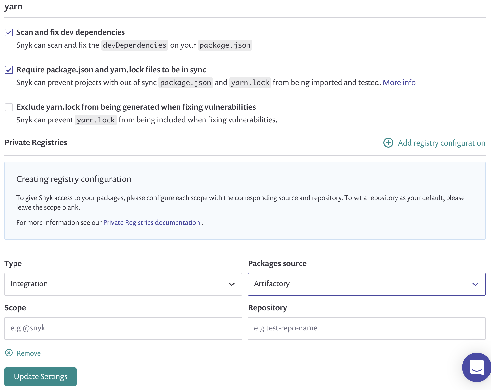

# Artifactory Registry for npm

### **Overview**


**Note**  
This guide is relevant for Snyk UI integrations only, the CLI already supports yarn and npm projects with private Artifactory registries.


You can add configuration to tell Snyk where your private Artifactory Node.js packages are hosted and what scope they are under.

This is the same information you would normally add in your `.yarnrc` or `.npmrc`

Once configured, Snyk will use this information to access private dependencies when creating Pull/Merge Requests**,** by allowing yarn to reach those deps in order to regenerate the lockfile.


**Feature availability**  
This feature is available with Enterprise plans. See [Pricing plans](https://snyk.io/plans/) for more details.


## JavaScript Language Settings

1. Go to settings  **&gt; Languages &gt; JavaScript** and either the npm or yarn settings depending on your project types \(yarn shown in screenshots below\)
2. If you have not previously connected to Artifactory you will be asked to configure an integration first, see [Artifactory Registry Setup.](https://support.snyk.io/hc/en-us/articles/360013805638) 
3. Select “Add registry configuration”    
   1. Select "Artifactory" as the Package source
   2. If you want to configure this registry as **default registry url**, then leave scope blank
   3. If you want to configure **only scoped packages** to use this registry then add a scope
   4. If you want to add a mix of **default registry url** and **scoped packages**, add multiple configurations - one for the default and one per scope.  
4. Once connected, you can go back to the JavaScript Language Setting and select "Artifactory" from the Integration type drop-down and configure scope  
5. When you have added all the registries and scopes you want, click **Update settings**.
6. Now test it out - open a Pull/Merge Request on a project that contains private dependencies that are hosted in Artifactory to see **a lockfile updated and included in the Snyk Fix Pull Request where previously none was generated**

   

