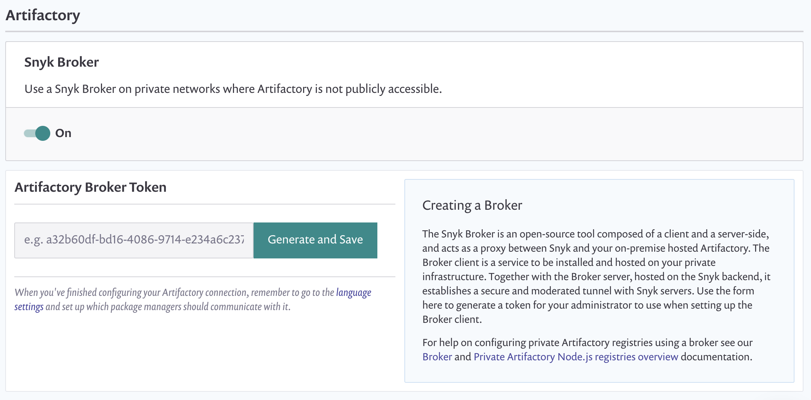

# Artifactory Registry setup

**Overview**

You can configure two types of Artifactory Package Repository integrations:

1. Publicly accessible instances protected by basic authentication
2. Instances on a private network \(with or without basic authentication\) accessed via a broker

Brokered Artifactory is currently supported for [Maven](https://support.snyk.io/hc/en-us/articles/360005507418) and [Node.js](https://support.snyk.io/hc/en-us/articles/360007537418) \(npm and Yarn\).

## Getting started

1. Go to settings  &gt; **Integrations &gt; Package Repositories &gt; Artifactory**
2. You should see this screen at the beginning.

   


**Note**  
If you do not see the “Publicly accessible” switch you do not have the necessary permissions and can only add a publicly accessible instance.  
Contact [support@snyk.io](mailto:support@snyk.io) if you want to add a private registry


## Set up publicly accessible instances

1. Enter URL of your Artifactory instance, this **must** end with **/artifactory**
2. Enter Username
3. Enter Password
4. Hit **Save**

## Set up brokered instances

1. Toggle **Artifactory \(publicly accessible\)** switch, you should now see a form for generating an Artifactory Broker token.   
2. Click on **Generate and Save** button
3. Copy the token that was generated for you, it will be needed to set up a new Broker Client
4. Set up a new [Broker Client](https://support.snyk.io/hc/en-us/articles/360004032397) in your prod environment:
5. Pull Broker Artifactory image from Dockerhub:  

   ```text
         docker pull snyk/broker:artifactory
   ```

6. Run docker image and provide environment variables  

   ```text
         docker run --restart=always \
           -p 8000:8000 \
           -e BROKER_TOKEN=secret-broker-token \
           -e ARTIFACTORY_URL=:@.artifactory.com/artifactory \
          -e RES_BODY_URL_SUB=http://.artifactory.com/artifactory
           snyk/broker:artifactory
   ```

   1. `BROKER_TOKEN` is the token generated in Integration &gt; Artifactory form 
   2. `ARTIFACTORY_URL` is URL to your Artifactory instance, including **/artifactory** at the end of URL. 
      1. **Minimum required data**: `ARTIFACTORY_URL=my.artifactory/artifactory` 
      2. **Parameter mapping**: Parameters in brackets are optional

         ```text
            ARTIFACTORY_URL=[http://][:@]hostname[:port]/artifactory
         ```

      3. **Protocol**: If left empty, protocol will default to \[[https://\]--this](https://]--this) should only be specified when no certificate is present and http is required instead for your instance
      4. **Basic auth**: URL encode both and user info to avoid errors that will prevent authentication
      5. **No basic auth**: Omit`:@` credentials 
   3. `RES_BODY_URL_SUB` is the URL of the Artifactory without credentials, and with http protocol and is required for NPM integration 
   4. Check connection status by refreshing Artifactory Integration Settings page, no connection error should be displayed

