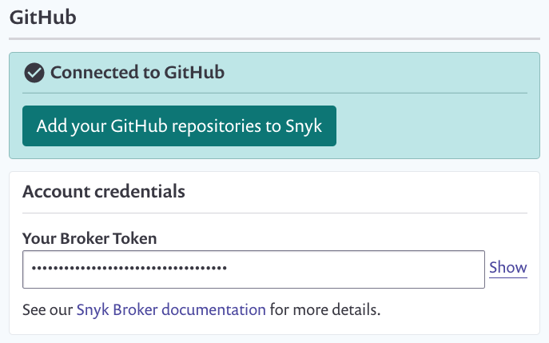

# How to install and configure your Snyk Broker client


Snyk’s recommended and supported method of running the Snyk Broker client is using Docker.


To install and configure your client:

1. Visit [the broker repository](https://github.com/snyk/broker) and follow the instructions for the relevant SCM to run one of our provided images, or derive your own.
2. For the environment variables required to run the Broker client, you must:
   1. 1. Retrieve your [unique broker client token,](https://docs.snyk.io/integrations/snyk-broker/retrieve-a-unique-broker-client-token)
      2. Ensure that you have the necessary permissions granted to your API credentials for the integration you are using by following [one of our integration guides.](https://docs.snyk.io/integrations)
3. After the broker is running, **identifying Broker server** appears towards the end of the log results, showing that a connection to Snyk has been established
4. Visit the settings for your brokered integration in [the Snyk application](https://app.snyk.io/) to see a message like the following: 

5. You can now use Snyk as normal.

