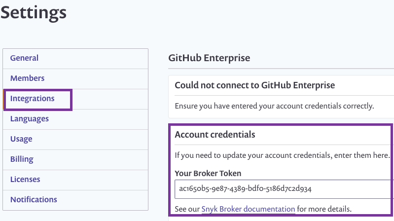

# Retrieve a unique Broker client token

To retrieve the token enabling you to install the Broker:

1. Enable Broker functionality. For code repository \(SCM\) integrations, Snyk Broker can be enabled via the Integrations API or by contacting support. For [Artifactory](https://support.snyk.io/hc/en-us/articles/360007537418) or Jira integrations, you can enable using the Snyk UI, or Snyk support can assist you with enabling this feature.
2. Click on settings

 &gt; **Integrations** for that specific integration update to see the Broker token.

3. From the row for the integration you’re setting up, click **Edit settings**. \(As you have not yet installed and configured the client, the notification from this screen correctly displays “Could not connect to…”.\)
4. Copy and paste the credentials / token in a file on the desktop to use in the environment variables of the command line argument when you install the client.

## Enabling across multiple organizations

You can use the same Git across multiple organizations in Snyk, using the same Broker token. To do this, create the token for an organization, then create a new organization based on the original; this clones the token and you can now enable the Broker for it.

