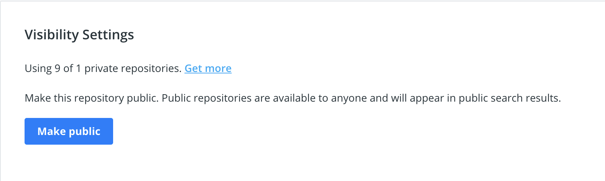

# Unauthorized access or Resource does not exist - Docker Hub

**Error:** Import fails when importing images from Docker Hub with the error with the error `Unauthorized access or Resource does not exist`_._

**Resolution:** This error occurs, because your image is private on your Docker Hub account. To resolve this, make your image public in the **settings > Visibility settings** section of your repository.

<figure><figcaption>
Visibility Settings, Makr publc
</figcaption></figure>
