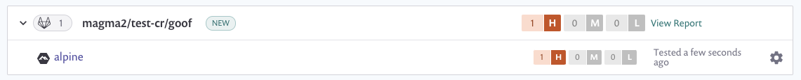

# Container security with GitLab Container Registry integration

Snyk integrates with GitLab container registry to enable you to import your container images and monitor them for vulnerabilities.

Snyk tests the images you’ve imported (referred to as \`projects\`) for any known security vulnerabilities, testing them at a frequency you control, and alerts you when new issues are detected.

Integration with GitLab container registry is available for all Snyk users.

To set up GitLab container registry integration in Snyk and start managing image vulnerabilities:

## **Prerequisites for GitLab Container Registry integration**

* You must be an administrator for the organization you're configuring in Snyk.
* Snyk needs a [personal access token](https://docs.gitlab.com/ee/user/profile/personal\_access\_tokens.html) to integrate with GitLab container registry and Snyk does not support integrating if the user is using GitLab SSO for accessing their GitLab container registry.

## **Configure GitLab Container Registry integration**

1. In your Snyk account, navigate to Integrations from the menu bar at the top. Under the Container Registries section, find the GitLab container registry option and click it.
2. In the **Account credentials** section, enter your GitLab container registry username and [personal access token](https://docs.gitlab.com/ee/user/profile/personal\_access\_tokens.html). In the **container registry name** fill in the full URL to the registry you want to integrate with. To finish, click **Save**.

If you are using a self-hosted GitLab container registry, [contact Snyk Support](https://support.snyk.io/hc/en-us/requests/new) to provide you with a token. For more information about setting up private registry integration see [Snyk Container for self-hosted container registries (with broker)](../../scan-containers/integrate-self-hosted-container-registries.md).

Snyk tests the connection values and the page reloads, now displaying GitLab container registry integration information, and the **Add your GitLab container registry images to Snyk** button becomes available. If the connection to GitLab container registry fails, notification appears under the **Connected to GitLab container registry** section. Now you can use Snyk to scan your images from GitLab container registry.

Snyk tests and monitors your GitLab container images by evaluating its tags in your repositories. Once imported to Snyk, your image vulnerabilities are surfaced and can be triaged easily.

To add images from GitLab container registry to Snyk:

## **Prerequisites for scanning container images from GitLab in Snyk**

* Have a Snyk account with access to the relevant organization (given by an administrator).
* GitLab container registry integration configured. To learn more about that, follow the steps in [Container security with GitLab container registry integration](https://docs.snyk.io/snyk-container/image-scanning-library/gitlab-container-registry-image-scanning/container-security-with-gitlab-container-registry-integration)

## **Steps in scanning container images from GitLab in Snyk**

1. Log in to your account and navigate to the relevant group and organization that you want to manage.
2. Under the **Projects** tab, click **Add project**. The list of integrations already configured on your account opens. Select the **GitLab container registry** option or **Other** if **GitLab container registry** doesn’t appear.
3. The view titles **Which images do you want to test?** opens, displaying all of the available images for your connected registry, grouped by each of your repositories. **Note**: GitLab Container Registry doesn't follow docker v2 API, therefore it is not possible to list images in repos. Due to that, you will need to manually specify the images you wish to scan.
4. Select single or multiple images to be imported to Snyk. Selection can be done by choosing a specific image or selecting an entire repository. You can also search by image name to find specific images to import. To finish, click **Add selected repositories** on the top-right.
5. A status bar appears at the top of the page as the images are imported; you can continue working in the meantime.
6. When the import ends:
   * You can view the newly imported image in the **Projects** page (marked with a **NEW** tag). Images are grouped by repository and are each linked individually to a detailed **Project** page.
     * An **import log** becomes available and can be reached at the top of the projects list.
   * To enrich the data and get recommendations regarding your base image, you can connect your Dockerfile to the image project, under **Settings**. For more info, see [adding-your-dockerfile-and-testing-your-base-image.md](../../scan-containers/scan-your-dockerfile/adding-your-dockerfile-and-testing-your-base-image.md "mention")

GitLab container registry imports are indicated with a unique icon, and you can also filter the integration in the **projects** view to see GitLab container registry projects only:


For **application** vulnerabilities within container images, any changes to the application will not be reflected with a manual or recurring retest. A re-import of the image is required. See [Detecting application vulnerabilities in container images ](../../scan-containers/using-snyk-container/detecting-application-vulnerabilities-in-container-images.md)for more information.

