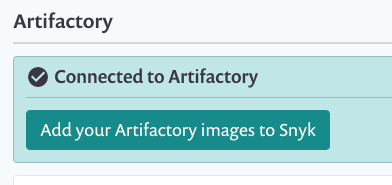

# Configuring your JFrog Artifactory Container Registry integration

The instructions on this page explain how to enable integration between one Artifactory instance as a container registry and a Snyk Organization to start managing your image security.

## Prerequisites for Artifactory Container Registry integration

* You must be an administrator for the Organization you are configuring in Snyk.
* You must provide user credentials to integrate with Artifactory. Snyk does not support Artifactory when configured for single sign-on (SSO).
* You must be running Docker. Snyk supports Docker repositories and the Docker package type for this integration.
* If you are using a self-hosted Artifactory instance, refer to [Snyk Broker - Container Registry Agent](../../../enterprise-setup/snyk-broker/snyk-broker-container-registry-agent/).

## Configure integration of Artifactory Container Registry

1. Log in to [your Snyk account](https://app.snyk.io).
2.  Navigate to **Integrations**; select the **Artifactory** option:

    \
    The configuration page in the **Settings** area loads.
3. Enter credentials as follows:
   * **Username and Password**—use your Artifactory login credentials.
   * **Container registry name -** the _full registry URL_ in the format: `<org>.jfrog.io/artifactory/api/docker/<repo-name>`.
4. Click **Save Changes** and verify that the confirmation appears.


To set up the integration, the Artifactory credentials need, at minimum, read permissions to the relevant Artifactory repository.


<figure><figcaption>
Artifactory account credentials
</figcaption></figure>

Snyk tests the connection values, and the page reloads, now displaying integration details as you entered them. At the top of the screen, a confirmation message in green indicates that the details were saved. If the connection fails, a notification appears.

<figure><figcaption>
Artifactory setup confirmation
</figcaption></figure>
