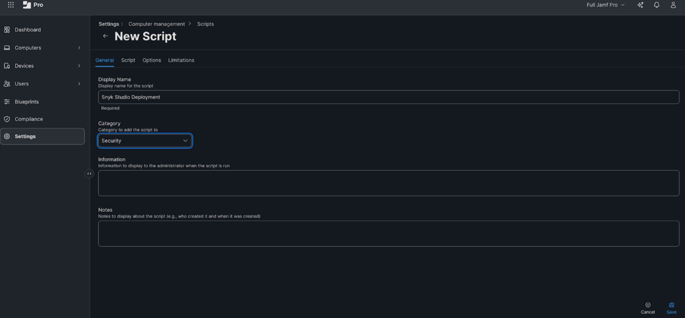
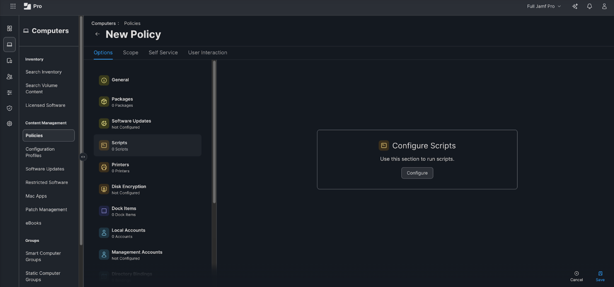
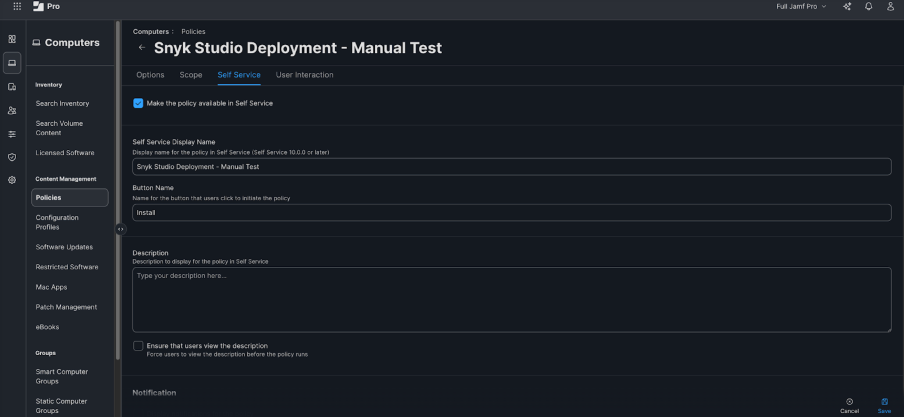

# Distribution at scale

This documentation outlines how to distribute Snyk Studio as a managed utility, automating local security testing and integrating it into your SDLC.

Why distribute Snyk Studio to every developer?

* Eliminates setup frictio&#x6E;**:** deliver Snyk Studio as pre-configured infrastructure, enabling easy adoption from day one.
* Security parit&#x79;**:** enable engineers across all levels to have access to the same tooling and to leverage the same security rules in their AI workflows.
* Reduced support overhea&#x64;**:** centralized configuration reduces isolated troubleshooting associated with separate local setups.
* Ever-present remediatio&#x6E;**:** provide every developer with a standardized, AI-assisted triage experience, accelerating remediation with native LLM integrations for both triage and fix generation.

## Distribution decisions to make

When distributing at scale, Snyk offers general guidelines, but also recognizes that decisions must be made based on your organization’s tooling, security policies, and developer culture.

This section provides an overview of each decision and provides guidance on how to manage the deployment accordingly.

### Which coding assistants are available to your developers?

You decide what coding assistants to make available to your developers. Nearly all coding assistants support the Model Context Protocol (MCP) and support some version of directives.

Coding assistants have differences in how MCP server configuration is managed, as well as how and where directives can be applied. This guide covers where some of these differences could manifest in your implementation, but Snyk Studio deployment at scale should work in conjunction with any coding assistant.

### What MDM tools does your organization use?

Your OS (Windows or Mac) determines which MDM (Intune, Jamf, and so on) your IT department uses to deploy software. They should have the proficiency in writing the necessary scripts and incorporating them into the corresponding MDM playbooks for deployment. However, the [Example Company X Blueprint](distribution-at-scale.md#decisions-made-by-company-x) section can serve as a model for how to port to your company’s MDM solution.

### Do you want to auto-update Snyk CLI or MCP versions?

The Snyk CLI and MCP Server are regularly improved with new features and fixes. Each have a regular schedule of release and are thoroughly tested beforehand. If needed, you can distribute a specific version to developers and allow time for internal vetting before distributing updates.

Expand the relevant option for more information on what actions you need to take. &#x20;

<details>

<summary><strong>Yes</strong>, I would like to enable auto-updates for Snyk CLI/MCP versions.</summary>

* If you are deploying alongside [Cursor](quickstart-guides-for-snyk-studio/cursor-guide.md), [Windsurf](quickstart-guides-for-snyk-studio/windsurf-guide.md), or [Copilot](quickstart-guides-for-snyk-studio/github-copilot-guide.md) in VS Code, no action needs to be taken as the default setting automatically upgrades dependencies when they are available.
* If you are deploying Snyk Studio into any other coding assistant, you will need to keep the Snyk CLI on the latest version using MDM, which will depend on your [chosen installation method](../../developer-tools/snyk-cli/install-or-update-the-snyk-cli/).

</details>

<details>

<summary><strong>No</strong>, I want to manually update Snyk CLI/MCP versions after internal testing is complete.</summary>

* If you are deploying alongside Cursor, Windsurf, or Copilot in VS Code, [install that specific CLI version](https://docs.snyk.io/developer-tools/snyk-cli/install-or-update-the-snyk-cli#install-with-standalone-executables).
  * If you want to use the Snyk VS Code IDE extension to facilitate the MCP server configuration and Secure at inception directives, install the VS Code IDE extension and disable auto CLI updates (`snyk.advanced.automaticDependencyManagement`) and set the path to your CLI explicitly (`snyk.advanced.cliPath`).
* If you are deploying alongside Claude Code or Gemini CLI, [install a specific CLI version](https://docs.snyk.io/developer-tools/snyk-cli/install-or-update-the-snyk-cli#install-with-standalone-executables) and run `snyk mcp config --name=[ade_name]`.
* If you are deploying alongside a coding assistant not covered by the above or prefer fine-grained controls, [install a specific CLI version](https://docs.snyk.io/developer-tools/snyk-cli/install-or-update-the-snyk-cli#install-with-standalone-executables), configure your ADE’s MCP server, and optionally write the rule files (varies by ADE).

</details>

### Do you want to enable Secure at inception directives?

[Secure at inception directives](directives.md#secure-at-inception-directives) guide the coding assistant on how and when to scan the code it generates and automatically fix newly introduced security issues.

You can configure whether you use these rules, the content, and how strictly you want them enforced.

<details>

<summary><strong>Yes</strong>, I want to enable Secure at inception directives.</summary>

* If you are deploying alongside Cursor, Windsurf, or Copilot in VS Code and want to use Snyk’s default Secure at inception directives which write to individual directories and automatically git ignore the files, you can leverage the [Snyk VS Code IDE extension](https://docs.snyk.io/developer-tools/snyk-ide-plugins-and-extensions/visual-studio-code-extension) to configure the Snyk MCP server (`snyk.securityAtInception.autoConfigureSnykMcpServer`) as well as Secure at inception directives and their corresponding execution frequency (`snyk.securityAtInception.executionFrequency`).
* If you are deploying Snyk Studio into any other coding assistant or want to customize the Secure at inception directives, write the directives to the appropriate directory for the specific coding assistant.
  *   Directives can be written at the user level, covering all repositories, for most coding assistants. For example, in Windsurf, rules should be written in the `global_rules.md` file in the `~/.codeium/windsurf/` directory for MacOS/Linux and `%USERPROFILE%\.codeium\windsurf\` for Windows.

      Some tools, including Cursor, do not allow rules to be written programmatically at the user level. Some tools have their own administrative consoles for managing directives, but you need to ensure they are kept in sync across your ADEs.
  * Directives can be written to each repository. These rules can be written using scripts (not MDM) and or Global Templates in Git. For example, in Cursor repository scoped rules are written as a `.md` file in the `.cursor/rules` directory at the root of the project.

</details>

<details>

<summary><strong>No</strong>, I do not want to enable any directives.</summary>

No additional action is required beyond configuring the Snyk MCP server. You can still manually invoke scans using your chosen agent.

</details>

### Do you want to allow developers to modify directive settings?

The main reason to offer this flexibility is that there is no standardized approach across the individual developers workflow to using AI coding assistants.

If the Snyk VS Code IDE extension is being used to configure the Snyk MCP server as well as Secure at inception directives and their corresponding execution frequency, developers can change the frequency between:

* **On Code Generation:** guides the agent to execute scans every time it generates new code in a Snyk supported language.
* **Smart Scan:** the agent model decides when to invoke Secure at Inception rules.
* **Manual:** disables Secure at inception rules but allows a user to invoke scans through the agent using natural language. You can change the settings back to **On Code Generation**, depending on your needs.

If you deploy Snyk Studio into any other coding assistant or customize the Secure at inception directives, you can modify directives by manually overwriting or deleting directive files.

<details>

<summary><strong>Yes</strong>, I want to enable developers to modify directive settings.</summary>

* As part of your MDM playbook, consider writing a helper file that indicates when directives were written to each developer’s machine. The script can check to see if a developer already has directives deployed, making no changes to the directive file contents.
* If you decide to roll out modification of directives on developer machines, you can change the MDM playbook to overwrite directive files based on the helper file timestamp and write a new helper file timestamp value.

</details>

<details>

<summary><strong>No</strong>, I do not want to enable developers to modify directive settings.</summary>

As part of your regular execution of the script using the MDM tool, no special consideration needs to be made to determine to which developer machines should have the directives written. For example, if your MDM script runs daily, any developers who changed directives since the last run will have their directives overwritten. If you choose this option, consider more frequent script executions.

</details>

## Example decisions and distribution steps

This example uses a fictional company called Company X.

### Decisions made by Company X

* Cursor and Windsurf are available to developers to use internally.
* Jamf is used as a MDM tool.
* Yes, I want to auto-update Snyk CLI/MCP versions.
* Yes, I want to enable Secure at inception directives.
* Yes, I want to allow developers to modify directive settings.

This results in a straightforward deployment where the Snyk VS Code IDE extension can be used to distribute the CLI, handle automatic dependency updates, automate the configuration of the MCP server, and set the Secure at inception directives. Allowing developers to modify directive settings is handled with a helper file on developer machines as shown in the example script.

### Development and rollout steps

Company X drafted the script and followed these steps:

<details>

<summary>1. Execute the script locally</summary>

This demonstrates functionality and troubleshoots any issues, with the user testing the experience in all applicable coding assistants and multiple runs.

</details>

<details>

<summary>2. Upload the script to Jamf</summary>

1. Navigate to **Settings** > **Computer Management** > **Scripts**.
2. Click the **New** button to create a new script.
3.  Configure the script with the following attributes:

    1. **Display Name**: Snyk Studio Deployment
    2. **Category**: Security
    3. **Priority**: After


    <figure><figcaption><p>Script attributes configuration in Jamf </p></figcaption></figure>
4. Navigate to the **Scripts** tab and paste in the script.
5. Click **Save**.

</details>

<details>

<summary>3. Create a Jamf policy for small user testing</summary>

1. Navigate to **Computers** > **Policies**.
2. Click **New** to create a new policy.
3. Configure **General settings** with the following attributes:
   1. **Display Name**: Snyk Studio Deployment - Manual Test
   2. **Category**: Security
   3. **Trigger**: Recurring Check-in
   4. **Execution Frequency**: Ongoing
4. Navigate to the **Options** > **Scripts**:
   1.  Click **Configure.**&#x20;

       <figure><figcaption><p>Configure the Snyk Studio Deployment script</p></figcaption></figure>
   2. Select the **Snyk Studio Deployment** script.
5. Navigate to the **Scope** tab. Configure the scope by setting the following value:
   1. **Targets**: Select one group for initial testing.
6. Click **Save**.
7. Optionally: Navigate to the **Self Service** tab and make the policy available:

<figure><figcaption><p>Optional Self Service setting in Jamf</p></figcaption></figure>

</details>

<details>

<summary>4. Validate with a small user test</summary>

1. Monitor **Policy Logs** in Jamf for execution status.
2. Ask initial users to open Cursor and or Windsurf to test functionality:
   1. Check that the Snyk extensions are installed.
   2. Confirm Snyk extension settings show the MCP server is configured and Secure at inception is enabled.
   3. Run a small coding task through the agent and observe that Secure at inception directives are automatically invoked.
   4. Prompt the agent to execute security scans manually.

</details>

<details>

<summary>5. Rollout to all users</summary>

1. Navigate to **Computers** > **Policies**.
2. Find the existing Snyk Studio Deployment policy.
3. Configure the scope by setting the following values:
   1. **Targets**: All Computers
   2. **Limitations**: None (unless you want to exclude specific devices)
4. Click **Save**.

</details>

### Sample script

Snyk provides a sample script for the Company X example for distributing Snyk Studio:

<details>

<summary>Example distribution script for Jamf</summary>


```bash
#!/bin/bash

# =============================================================================
# Snyk Studio Setup Script
# =============================================================================
# This script automates the complete setup of Snyk Studio for supported IDEs
# (Cursor, Windsurf). It performs two main tasks:
#
# 1. Extension Installation: Installs the Snyk security extension from the Open
#    VSX Marketplace into each supported IDE.
#
# 2. Secure at inception Configuration: Configures the IDE settings.json to
#    enable Snyk's "Secure at inception" feature, which integrates security
#    scanning into AI code generation workflows.
#
# The script is designed to run in an MDM/Jamf context where commands execute
# as root but need to install extensions and modify settings for the logged-in
# console user.
#
# Marker files are used to ensure settings are only applied once per IDE,
# preventing repeated modifications on subsequent MDM policy runs. This allows
# developers to modify their settings without having them overwritten. These
# future setting modifications can still be tracked by Snyk Studio.
# =============================================================================

set -u -o pipefail

# =============================================================================
# CONSTANTS
# =============================================================================

# Cursor and Windsurf both use the Open VSX Marketplace for extensions.
# https://open-vsx.org/extension/snyk-security/snyk-vulnerability-scanner
readonly INSTALL_EXTENSION_ID="snyk-security.snyk-vulnerability-scanner"

# Paths for temporary files
readonly MARKER_FILE_DIR="/tmp/snyk-ide-mdm"

# Global variable set by find_editor_cmd to store the resolved editor path
EDITOR_CMD=""

# =============================================================================
# LOGGING FUNCTIONS
# =============================================================================

# Log an informational message to stdout
log_info() { echo "[INFO] $1"; }

# Log a warning message to stderr (non-fatal issues)
log_warning() { echo "[WARNING] $1" >&2; }

# Log an error message to stderr
log_error() { echo "[ERROR] $1" >&2; }

# =============================================================================
# MDM/Jamf HELPERS
# =============================================================================
# These functions handle the complexity of running commands as the logged-in
# GUI user rather than root. This is critical in MDM contexts where the script
# runs as root, but extensions must be installed and settings must be written to
# the user's home directory with proper ownership and permissions.
# =============================================================================

# Get the username of the currently logged-in console (GUI) user.
# Uses /dev/console ownership to determine who owns the active GUI session.
get_console_user() { stat -f%Su /dev/console; }

# Get the home directory of the console user.
# Uses launchctl to run in the user's context to correctly resolve $HOME,
# which handles edge cases like mobile accounts or network home directories.
get_console_home() {
  local user
  user="$(get_console_user)"
  # Run in the user's launchd session to get their actual home directory
  launchctl asuser "$(id -u "$user")" sudo -u "$user" /bin/sh -lc 'printf %s "$HOME"'
}

# Execute a command as the console user with their launchd environment.
# This ensures commands run with proper user permissions and environment
# rather than as root.
# launchctl asuser ensures we're in the user's launchd domain (GUI session)
# sudo -u ensures we drop privileges to run as that user
run_as_user() {
  local user uid
  user="$(get_console_user)"
  uid="$(id -u "$user")"
  launchctl asuser "$uid" sudo -u "$user" "$@"
}

# =============================================================================
# JQ BINARY MANAGEMENT
# =============================================================================
# The script requires jq for JSON manipulation. Since jq may not be installed
# on managed macOS systems, we download a verified binary to a temporary
# location. MD5 hashes ensure the binary hasn't been tampered with.
# =============================================================================

# jq version and integrity verification hashes
readonly JQ_VERSION="1.8.1"
readonly JQ_HASH_MACOS_ARM64="d1e04871ef93ffd2807a00d7edfa305b"
readonly JQ_HASH_MACOS_AMD64="d91812b3fbcc20ae2e1f28a9b8141c67"
readonly JQ_BINARY_PATH="/tmp/snyk-ide-mdm-jq-${JQ_VERSION}"

# Detect system architecture and normalize to download URL format
get_system_architecture() {
  local arch
  arch="$(uname -m)"
  case "$arch" in
    arm64|aarch64) echo "arm64" ;;   # Apple Silicon
    x86_64|amd64) echo "amd64" ;;    # Intel
    *)
      log_error "Unsupported architecture: $arch"
      return 1
      ;;
  esac
}

# Verify the downloaded jq binary matches the expected MD5 hash.
# This prevents execution of tampered or corrupted binaries.
verify_jq_hash() {
  local jq_path="$1"
  local arch="$2"

  local expected_hash
  case "$arch" in
    arm64) expected_hash="$JQ_HASH_MACOS_ARM64" ;;
    amd64) expected_hash="$JQ_HASH_MACOS_AMD64" ;;
    *)
      log_error "Unknown architecture for hash verification: $arch"
      return 1
      ;;
  esac

  local actual_hash
  actual_hash="$(run_as_user /sbin/md5 -q "$jq_path" 2>/dev/null)"

  if [[ "$actual_hash" != "$expected_hash" ]]; then
    log_error "MD5 hash mismatch for jq binary. Expected: $expected_hash, Got: $actual_hash"
    return 1
  fi

  log_info "jq binary hash verified successfully with hash: $actual_hash"
  return 0
}

# Download jq binary if not already present. Downloads from official GitHub
# release and verifies integrity before allowing use.
download_jq_if_needed() {
  # Skip download if binary already exists and is executable
  if [[ -x "$JQ_BINARY_PATH" ]]; then
    log_info "jq binary already exists at $JQ_BINARY_PATH"
    return 0
  fi

  log_info "Downloading jq ${JQ_VERSION} binary..."

  local arch
  arch="$(get_system_architecture)" || return 1

  # Construct download URL for the appropriate architecture
  local download_url
  case "$arch" in
    arm64|amd64) download_url="https://github.com/jqlang/jq/releases/download/jq-${JQ_VERSION}/jq-macos-${arch}" ;;
    *)
      log_error "Unknown architecture: $arch"
      return 1
      ;;
  esac

  log_info "Downloading jq binary from: $download_url"

  # Download binary with curl
  if ! run_as_user /usr/bin/curl -L -f -s -o "$JQ_BINARY_PATH" "$download_url"; then
    log_error "Failed to download jq binary from $download_url"
    return 1
  fi

  # Make binary executable
  if ! run_as_user /bin/chmod +x "$JQ_BINARY_PATH"; then
    log_error "Failed to make jq binary executable"
    return 1
  fi

  # Verify hash before allowing use; remove binary if verification fails
  verify_jq_hash "$JQ_BINARY_PATH" "$arch" || {
    log_error "Hash verification failed, removing binary"
    run_as_user /bin/rm -f "$JQ_BINARY_PATH"
    return 1
  }

  log_info "Successfully downloaded and configured jq binary"
  return 0
}

# =============================================================================
# PATH SETUP
# =============================================================================
# Functions to construct PATH and locate editor executables. IDEs may install
# their CLI tools in various locations, so we check multiple paths including
# app bundles and user-specific directories.
# =============================================================================

# Build a comprehensive PATH that includes editor-specific paths and common
# locations for developer tools (Homebrew, system binaries, etc.)
build_path() {
  local editor_paths="$1"
  # Combine editor-specific paths with standard system paths
  echo "${editor_paths}:/opt/homebrew/bin:/usr/local/bin:/usr/bin:/bin:/usr/sbin:/sbin"
}

# Locate the editor CLI executable by checking provided paths first,
# then falling back to PATH resolution. Sets EDITOR_CMD on success.
find_editor_cmd() {
  local name="$1"
  local paths="$2"

  # First, check explicit paths directly (most reliable)
  IFS=':' read -ra path_array <<< "$paths"
  for path in "${path_array[@]}"; do
    local candidate="${path}/$name"
    # Verify the file exists and is executable by the target user
    if run_as_user test -x "$candidate"; then
      EDITOR_CMD="$candidate"
      return 0
    fi
  done

  # Fall back to PATH-based resolution using the user's shell environment
  local user_path resolved
  user_path="$(build_path "$paths")"

  # Use command -v in a login shell to leverage the user's full environment
  if resolved=$(run_as_user /bin/sh -lc "PATH='${user_path}':\"\$PATH\"; command -v $name 2>/dev/null || true"); then
    if [[ -n "$resolved" ]]; then
      EDITOR_CMD="$resolved"
      return 0
    fi
  fi

  return 1
}

# =============================================================================
# ZSCALER HELPER
# =============================================================================
# Corporate environments often use Zscaler or similar SSL inspection proxies.
# These proxies present their own certificates which Node.js (used by VS Code
# extensions) won't trust by default. This function extracts the Zscaler root
# certificate and prepares it for use via NODE_EXTRA_CA_CERTS.
# =============================================================================

# Check for Zscaler certificate in system keychain and return an environment
# variable assignment string if found. Returns empty string if not found.
get_zscaler_cert_env_var() {
  local cert_file=""

  # Inner function to find and export the Zscaler certificate
  _find_zscaler_cert_file() {
    # Search the system keychain for a Zscaler root certificate
    local zscaler_certs
    if zscaler_certs=$(security find-certificate -c "Zscaler Root CA" -p /Library/Keychains/System.keychain 2>/dev/null); then
      log_info "Zscaler certificate found in system keychain."

      # Create a temporary PEM file to hold the certificate
      # This file will be passed to Node.js via NODE_EXTRA_CA_CERTS
      cert_file=$(run_as_user mktemp --tmpdir=/tmp zscaler-cert-XXXXXXXXXX.pem)
      if ! run_as_user printf %s "${zscaler_certs}" > "$cert_file"; then
        log_error "Failed to export Zscaler certificate to temporary file: $cert_file"
        exit 1
      fi

      log_info "Exported certificate to temporary file: $cert_file"

      # Register cleanup handler to remove the temp file when script exits
      trap 'run_as_user rm -f "$cert_file"' EXIT
    fi
  }

  _find_zscaler_cert_file
  unset -f _find_zscaler_cert_file

  # Return the environment variable assignment string if certificate was found
  if [[ -n "$cert_file" ]]; then
    echo "NODE_EXTRA_CA_CERTS='$cert_file' "
  fi
}

# =============================================================================
# EXTENSION MANAGEMENT FUNCTIONS
# =============================================================================
# Core functions for checking IDE and extension installation status, and
# performing the actual extension installation. These functions use the VS Code
# CLI interface which is shared by compatible editors (Cursor, Windsurf, etc.)
# =============================================================================

# Check if the specified editor is installed and accessible.
# Sets EDITOR_CMD as a side effect if the editor is found.
editor_installed() {
  local name="$1"
  local paths="$2"

  # Try to find the editor executable
  if find_editor_cmd "$name" "$paths"; then
    # Verify the editor actually runs by checking its version
    if run_as_user "${EDITOR_CMD}" --version >/dev/null 2>&1; then
      log_info "${name} installed (using: ${EDITOR_CMD})"
      return 0
    fi
  fi

  log_info "${name} not installed, skipping"
  return 1
}

# Check if the Snyk extension is already installed in the editor.
# Uses the --list-extensions CLI command to query installed extensions.
extension_installed() {
  local name="$1" extensions_output

  # Query the list of installed extensions from the editor
  if ! extensions_output=$(run_as_user "${EDITOR_CMD}" --list-extensions 2>/dev/null); then
    log_error "Failed to list extensions via ${EDITOR_CMD}"
    return 1
  fi

  # Check if the Snyk extension ID appears in the list (exact line match)
  if echo "${extensions_output}" | grep -qx "${INSTALL_EXTENSION_ID}"; then
    log_info "Snyk extension already installed in ${name}, skipping"
    return 0
  fi

  log_info "Snyk extension not yet installed in ${name}"
  return 1
}

# Install the Snyk extension into the specified editor.
# Handles extensions directory creation, Zscaler certificate injection,
# and runs the installation command as the console user.
install_extension() {
  local name="$1" paths="$2"
  local user_home extdir output rc user_path

  # Resolve user paths and create the extensions directory if needed
  user_home="$(get_console_home)"
  user_path="$(build_path "$paths")"
  # Extensions are stored in ~/.${editor_name}/extensions by convention
  extdir="${user_home}/.${name}/extensions"
  run_as_user /bin/mkdir -p "${extdir}"

  log_info "Installing Snyk extension for ${name}"

  # Get Zscaler certificate env var if applicable (for corporate proxies)
  local cert_env_var
  cert_env_var="$(get_zscaler_cert_env_var)"

  # Build the full installation command with all necessary environment setup
  # - cert_env_var: Zscaler certificate for HTTPS (if present)
  # - HOME: User's home directory for proper config resolution
  # - PATH: Include editor-specific paths
  # - --extensions-dir: Explicit extensions directory
  # - --force: Overwrite if already partially installed
  local install_cmd="${cert_env_var}HOME='${user_home}' PATH='${user_path}' '${EDITOR_CMD}' --extensions-dir '${extdir}' --install-extension '${INSTALL_EXTENSION_ID}' --force"

  # Execute the installation in a login shell for proper environment
  log_info "Running installation command: $install_cmd"
  output=$(run_as_user /bin/sh -lc "$install_cmd" 2>&1) || rc=$?

  # Check for success (exit code 0 or not set)
  if [[ -z "${rc:-}" || "${rc}" -eq 0 ]]; then
    log_info "Extension installed for ${name}"
    return 0
  fi

  # Installation failed - log the error output
  log_error "Install failed (exit ${rc}) for ${name}:"
  printf '%s\n' "${output}" >&2
  return 1
}

# =============================================================================
# JSON CONFIGURATION MANAGEMENT
# =============================================================================
# Functions to safely read and modify IDE settings.json files. These files
# control IDE behavior and extension settings. We use jq to ensure valid JSON
# output. Note: jq doesn't support JSONC (comments, trailing commas) which
# some IDEs may produce if manually edited.
# =============================================================================

# Update the settings.json file to enable Secure at Inception settings.
# Creates the file with empty JSON object if it doesn't exist.
update_json() {
  local file_path="$1"

  # Ensure parent directory exists
  run_as_user /bin/mkdir -p "$(dirname "$file_path")"

  # Create empty JSON file if it doesn't exist
  if ! run_as_user test -f "$file_path"; then
    log_warning "Config file missing; creating"
    run_as_user /bin/sh -lc "printf '{}' > \"${file_path}\""
  fi

  # Validate JSON before attempting modifications
  # Note: jq doesn't support JSONC, so will fail on comments or trailing commas
  local jq_error
  if ! jq_error=$(run_as_user "$JQ_BINARY_PATH" '.' "$file_path" 2>&1 >/dev/null); then
    log_error "Invalid JSON detected in $file_path: $jq_error"
    return 1
  fi

  # Capture original content to detect if changes are needed
  local original_content
  original_content=$(run_as_user "$JQ_BINARY_PATH" '.' "$file_path" 2>/dev/null)

  # jq filter to set Secure at Inception settings
  # See extension options: https://github.com/snyk/vscode-extension/blob/50d2dacf41b9b884f510743e6a2d60b8e58e9694/package.json#L290-L294
  local jq_filter='."snyk.securityAtInception.autoConfigureSnykMcpServer" = true | ."snyk.securityAtInception.executionFrequency" = "On Code Generation"'

  # Apply the jq filter to update settings
  local output
  if ! output=$(run_as_user "$JQ_BINARY_PATH" "$jq_filter" "$file_path"); then
    log_error "Failed to process settings in $file_path"
    return 1
  fi

  # Skip write if settings are already correctly configured
  if [[ "$original_content" == "$output" ]]; then
    log_info "No updates written in setting file $file_path (settings already configured)"
    return 0
  fi

  # Write the updated JSON back to the settings file
  if ! run_as_user /bin/sh -c "printf '%s\n' \"\$0\" > \"$file_path\"" "$output"; then
    log_error "Failed to write updated settings to $file_path"
    return 1
  fi

  log_info "Successfully updated settings in $file_path"
  return 0
}

# =============================================================================
# MARKER FILE MANAGEMENT
# =============================================================================
# Marker files track which IDEs have already been configured. This prevents
# the script from repeatedly modifying settings on every MDM policy run.
# Markers are stored in /tmp/snyk-ide-mdm/ with timestamps.
# If you'd rather enforce a particular scan setting (e.g. "On Code Generation")
# on every run of this script, these functions can be skipped.
# =============================================================================

# Get the path to the marker file for a given IDE
get_marker_file_path() {
  local ide="$1"
  echo "${MARKER_FILE_DIR}/${ide}"
}

# Check if an IDE has already been configured by looking for its marker file
is_already_updated() {
  local marker_file="$1"

  if run_as_user test -f "$marker_file"; then
    return 0  # Already updated
  fi

  return 1  # Not updated yet
}

# Create a marker file with a UTC timestamp to record when configuration was applied
create_marker_file() {
  local ide="$1"
  local marker_file
  marker_file="$(get_marker_file_path "$ide")"

  # Ensure marker directory exists
  run_as_user /bin/mkdir -p "$(dirname "$marker_file")"

  # Write ISO 8601 timestamp to marker file
  if ! run_as_user /bin/sh -c "printf '%s\n' \"$(date -u +%Y-%m-%dT%H:%M:%SZ)\" > \"$marker_file\""; then
    log_error "Failed to create marker file: $marker_file"
    return 1
  fi

  log_info "Created marker file: $marker_file"
  return 0
}

# =============================================================================
# CONFIG FILE PROCESSING
# =============================================================================
# Orchestrates the configuration update for a single IDE. Checks marker file,
# updates settings if needed, and creates marker on success.
# =============================================================================

# Process a single IDE's configuration file
process_config_file() {
  local ide="$1"
  local config_file="$2"
  log_info "Processing configuration file for ${ide}"

  # Check if this IDE was already configured (marker file exists)
  local marker_file; marker_file="$(get_marker_file_path "$ide")"
  if is_already_updated "$marker_file"; then
    log_info "Skipping update for ${ide} - already configured (marker file exists at $marker_file)"
    return 0
  fi

  # Apply settings updates
  if ! update_json "$config_file"; then
    return 1
  fi

  # Create marker file to prevent future updates
  if ! create_marker_file "$ide"; then
    log_warning "Failed to create marker file for ${ide}, but config was updated"
    # Don't fail the whole operation, but log warning
  fi

  return 0
}

# =============================================================================
# MAIN EXECUTION
# =============================================================================
# Entry point that iterates through supported IDEs to:
# 1. Install the Snyk extension, if not already installed
# 2. Configure Secure at Inception settings
# =============================================================================

main() {
  log_info "Starting Snyk Studio setup script"

  local user_home
  user_home="$(get_console_home)"

  # Define supported IDEs with their CLI paths and config file paths
  # Format: "IDE_NAME|CLI_PATHS|CONFIG_FILE_PATH"
  local ide_entries=(
    "cursor|/Applications/Cursor.app/Contents/Resources/app/bin|${user_home}/Library/Application Support/Cursor/User/settings.json"
    "windsurf|${user_home}/.codeium/windsurf/bin:/Applications/Windsurf.app/Contents/Resources/app/bin|${user_home}/Library/Application Support/Windsurf/User/settings.json"
  )

  # Track if jq has been downloaded (only needed for config updates)
  local jq_downloaded=false

  # Track overall success/failure
  local ok=0

  # Process each IDE
  for entry in "${ide_entries[@]}"; do
    # Parse the IDE entry into name, paths, and config file
    IFS='|' read -r name paths config_file <<< "$entry"

    log_info "Processing ${name}..."

    # Skip if this editor isn't installed on this machine
    if ! editor_installed "$name" "$paths"; then
      continue
    fi

    # Step 1: Install extension if not already installed
    if ! extension_installed "$name"; then
      if ! install_extension "$name" "$paths"; then
        log_error "Failed to install extension for ${name}"
        ok=1
        continue
      fi
    fi

    # Step 2: Configure Secure at Inception settings
    # Download jq only once, when first needed
    if [[ "$jq_downloaded" != "true" ]]; then
      if ! download_jq_if_needed; then
        log_error "Failed to download jq binary. Cannot configure settings."
        ok=1
        continue
      fi
      jq_downloaded=true
    fi

    if ! process_config_file "$name" "$config_file"; then
      log_error "Failed to configure settings for ${name}"
      ok=1
    fi

    log_info "${name} processing complete"
  done

  if [[ $ok -eq 0 ]]; then
    log_info "Snyk Studio setup script completed successfully"
  else
    log_error "Snyk Studio setup script completed with errors"
  fi

  exit $ok
}

main "$@"
```


</details>
