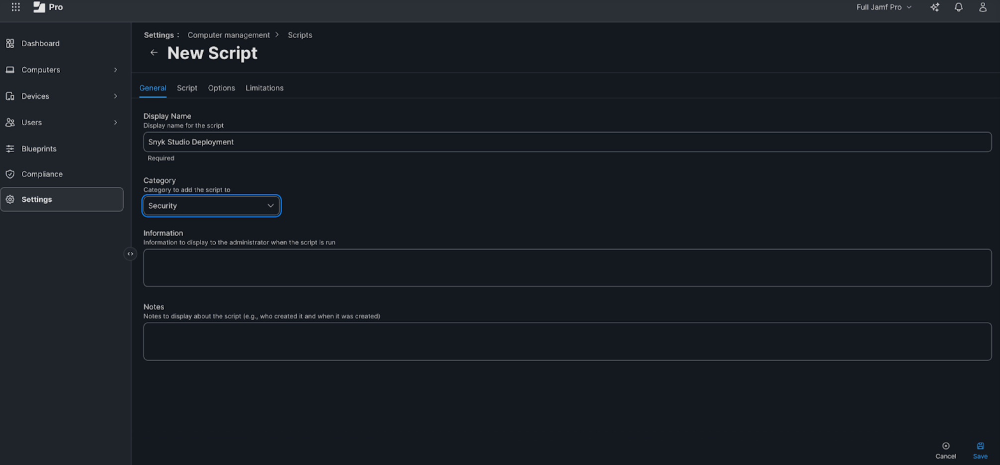
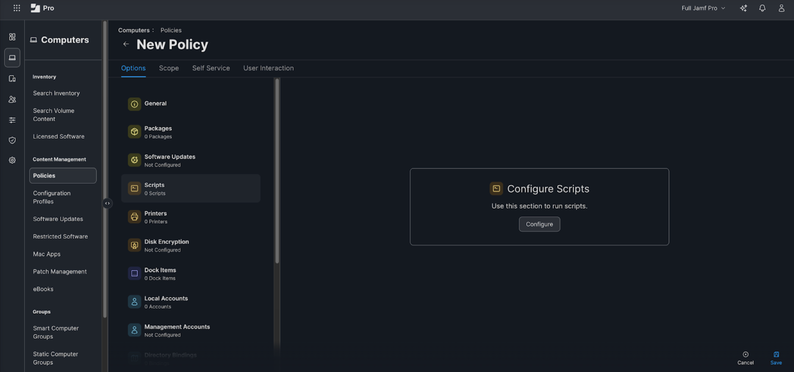
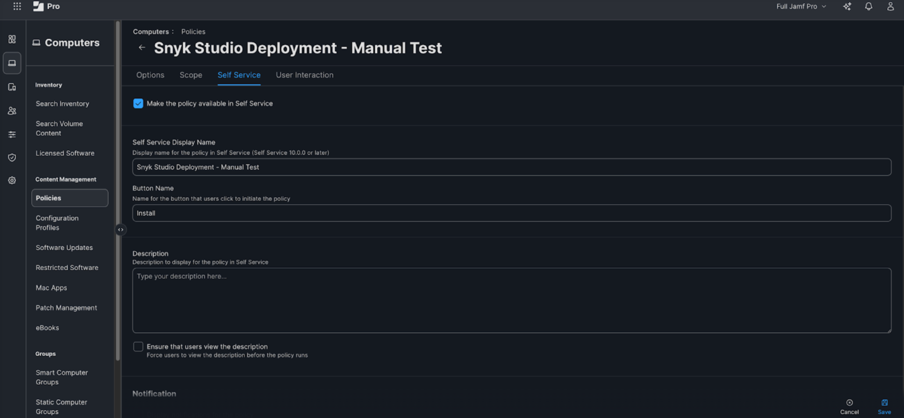

# Distribution at scale

Distribute Snyk Studio as a managed utility to automate local security testing and integrate it into your software development life cycle (SDLC).

## Benefits of distributing Snyk Studio

Distributing Snyk Studio to every developer offers the following benefits:

* Eliminate setup friction: Deliver Snyk Studio as pre-configured infrastructure to allow adoption immediately.
* Ensure security parity: Give engineers access to the same tooling and use the same security rules in their AI workflows.
* Reduce support overhead: Use centralized configuration to reduce troubleshooting for separate local setups.
* Standardize remediation: Provide a standardized, AI-assisted triage experience. Accelerate remediation using native LLM integrations for triage and fix generation.

## Deployment decisions

Snyk provides general guidelines for distributing at scale. You can adapt these based on your tooling, security policies, and developer culture. This section covers key decisions and deployment management.

### Which coding assistants are available to your developers?

Snyk recommends using one of the following ADEs because they support the preferred hooks-based approach:

* Claude Code
* Codex CLI
* Cursor
* Gemini CLI

Most other assistants support the Model Context Protocol (MCP) and directives. While configuration management varies by assistant, Snyk Studio deployment works with any coding assistant with MCP and directive capabilities.

### What MDM tools does your organization use?

The operating system (Windows or macOS) determines the mobile device management (MDM) tool your IT department uses, such as Intune or Jamf. IT administrators write and incorporate the necessary scripts into MDM playbooks. Use the [Decisions made by Example company](distribution-at-scale.md#decisions-made-by-example-company) section as a model to port to your MDM solution.

### Do you want to auto-update Snyk CLI or MCP versions?

Snyk updates the Snyk CLI and MCP Server regularly with features and fixes. You can distribute specific versions to developers to allow time for internal vetting. Expand the relevant option for more information on what actions you need to take.

<details>

<summary><strong>Yes</strong>, I would like to enable auto-updates for Snyk CLI/MCP versions.</summary>

You need to keep the Snyk CLI on the latest version using MDM, which will depend on your [chosen installation method](../../developer-tools/snyk-cli/install-the-snyk-cli/).

</details>

<details>

<summary><strong>No</strong>, I want to manually update Snyk CLI/MCP versions after internal testing is complete.</summary>

* If you are deploying alongside Cursor, Windsurf, Antigravity, VS Code, Gemini CLI, or Claude CLI, [install a specific CLI version](../../developer-tools/snyk-cli/install-the-snyk-cli/) and run `snyk mcp config --tool=[ade_name]` where `[ade_name]` is one of the following:
  * `cursor`
  * `windsurf`
  * `antigravity`
  * `visual studio code`
  * `gemini-cli`
  * `claude-cli`
* This guide does not cover fine-grained controls for deploying alongside other coding assistants.\
  \
  To deploy, complete the following steps:<br>
  1. [Install a specific CLI version](../../developer-tools/snyk-cli/install-the-snyk-cli/).
  2. Configure the MCP server for your ADE.
  3. Write the rule files. This step is optional and varies by ADE.

</details>

### Do you want to enable Secure at inception directives?

[Secure at inception directives](directives.md#secure-at-inception-directives) guide the coding assistant on how and when to scan generated code and automatically fix security issues. You can configure whether you use these directives, the content, and how strictly you want them enforced.

<details>

<summary><strong>Yes</strong>, I want to enable Secure at inception directives.</summary>

* If you use Claude Code, Codex CLI, Cursor, Gemini CLI, use the [Snyk Studio installer](getting-started-with-snyk-studio.md#install-snyk-studio-for-ades-with-hooks-support) to automatically configure the directives.
* If you deploy Snyk Studio into any other coding assistant or want to customize the Secure at inception directives, write the directives to the appropriate directory for your assistant. You can apply directives at the user level or the repository level.
  * User level directives: These apply to all repositories. For Windsurf, add rules to the `global_rules.md` file. For MacOS or Linux, this file is located in the `~/.codeium/windsurf/directory`. For Windows, this file is located in the `%USERPROFILE%\.codeium\windsurf\` directory. Cursor does not support programmatic user level rules.
  * If you use administrative consoles to manage directives, they must remain in sync across your development environments.
  * Repository-level directives: You can write directives for specific repositories using scripts (not MDM) or Git Global Templates. For Cursor, add a `.md` file to the `.cursor/rules` directory at the project root.

</details>

<details>

<summary><strong>No</strong>, I do not want to enable any directives.</summary>

No additional action is required beyond configuring the Snyk MCP server. You can manually invoke scans using your chosen agent.

</details>

### Do you want to allow developers to modify directive settings?

If you customize the Secure at inception directives, you can modify them by manually overwriting or deleting directive files.

<details>

<summary><strong>Yes</strong>, I want to enable developers to modify directive settings.</summary>

* To modify directive on developer machines, update your MDM playbook to:
  * Overwrite directive files using the helper file timestamp. The script can check to see if a developer already has directives deployed, making no changes to the directive file contents.
  * Write a new timestamp value.

</details>

<details>

<summary><strong>No</strong>, I do not want to enable developers to modify directive settings.</summary>

Run the MDM script on all developer machines. You do not need to identify specific machines for updates.

If the script runs daily, it overwrites any manual changes developers made since the last run. Run the script frequently to ensure consistency.

</details>

## Example decisions and distribution steps

The following example details deployment steps for "Example Company":

### Decisions made by Example company

* Claude Code and Cursor are available to developers to use internally.
* Jamf is used as a MDM tool.
* Yes, I want to auto-update Snyk CLI/MCP versions.
* Yes, I want to enable Secure at inception directives.
* No, I don't want to allow developers to modify directive settings.

This results in a straightforward deployment where the [Snyk Studio installer](getting-started-with-snyk-studio.md#install-snyk-studio-for-ades-with-hooks-support) can configure the hooks (guardrail directives), skills, MCP server, and commands. The configuration is enforced as frequently as the MDM script runs.

### Development and rollout steps

Example company drafted the script and followed these steps:

<details>

<summary>1. Execute the installer script locally</summary>

Running the [installer script](getting-started-with-snyk-studio.md#install-snyk-studio-for-ades-with-hooks-support) locally demonstrates functionality and allows troubleshooting, with the user testing the experience in all applicable coding assistants and multiple runs.

</details>

<details>

<summary>2. Upload the script to Jamf</summary>

1. Navigate to **Settings** > **Computer Management** > **Scripts**.
2. Click the **New** button to create a new script.
3.  Configure the script with the following attributes:

    1. **Display Name**: Snyk Studio Deployment
    2. **Category**: Security
    3. **Priority**: After

    <figure><figcaption><p>Script attributes configuration in Jamf</p></figcaption></figure>
4. Navigate to the **Scripts** tab and paste in the script.
5. Click **Save**.

</details>

<details>

<summary>3. Create a Jamf policy for small user testing</summary>

1. Navigate to **Computers** > **Policies**.
2. Click **New** to create a new policy.
3. Configure **General settings** with the following attributes:
   1. **Display Name**: Snyk Studio Deployment - Manual Test
   2. **Category**: Security
   3. **Trigger**: Recurring Check-in
   4. **Execution Frequency**: Ongoing
4. Navigate to the **Options** > **Scripts**:
   1.  Click **Configure.**

       <figure><figcaption><p>Configure the Snyk Studio Deployment script</p></figcaption></figure>
   2. Select the **Snyk Studio Deployment** script.
5. Navigate to the **Scope** tab. Configure the scope by setting the following value:
   1. **Targets**: Select one group for initial testing.
6. Click **Save**.
7. Optionally: Navigate to the **Self Service** tab and make the policy available:

<figure><figcaption><p>Optional Self Service setting in Jamf</p></figcaption></figure>

</details>

<details>

<summary>4. Validate with a small user test</summary>

1. Monitor **Policy Logs** in Jamf for execution status.
2. Ask initial users to open Cursor and or Windsurf to test functionality:
   1. Check that the Snyk extensions are installed.
   2. Confirm Snyk extension settings show the MCP server is configured and Secure at inception is enabled.
   3. Run a small coding task through the agent and observe that Secure at inception directives are automatically invoked.
   4. Prompt the agent to execute security scans manually.

</details>

<details>

<summary>5. Rollout to all users</summary>

1. Navigate to **Computers** > **Policies**.
2. Find the existing Snyk Studio Deployment policy.
3. Configure the scope by setting the following values:
   1. **Targets**: All Computers
   2. **Limitations**: None (unless you want to exclude specific devices)
4. Click **Save**.

</details>

### Sample script

Snyk provides a sample script modeled after the Example company for distributing Snyk Studio:

<details>

<summary>Example distribution script for Jamf</summary>


```bash
#!/bin/bash
set -euo pipefail
export LANG=C.UTF-8
export LC_ALL=C.UTF-8

# ============================================================
# Evo MDM Generator - Snyk Studio Setup
# Platform: jamf-macos
# Distribution: GitHub Live Pull (recipes downloaded at runtime from main)
# Generated against snyk/studio-recipes@195c76ac0cfd5e4901a58a9c9339755cc0f8814a (informational; runtime tracks main)
# Profile: default
# ADEs: Cursor, Claude
# Generated: 2026-05-18
# ============================================================

### CLIENT CONFIGURATION ###
CONFIGURE_CURSOR=true
CONFIGURE_CLAUDE=true
CONFIGURE_WINDSURF=false
DEPLOY_SAI_HOOKS=true
DEPLOY_COMMANDS=true
DEPLOY_FIX_COMMAND=true
DEPLOY_BATCH_FIX_COMMAND=true
DEPLOY_SKILLS=true
DEPLOY_MCP=true
DISABLE_UPGRADES=false
ALLOW_DEV_MODS=false
USE_MARKERS=false
FORCE_REDEPLOY=false
STUDIO_RECIPES_REF="main"
STUDIO_RECIPES_REPO="snyk/studio-recipes"
### CLIENT CONFIGURATION ###

CERT_FILE=""
MARKER_DIR="/tmp/evo-mdm"
JQ_PATH=""

# --- User context helpers ---
get_console_user() {
    local user
    user=$(stat -f%Su /dev/console 2>/dev/null || echo "")
    if [[ -z "$user" || "$user" == "root" || "$user" == "loginwindow" ]]; then
        echo ""
        return 1
    fi
    echo "$user"
}

get_console_home() {
    local user="$1"
    local uid
    uid=$(id -u "$user" 2>/dev/null) || return 1
    local home
    home=$(launchctl asuser "$uid" sudo -u "$user" /bin/zsh -c 'echo $HOME' 2>/dev/null) || return 1
    echo "$home"
}

# Run a command as the console user in a non-login zsh.
# Pass --with-profile as the first argument when the command depends on the
# user's PATH (e.g., nvm-managed npm). Sourcing ~/.zprofile is opt-in to keep
# the common case fast and immune to user dotfile errors.
run_as_user() {
    local user="$1"; shift
    local source_profile="false"
    if [[ "${1:-}" == "--with-profile" ]]; then
        source_profile="true"
        shift
    fi
    local uid
    uid=$(id -u "$user")
    if [[ "$source_profile" == "true" ]]; then
        launchctl asuser "$uid" sudo -u "$user" /bin/zsh -c "[ -f ~/.zprofile ] && . ~/.zprofile >/dev/null 2>&1; $*"
    else
        launchctl asuser "$uid" sudo -u "$user" /bin/zsh -c "$*"
    fi
}

# --- Logging ---
log_info() { echo "[INFO] [studio] $1"; }
log_error() { echo "[ERROR] [studio] $1" >&2; }
log_warn() { echo "[WARN] [studio] $1"; }

# --- Zscaler certificate fix ---
fix_zscaler_cert_path() {
    if [[ "$(uname -s)" != "Darwin" ]]; then return 0; fi
    local cert_path="/tmp/zscaler-cert.pem"
    if [[ -f "$cert_path" ]]; then
        CERT_FILE="$cert_path"
        return 0
    fi
    local zscaler_certs
    if zscaler_certs=$(security find-certificate -c "Zscaler Root CA" -p /Library/Keychains/System.keychain 2>/dev/null); then
        if ! printf "%s\n" "${zscaler_certs}" > "$cert_path" 2>/dev/null; then
            log_warn "Failed to write Zscaler cert to $cert_path; downloads will proceed without proxy CA"
            return 0
        fi
        CERT_FILE="$cert_path"
    fi
}

# --- Download helper ---
download_file() {
    local url="$1" output="$2"
    if command -v curl >/dev/null 2>&1; then
        local curl_opts=(-fsSL -o "$output" --max-time 120 --connect-timeout 15)
        [[ -n "$CERT_FILE" ]] && curl_opts+=(--cacert "$CERT_FILE")
        curl "${curl_opts[@]}" "$url" || return 1
    elif command -v wget >/dev/null 2>&1; then
        local wget_opts=(-qO "$output" --timeout=120 --connect-timeout=15)
        [[ -n "$CERT_FILE" ]] && wget_opts+=(--ca-certificate="$CERT_FILE")
        wget "${wget_opts[@]}" "$url" || return 1
    else
        log_error "No download utility found"
        return 1
    fi
}

# --- jq management ---
ensure_jq() {
    if command -v jq >/dev/null 2>&1; then
        JQ_PATH="jq"
        return 0
    fi

    local jq_dir="/tmp/evo-mdm-tools"
    local jq_bin="$jq_dir/jq"

    if [[ -f "$jq_bin" && -x "$jq_bin" ]]; then
        JQ_PATH="$jq_bin"
        return 0
    fi

    mkdir -p "$jq_dir"

    local arch
    case "$(uname -m)" in
        arm64|aarch64) arch="arm64" ;;
        *) arch="amd64" ;;
    esac

    local jq_url="https://github.com/jqlang/jq/releases/download/jq-1.7.1/jq-macos-${arch}"
    log_info "Downloading jq from $jq_url"
    download_file "$jq_url" "$jq_bin" || { log_error "Failed to download jq"; return 1; }
    chmod +x "$jq_bin"
    JQ_PATH="$jq_bin"
}

# --- JSON merge helpers (using jq, no Python needed) ---
merge_cursor_hooks() {
    local user="$1" home="$2"
    local target="$home/.cursor/hooks.json"

    run_as_user "$user" "mkdir -p '$home/.cursor'"

    local existing='{}'
    if [[ -f "$target" ]]; then
        existing=$(cat "$target")
        cp "$target" "${target}.bak"
    fi

    local snyk_cmd='python3 "$HOME/.cursor/hooks/snyk_secure_at_inception.py"'
    local merged
    merged=$(echo "$existing" | "$JQ_PATH" --arg cmd "$snyk_cmd" '
        .version = (.version // 1) |
        .hooks = (.hooks // {}) |
        .hooks.afterFileEdit = (
            [(.hooks.afterFileEdit // [])[] | select(.command != $cmd)] +
            [{"command": $cmd}]
        ) |
        .hooks.stop = (
            [(.hooks.stop // [])[] | select(.command != $cmd)] +
            [{"command": $cmd}]
        )
    ')

    echo "$merged" > "$target.tmp" && mv "$target.tmp" "$target"
    chown "$user" "$target"
    log_info "Merged hooks into .cursor/hooks.json"
}

merge_claude_settings() {
    local user="$1" home="$2"
    local target="$home/.claude/settings.json"

    run_as_user "$user" "mkdir -p '$home/.claude'"

    local existing='{}'
    if [[ -f "$target" ]]; then
        existing=$(cat "$target")
        cp "$target" "${target}.bak"
    fi

    local snyk_cmd='python3 "$HOME/.claude/hooks/snyk_secure_at_inception.py"'
    local merged
    merged=$(echo "$existing" | "$JQ_PATH" --arg cmd "$snyk_cmd" '
        .hooks = (.hooks // {}) |

        # PostToolUse: ensure Snyk Edit|Write matcher group exists
        .hooks.PostToolUse = (
            [(.hooks.PostToolUse // [])[] |
                select(
                    (.matcher // "") != "Edit|Write" or
                    ([.hooks[]? | select(.command == $cmd)] | length) == 0
                )
            ] + [{
                "matcher": "Edit|Write",
                "hooks": [{
                    "type": "command",
                    "command": $cmd,
                    "statusMessage": "Tracking code changes for security scan..."
                }]
            }]
        ) |

        # Stop: ensure Snyk hook exists
        .hooks.Stop = (
            [(.hooks.Stop // [])[] |
                select(
                    ([.hooks[]? | select(.command == $cmd)] | length) == 0
                )
            ] + [{
                "hooks": [{
                    "type": "command",
                    "command": $cmd,
                    "statusMessage": "Evaluating security scan results..."
                }]
            }]
        )
    ')

    echo "$merged" > "$target.tmp" && mv "$target.tmp" "$target"
    chown "$user" "$target"
    log_info "Merged hooks into .claude/settings.json"
}

merge_mcp_config() {
    local user="$1" home="$2"
    local target="$home/.mcp.json"

    local existing='{}'
    if [[ -f "$target" ]]; then
        existing=$(cat "$target")
        cp "$target" "${target}.bak"
    fi

    local merged
    merged=$(echo "$existing" | "$JQ_PATH" '
        .mcpServers = (.mcpServers // {}) |
        .mcpServers.Snyk = {
            "command": "npx",
            "args": ["-y", "snyk@latest", "mcp", "-t", "stdio"]
        }
    ')

    echo "$merged" > "$target.tmp" && mv "$target.tmp" "$target"
    chown "$user" "$target"
    log_info "Merged Snyk MCP server into .mcp.json"
}

# --- File deployment helpers (Live mode: download from GitHub at runtime) ---
deploy_file_from_github() {
    local repo="$1" ref="$2" src_path="$3" dest_path="$4" user="$5" executable="${6:-false}"
    local url="https://raw.githubusercontent.com/${repo}/${ref}/${src_path}"

    run_as_user "$user" "mkdir -p '$(dirname "$dest_path")'"
    local tmpfile=$(mktemp)
    download_file "$url" "$tmpfile" || { log_error "Failed to download $src_path"; rm -f "$tmpfile"; return 1; }
    cp "$tmpfile" "$dest_path"
    chown "$user" "$dest_path"
    if [[ "$executable" == "true" ]]; then
        chmod +x "$dest_path" 2>/dev/null || true
    fi
    rm -f "$tmpfile"
    log_info "Deployed $src_path -> $dest_path"
}

# --- Snyk CLI check ---
check_snyk_cli() {
    local user="$1"
    local npm_out
    if run_as_user "$user" --with-profile "command -v snyk" >/dev/null 2>&1; then
        local version
        version=$(run_as_user "$user" --with-profile "snyk --version" 2>/dev/null || echo "unknown")
        log_info "Snyk CLI found: v$version"
        if [[ "$DISABLE_UPGRADES" != "true" ]]; then
            if run_as_user "$user" --with-profile "command -v npm" >/dev/null 2>&1; then
                log_info "Upgrading Snyk CLI..."
                if npm_out=$(run_as_user "$user" --with-profile "npm install -g snyk@latest" 2>&1); then
                    log_info "Snyk CLI upgraded via npm."
                else
                    log_warn "npm install -g snyk@latest failed (will fall back to npx at MCP startup):"
                    log_warn "  $npm_out"
                fi
            fi
        fi
    else
        log_info "Snyk CLI not found."
        if [[ "$DISABLE_UPGRADES" != "true" ]]; then
            if run_as_user "$user" --with-profile "command -v npm" >/dev/null 2>&1; then
                log_info "Installing Snyk CLI via npm..."
                if npm_out=$(run_as_user "$user" --with-profile "npm install -g snyk@latest" 2>&1); then
                    log_info "Snyk CLI installed via npm."
                else
                    log_warn "npm install -g snyk@latest failed (will fall back to npx at MCP startup):"
                    log_warn "  $npm_out"
                fi
            else
                log_warn "npm not available. Snyk CLI will be installed on first MCP use via npx."
            fi
        fi
    fi
}

# --- Deploy recipes for a specific ADE (Live mode) ---
deploy_recipes_for_ade() {
    local ade="$1" user="$2" home="$3"
    local base_dir

    case "$ade" in
        cursor)  base_dir="$home/.cursor" ;;
        claude)  base_dir="$home/.claude" ;;
        windsurf) base_dir="$home/.codeium/windsurf" ;;
        *) log_error "Unknown ADE: $ade"; return 1 ;;
    esac

    log_info "Deploying recipes for $ade to $base_dir"

    # SAI Hooks
    if [[ "$DEPLOY_SAI_HOOKS" == "true" ]]; then
        local hooks_base="guardrail_directives/secure_at_inception/hooks_version"

        if [[ "$ade" == "cursor" ]]; then
            deploy_file_from_github "$STUDIO_RECIPES_REPO" "$STUDIO_RECIPES_REF" \
                "$hooks_base/cursor/async_cli_version/snyk_secure_at_inception.py" \
                "$base_dir/hooks/snyk_secure_at_inception.py" "$user" "true"
            deploy_file_from_github "$STUDIO_RECIPES_REPO" "$STUDIO_RECIPES_REF" \
                "$hooks_base/cursor/async_cli_version/lib/scan_runner.py" \
                "$base_dir/hooks/lib/scan_runner.py" "$user" "true"
            deploy_file_from_github "$STUDIO_RECIPES_REPO" "$STUDIO_RECIPES_REF" \
                "$hooks_base/cursor/async_cli_version/lib/scan_worker.py" \
                "$base_dir/hooks/lib/scan_worker.py" "$user" "true"
            deploy_file_from_github "$STUDIO_RECIPES_REPO" "$STUDIO_RECIPES_REF" \
                "$hooks_base/cursor/async_cli_version/lib/platform_utils.py" \
                "$base_dir/hooks/lib/platform_utils.py" "$user" "true"

            merge_cursor_hooks "$user" "$home"

        elif [[ "$ade" == "claude" ]]; then
            deploy_file_from_github "$STUDIO_RECIPES_REPO" "$STUDIO_RECIPES_REF" \
                "$hooks_base/claude/async_cli_version/snyk_secure_at_inception.py" \
                "$base_dir/hooks/snyk_secure_at_inception.py" "$user" "true"
            deploy_file_from_github "$STUDIO_RECIPES_REPO" "$STUDIO_RECIPES_REF" \
                "$hooks_base/claude/async_cli_version/lib/scan_runner.py" \
                "$base_dir/hooks/lib/scan_runner.py" "$user" "true"
            deploy_file_from_github "$STUDIO_RECIPES_REPO" "$STUDIO_RECIPES_REF" \
                "$hooks_base/claude/async_cli_version/lib/scan_worker.py" \
                "$base_dir/hooks/lib/scan_worker.py" "$user" "true"
            deploy_file_from_github "$STUDIO_RECIPES_REPO" "$STUDIO_RECIPES_REF" \
                "$hooks_base/claude/async_cli_version/lib/platform_utils.py" \
                "$base_dir/hooks/lib/platform_utils.py" "$user" "true"

            merge_claude_settings "$user" "$home"
        fi
    fi

    # Commands
    if [[ "$DEPLOY_COMMANDS" == "true" ]]; then
        local cmd_base="command_directives/synchronous_remediation/command"
        local cmd_dest

        if [[ "$ade" == "cursor" || "$ade" == "claude" ]]; then
            cmd_dest="$base_dir/commands"

            if [[ "$DEPLOY_FIX_COMMAND" == "true" ]]; then
                deploy_file_from_github "$STUDIO_RECIPES_REPO" "$STUDIO_RECIPES_REF" \
                    "$cmd_base/single_all_in_one_command/snyk-fix.md" \
                    "$cmd_dest/snyk-fix.md" "$user"
            fi

            if [[ "$DEPLOY_BATCH_FIX_COMMAND" == "true" ]]; then
                deploy_file_from_github "$STUDIO_RECIPES_REPO" "$STUDIO_RECIPES_REF" \
                    "$cmd_base/snyk-batch-fix.md" \
                    "$cmd_dest/snyk-batch-fix.md" "$user"
            fi
        fi
    fi

    # Skills
    if [[ "$DEPLOY_SKILLS" == "true" ]]; then
        local skill_base="command_directives/synchronous_remediation/skills/secure-dependency-health-check"

        if [[ "$ade" == "cursor" ]]; then
            deploy_file_from_github "$STUDIO_RECIPES_REPO" "$STUDIO_RECIPES_REF" \
                "$skill_base/SKILL.md" \
                "$base_dir/skills/snyk/secure-dependency-health-check/SKILL.md" "$user"
            deploy_file_from_github "$STUDIO_RECIPES_REPO" "$STUDIO_RECIPES_REF" \
                "$skill_base/references/package-evaluation-criteria.md" \
                "$base_dir/skills/snyk/secure-dependency-health-check/references/package-evaluation-criteria.md" "$user"
        elif [[ "$ade" == "claude" ]]; then
            # Claude uses commands; transform by stripping YAML frontmatter at runtime.
            local tmpskill=$(mktemp)
            download_file "https://raw.githubusercontent.com/${STUDIO_RECIPES_REPO}/${STUDIO_RECIPES_REF}/$skill_base/SKILL.md" "$tmpskill" || true
            if [[ -f "$tmpskill" ]]; then
                sed '1{/^---$/!q;};1,/^---$/d' "$tmpskill" > "$tmpskill.stripped"
                run_as_user "$user" "mkdir -p '$base_dir/commands'"
                cp "$tmpskill.stripped" "$base_dir/commands/secure-dependency-health-check.md"
                chown "$user" "$base_dir/commands/secure-dependency-health-check.md"
                rm -f "$tmpskill" "$tmpskill.stripped"
            fi
        fi
    fi

    # MCP Config
    if [[ "$DEPLOY_MCP" == "true" ]]; then
        merge_mcp_config "$user" "$home"
    fi
}

# --- Main ---
main() {
    log_info "Starting Snyk Studio deployment"

    local user home
    user=$(get_console_user) || { log_error "No console user found"; exit 1; }
    home=$(get_console_home "$user") || { log_error "Cannot resolve home for $user"; exit 1; }

    log_info "Console user: $user, home: $home"

    # Check markers
    if [[ "$USE_MARKERS" == "true" && "$FORCE_REDEPLOY" != "true" ]]; then
        local marker="$MARKER_DIR/studio-deployed"
        if [[ -f "$marker" ]]; then
            log_info "Studio already deployed (marker exists at $marker). Skipping."
            exit 0
        fi
    fi

    fix_zscaler_cert_path
    ensure_jq || { log_error "jq is required but could not be obtained"; exit 1; }

    # Check/install Snyk CLI
    check_snyk_cli "$user"

    # Deploy to each ADE; track success across all selected ADEs so the marker
    # is only written when every deployment succeeded (avoids "stuck" markers).
    local all_ok="true"
    if [[ "$CONFIGURE_CURSOR" == "true" ]]; then
        if ! deploy_recipes_for_ade "cursor" "$user" "$home"; then
            all_ok="false"
            log_error "Cursor deployment failed"
        fi
    fi
    if [[ "$CONFIGURE_CLAUDE" == "true" ]]; then
        if ! deploy_recipes_for_ade "claude" "$user" "$home"; then
            all_ok="false"
            log_error "Claude deployment failed"
        fi
    fi
    if [[ "$CONFIGURE_WINDSURF" == "true" ]]; then
        if ! deploy_recipes_for_ade "windsurf" "$user" "$home"; then
            all_ok="false"
            log_error "Windsurf deployment failed"
        fi
    fi

    if [[ "$all_ok" != "true" ]]; then
        log_error "One or more ADE deployments failed; marker NOT written."
        exit 1
    fi

    if [[ "$USE_MARKERS" == "true" ]]; then
        mkdir -p "$MARKER_DIR"
        date > "$MARKER_DIR/studio-deployed"
        log_info "Marker set at $MARKER_DIR/studio-deployed"
    fi

    log_info "Snyk Studio deployment complete."
}

main "$@"

```


</details>
