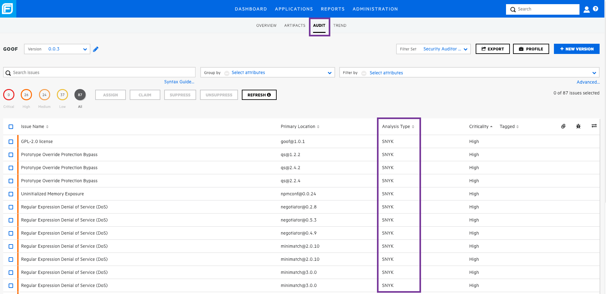

# Fortify SSC integration

Integrate the Snyk plugin with Micro Focus Fortify Software Security Center (Fortify SSC) and obtain a unified view of your open-source security vulnerabilities.

Combining the two sources provides a more accurate view of the overall security posture of your application portfolio and also naturally tracks that posture over time as vulnerabilities are fixed or introduced.

The Snyk parser plugin converts your Snyk scan results into a format that Fortify SSC can read and display.

## How Fortify SSC integration works

The Snyk plugin parses scanned results from Snyk and then feeds those results into Fortify SSC. In this way, you can view, monitor, and manage your open-source vulnerabilities in a single view.

To display Snyk data from the Fortify app:

1. The user runs a Snyk scan on a Project from the CLI, generating a `.json` report.
2. The user uploads the report to Fortify SSC.
3. The plugin parses the results and feeds them to Fortify for the application Project.
4. The Snyk scan results are displayed from Fortify, and the user can view and track data from the Fortify SSC app user interface (UI).

## Prerequisites for Fortify SSC integration

1. Ensure you have installed the Snyk CLI and authenticated your account.
2. `Your SNYK_TOKEN` for use with the Snyk CLI. You can find your API token in your [account settings on snyk.io](https://app.snyk.io/account/).
3. Fortify SSC 18.20

## Fortify SSC and Snyk: an overview of the SSC feed

After Snyk data is imported to the Fortify SSC app, navigate to the Audit tab to view the data. Each row of imported data shows the **Analysis Type SNYK** and appears like the following image:

<figure><figcaption>
Snyk data in Fortify SSC app with analysis type SNYK
</figcaption></figure>

Expanding a specific vulnerability reveals detailed information, as shown in the following example:

<figure><figcaption>
Vulneratibity information in the Fortify SCC app
</figcaption></figure>

Included are the Issue scan status, Issue status, Confidence, Impact, and the designated Audited: true or false, with an overview of the issue and its publication time.
